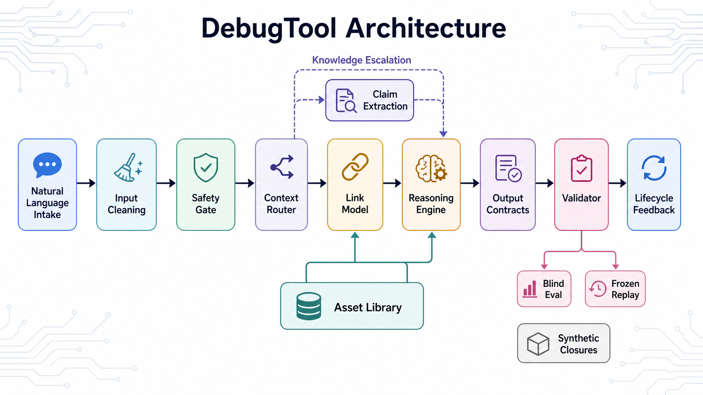
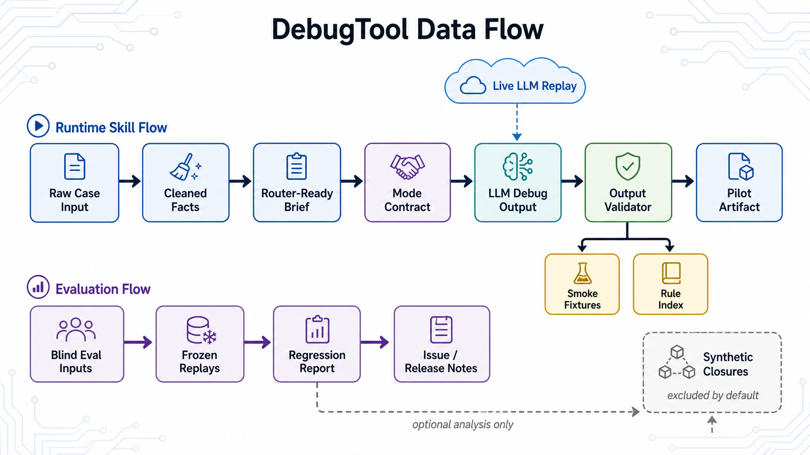

# DebugTool

DebugTool 是面向硬件 debug 的 **prompt-engineering skill 包**。它不是 Python 调试器，也不是 LLM 客户端；真正的运行时核心是 `SKILL.md`、`prompts/`、`output_contracts/`、`reasoning/`、`routing/` 和 `assets/` 这些 markdown / YAML 合同。Python 脚本只负责结构性校验、lint、语料治理和 replay。

当前版本：`V0.99.13`，founder-pilot candidate。适合窄范围内部 pilot，不应当视为 V1.0 或团队级稳定版。

## 架构图

下面两张图由 Image2 生成，并作为仓库资产提交。





## 项目定位

DebugTool 帮助 LLM 把自然语言硬件故障描述转换成 contract-shaped debug artifact：

1. 清洗 raw case，拆出事实、修订、stale evidence 和 unknowns。
2. 通过 router 选择合适的 debug mode。
3. 基于内部资产建立第一版 link model 和 hypothesis tree。
4. 只有当第一版模型存在高影响缺口时，才升级到外部 knowledge。
5. 按 output contract 输出带 evidence refs、概率、成本和行动门槛的 debug 结果。
6. 在复用、发布或沉淀训练材料前，用 deterministic scripts 做结构校验。

validator 只能证明输出符合合同和可追溯要求；它不证明硬件 root cause 一定正确。

## 评估边界

默认 regression signal 已经排除 synthetic closures，避免把自证语料误当真实回归能力。

| 区域 | 用途 | 默认 gate |
|---|---|---|
| `regression/blind_eval/` | 隐藏目标 lesson 的盲评案例 | Yes |
| `regression/frozen_artifact_replay/` | 已冻结生成物的 contract 兼容性回放 | Yes |
| `regression/output_validator_smoke_cases/` | focused pass/fail fixtures，包含对抗性咒语词案例 | Yes |
| `training/closed_loop/synthetic_closures/` | 从 authoritative queue focus 机器生成的 closure | No |
| `scripts/run_llm_replay.py` | 可选 live LLM replay，跑 blind-eval raw inputs | Optional，依赖 `ANTHROPIC_API_KEY` |

synthetic closures 仍可用于训练脚手架和覆盖面盘点，但不计入默认 hit-rate。

## 关键目录

| 路径 | 作用 |
|---|---|
| `SKILL.md` | LLM skill 的高层 mandatory rules |
| `output_contracts/` | 各 debug mode 的输出合同 |
| `prompts/` | router 和 mode prompt 片段 |
| `reasoning/` | 概率、成本、asset priority 和推理策略 |
| `assets/` | link models、signatures、principles、pattern bundles、case records |
| `schemas/asset_schema.yaml` | machine-readable asset JSON Schema |
| `regression/` | blind eval、frozen replay、validator smoke fixtures |
| `training/` | candidate sources、synthetic closures、real-case intake |
| `scripts/` | validators、linters、replay runners、reports |
| `lifecycle/` | 晋级、治理和维护规则 |

## 快速开始

安装依赖：

```bash
python -m pip install -r requirements.txt
```

验证单个生成物：

```bash
python scripts/output_validator.py --mode architecture_first --file output.md
python scripts/output_validator.py --mode evidence_audit --file audit.md
```

运行核心本地检查：

```bash
python -m ruff check .
python -m ruff format --check .
python -m mypy
python -m pytest
python scripts/lint_contracts.py
python scripts/lint_case_governance.py
python scripts/lint_assets.py
python scripts/regression_suite_linter.py
python scripts/run_output_validator_smoke.py
python scripts/run_frozen_artifact_replay.py
python scripts/run_blind_eval.py
python scripts/regression_run.py
```

Windows PowerShell 如果遇到第三方 pytest plugin 干扰，可用：

```powershell
$env:PYTEST_DISABLE_PLUGIN_AUTOLOAD = "1"
python -m pytest
```

## 可选 Live LLM Replay

live replay 是可选路径，CI 不依赖密钥也必须能运行。

```bash
python scripts/run_llm_replay.py --dry-run --limit 1
python scripts/run_llm_replay.py --limit 8 --output-dir regression/blind_eval/live_outputs
```

设置 `ANTHROPIC_API_KEY` 后才会实际调用 LLM。没有密钥时脚本 fail closed；`--dry-run` 只验证 corpus discovery 和输出路径。

## Regression Report

生成默认信号报告：

```bash
python scripts/regression_run.py --output regression_report.md --json regression_report.json
```

只有在需要训练盘点视角时，才显式包含 synthetic closures：

```bash
python scripts/regression_run.py --include-synthetic --output regression_report_synthetic.md
```

## 设计约束

DebugTool 不应拥有项目私有知识。板级原理图、项目笔记、datasheet、日志、历史 debug records 应放在外部 workspace knowledge 中。只有当用户明确要求，或第一版 link model 存在会影响行动排序的高影响缺口时，才使用 `DEBUGTOOL_KB_ROOT`、`knowledge_sources.yaml` 或用户指定路径升级。

可读正文语言应跟随用户。固定 contract headings、schema fields、signal names、register names、paths 和 validator-facing IDs 可以保留英文，以便校验和追溯。

规则索引在 `scripts/output_validator_RULES.md`。新增 `V-*` 错误码时，应同步写 rationale，并加入能证明该规则捕获真实风险的 fixture。

## V1.0 门槛

不要因为结构看起来完整就升级到 V1.0。至少需要满足：

- 至少 5 个真实项目 case 经过 `training/real_project_cases/` 流程。
- 真实 case 的 top-3 hit 或 near-hit rate 不低于 70%。
- 连续 30 天没有未解决的 P0 safety 或 contract bug。
- CI 中 validators、linters、smoke cases、regression-suite checks 全部通过。
- 人工审核显示 pilot case 的 safety-gate true positive 不低于 90%。
- pilot 操作中，从 cleaned input 到第一个可执行测量动作的中位时间低于 3 分钟。
- 每个 breaking contract 或输出格式变更都有明确 changelog。
