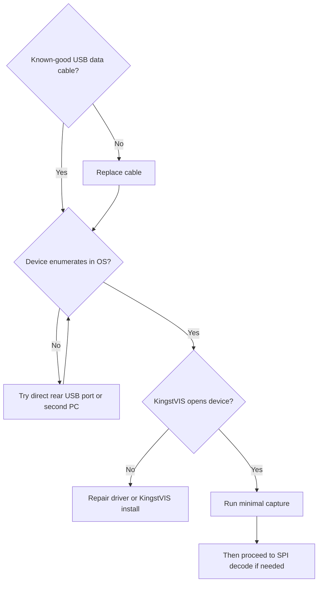

# Signature-Based Fast Path Debug

## 0. Mode / Signature / Confidence

Mode: Signature-Based Fast Path.  
Matched signature: `SIG-USB-NOT-CONNECTED`.  
Confidence: high, because the symptom is LA1010 LED on but KingstVIS reports device not connected / error -105.

## 1. Safety Gate

S0. Low-voltage USB debug. No destructive or hazardous action required.

## 2. Quick Diagnosis

LED on proves the device receives power. It does not prove that the USB data pair, enumeration path, driver binding, or application layer is healthy. The first fault domain is USB connectivity/enumeration, not SPI decode configuration.

## 3. Minimal Context Still Needed

- Is the USB cable known to support data, not charging only?
- Does Windows Device Manager show a new USB device when plugging the LA1010?
- Does KingstVIS version match the driver/device generation?
- Does another USB port or another PC enumerate the device?

## 4. Top 3-5 Actions

1. Replace the USB cable with a known-good data cable.
2. Plug directly into the PC, avoiding hubs/front-panel ports.
3. Check Device Manager for enumeration, unknown device, or driver error.
4. Reinstall or repair KingstVIS/driver if enumeration exists but app cannot open device.
5. Only after the device opens successfully, test minimal capture before touching SPI CPOL/CPHA/decode settings.

## 5. Stop / Escalate Conditions

Escalate if the device does not enumerate on two known-good data cables and two PCs. Stop SPI-level investigation until the acquisition device itself is visible to the OS and KingstVIS.

## 6. Mini Decision Tree

## 7. Why Full Architecture Is Not Needed Yet

The failure occurs before target-board signal capture. A full target architecture does not help until the logic analyzer is enumerated and opened by the software.

## 8. When To Switch Modes

Switch to Architecture-First only after the LA1010 is detected and can capture, but the target SPI/I2C/UART signal still decodes incorrectly or intermittently.
