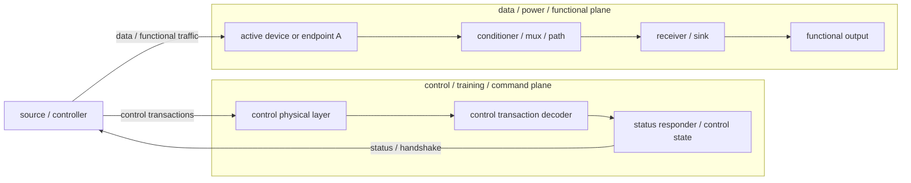
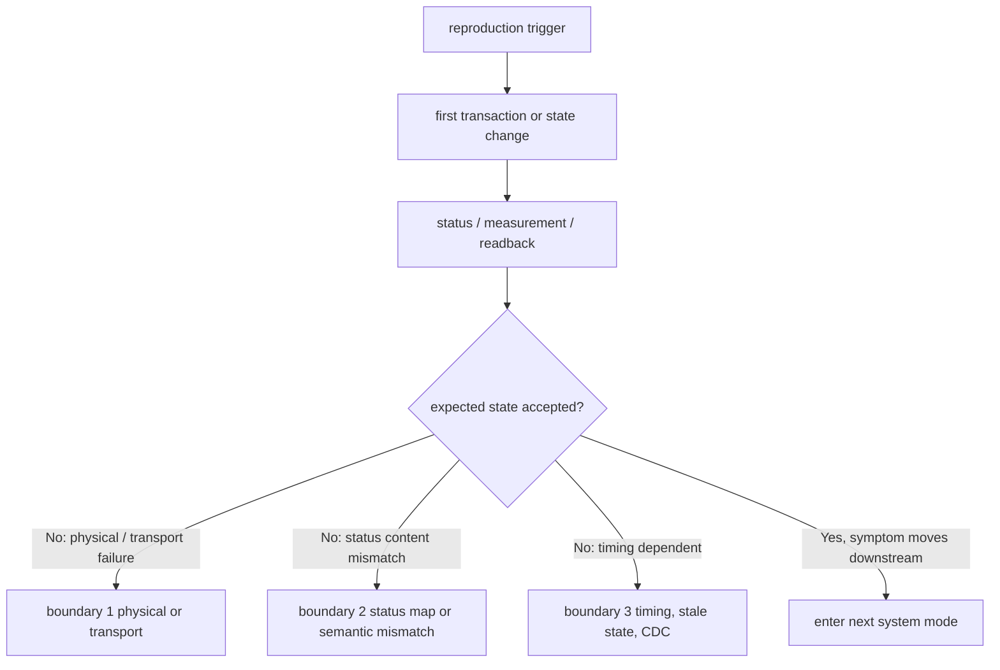
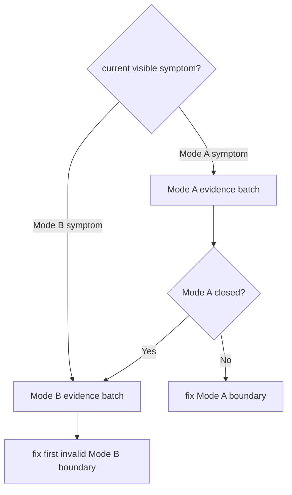

# Visual Architecture Brief Template

Use this template when a debug case is complex enough that readers need to know which system, subsystem, or mode currently owns the bug before reading detailed evidence tables.

Keep this template generic. Put project-specific device names, signal names, rails, channels, and owners in the case artifact, not in this template.

## 0. Executive Frame

Current conclusion:

- current visible symptom:
- current owning system:
- current owning subsystem:
- current mode / gate:
- strongest reason:
- first action:
- stop condition:

Action route:

1. TBD
2. TBD
3. TBD

## 1. System Placement

Use this diagram to show where the bug currently lives in the full system.

Reader note:

- If the current visible symptom is a control-plane failure, do not route first to the data plane.
- If the control plane is proven closed and the symptom remains, then move to the data plane.

## 2. Subsystem Architecture

Use this diagram to expand the currently owning subsystem.

## 3. Mode Gate

The mode gate is the top-level router. It should make it obvious when to stay in the current subsystem and when to switch.

| mode | visible symptom | first subsystem | required evidence batch | stop condition |
|---|---|---|---|---|
| Mode A |  |  |  |  |
| Mode B |  |  |  |  |

## 4. High-Signal Evidence Stack

Keep this table short. It is the first set of evidence a senior engineer would ask for.

| priority | evidence | answers | if failing | if clean |
|---:|---|---|---|---|
| 1 |  |  |  |  |
| 2 |  |  |  |  |
| 3 |  |  |  |  |
| 4 |  |  |  |  |
| 5 |  |  |  |  |

## 5. Subsystem Conclusions

Write the highest-signal conclusion in plain language:

- current first subsystem:
- current non-goals:
- conditions to change route:
- most likely mistake to avoid:

## 6. Field Brief

One sentence for the field team:

> TBD

Minimum same-window tasks:

1. TBD
2. TBD
3. TBD

Stop conditions:

- TBD
- TBD
- TBD
