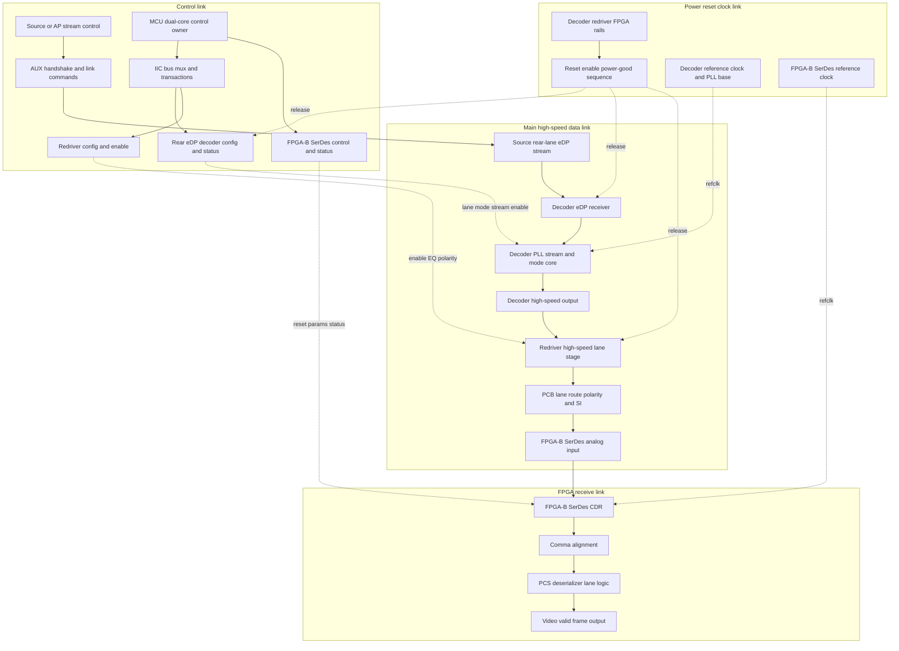
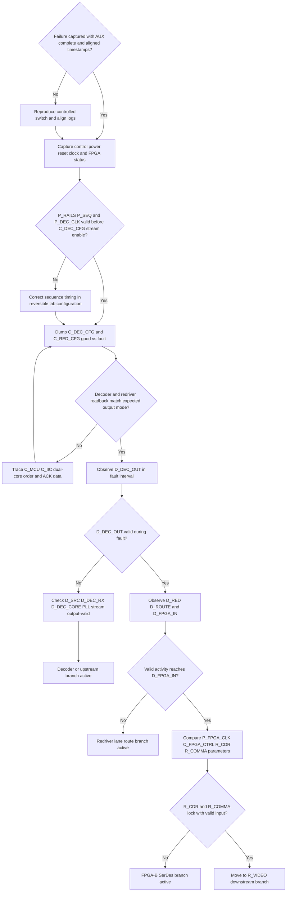

# Architecture-First Debug Decision Tree

## 1. Project Context Summary

Issue: a four-lane eDP video path is split across two FPGA receivers. The front two lanes are received by FPGA-A and are relatively stable. The rear two lanes are received by FPGA-B and intermittently show no image after video-stream switching.

Current confirmed boundary: rear-lane AUX communication and command handshake complete normally, while FPGA-B SerDes CDR and comma alignment fail in the fault state. Manual FPGA-B SerDes reset does not recover the failure.

This output starts from a detailed link model and then derives the hypothesis tree and action decision tree. It does not treat any root cause as concluded before the required evidence gates are passed.

### Input Cleaning Record

#### Raw Input Boundary

The raw input is a project issue-sync note plus later user direction. It includes current architecture, observed symptoms, confirmed updates, suspected causes, completed experiments, and proposed next actions. It is not a final root-cause report.

#### Entity / Alias Normalization

| Alias | Normalized Meaning | Notes |
|---|---|---|
| front two lanes | eDP lanes received by FPGA-A | Stable comparison group |
| rear two lanes | eDP lanes received by FPGA-B | Failing path |
| FPGA-A | KU3P-side receiver | Receives eDP0/1 in the user description |
| FPGA-B | AU15P-side receiver | Receives eDP2/3 in the user description |
| decoder | front-end eDP decoder for rear-lane path | Exact part number not provided |
| redriver | high-speed conditioning path after decoder | Presence and readback details need schematic confirmation |
| AUX | eDP AUX control/handshake path | Confirmed to complete normally in current discussion |
| IIC | MCU control/configuration path to decoder or redriver | Must be proven with transaction and readback evidence |

#### Observed / Confirmed Facts

| id | fact | source_in_input | confidence | affected_link_or_node |
|---|---|---|---|---|
| IC-F1 | Four-lane eDP is split across two FPGA receivers | user issue-sync text | high | architecture |
| IC-F2 | Front two lanes are received by FPGA-A and show better display behavior | user issue-sync text | high | comparison path |
| IC-F3 | Rear two lanes are received by FPGA-B and intermittently fail to display after video switching | user issue-sync text | high | D_SRC to R_VIDEO |
| IC-F4 | Rear-lane AUX communication and command handshake can complete normally | latest confirmed discussion | high | C_AUX |
| IC-F5 | FPGA-B SerDes CDR cannot lock in the fault state | user issue-sync text | high | R_CDR |
| IC-F6 | Comma alignment fails or shows periodic abnormality in the fault state | user issue-sync text | high | R_COMMA |
| IC-F7 | Manual SerDes reset does not improve the failing state | user issue-sync text | high | C_FPGA_CTRL, R_CDR |
| IC-F8 | Demo board behavior suggests SerDes reset can recover similar receive symptoms when input source is valid | user issue-sync text | medium | R_CDR with valid input |
| IC-F9 | Single DEV3 selection is worse, while DEV3 plus DEV4 improves receive behavior | user issue-sync text | medium | D_DEC_OUT, D_RED, D_ROUTE |
| IC-F10 | FPGA-side aux_in initial levels differed across channels in earlier captures | earlier investigation note | medium | C_AUX |
| IC-F11 | Weak pull-down on FPGA-side aux_in did not solve the issue | earlier investigation note | medium | C_AUX |

#### Judgments / Inferences / Hypotheses

| id | statement | based_on | confidence | could_be_wrong_if |
|---|---|---|---|---|
| IC-J1 | AUX is not the primary current blocker | IC-F4,IC-F10,IC-F11 | high | a new capture shows AUX completes only in good state but not fault state |
| IC-J2 | The fault is probably before or at the decoder output, not inside downstream display pipeline | IC-F5,IC-F6,IC-F7 | medium | decoder output and FPGA-B input are proven valid during the same fault interval |
| IC-J3 | Decoder configuration, power sequence, or physical output state is a high-priority suspect | IC-F4,IC-F5,IC-F7 | medium | decoder readback, output-valid, and measured output are all correct in fault state |
| IC-J4 | Pure FPGA-B SerDes reset-state failure is lower priority than source/output validity | IC-F7,IC-F8 | medium | valid input reaches FPGA-B and CDR still fails |
| IC-J5 | DEV3/DEV4 behavior may indicate lane coupling, lane enable, mode, or redriver path effects | IC-F9 | low-medium | per-lane output and lane mapping are proven identical good vs fault |

#### Actions Already Tried And Results

| id | action | target | result | interpretation | evidence_refs |
|---|---|---|---|---|---|
| IC-M1 | Verified rear-lane AUX command flow | C_AUX | handshake can complete | Demotes AUX-blocked branch but does not prove high-speed data output | IC-F4 |
| IC-M2 | Manually reset FPGA-B SerDes | C_FPGA_CTRL, R_CDR | no improvement | SerDes reset alone is not sufficient; invalid input remains plausible | IC-F7 |
| IC-M3 | Applied weak pull-down to normalize aux_in initial level | C_AUX | no improvement | Initial aux_in level difference is not sufficient as primary explanation | IC-F10,IC-F11 |
| IC-M4 | Compared against demo board reset behavior | R_CDR | demo board can recover with valid input | Raises value of proving decoder output validity before more SerDes work | IC-F8 |

#### Proposed Methods / Pending Actions

| id | proposed_action | owner_if_known | target | expected_evidence | hypothesis_or_link_node |
|---|---|---|---|---|---|
| IC-P1 | Scope decoder power, reset, enable, and reference clock during the failing switch | hardware owner | P_RAILS, P_SEQ, P_DEC_CLK | timing pass/fail against datasheet | H2 |
| IC-P2 | Measure whether decoder has high-speed output in the fault state | hardware owner | D_DEC_OUT | output present/absent or output-valid status | H1,H2,H4 |
| IC-P3 | Capture MCU IIC writes and readback to decoder and redriver | MCU/software owner | C_MCU, C_IIC, C_DEC_CFG, C_RED_CFG | address/data/ACK/readback/time order | H1,H3,H5 |
| IC-P4 | Test dual-core ownership variable by swapping or serializing control ownership | MCU/software owner | C_MCU | failure rate or readback changes | H3 |
| IC-P5 | Compare redriver output and FPGA-B input only after decoder output is valid | hardware/FPGA owner | D_RED, D_ROUTE, D_FPGA_IN | signal preserved or lost across lane path | H5,H6 |

#### Contradictions / Revisions

| id | previous_statement | revised_statement | why_revised | impact_on_routing |
|---|---|---|---|---|
| IC-R1 | Rear-lane problem may be caused by AUX communication being stuck | Rear-lane AUX handshake completes normally | IC-F4 | Move from AUX/control-blocked focus to decoder/data-output evidence gates |
| IC-R2 | aux_in initial level difference may block protocol handshake | aux_in difference did not prevent command flow and pull-down did not solve issue | IC-F4,IC-F10,IC-F11 | Keep aux_in as context, not primary branch |
| IC-R3 | SerDes reset should recover if receiver logic is stuck | SerDes reset does not recover on target board | IC-F7,IC-F8 | Prove input/output validity before further SerDes reset experiments |

#### Missing Information

| id | missing_information | why_it_matters |
|---|---|---|
| IC-G1 | Decoder part number, register map, and status bits | Required to define valid output and PLL/stream states |
| IC-G2 | Good-state and fault-state decoder/redriver register dumps | Separates wrong configuration from valid configuration with bad physical output |
| IC-G3 | Time-aligned waveforms for rails, reset, enable, refclk, IIC, and FPGA status | Separates sequence, race, and measurement-correlation branches |
| IC-G4 | Lane mapping and redriver topology | Required before interpreting DEV3/DEV4 coupling |
| IC-G5 | FPGA-B SerDes parameter and reference-clock comparison | Required only after valid input is proven |

#### Router-Ready Case Brief

The cleaned case is an architecture-first eDP rear-lane no-display debug problem. The confirmed facts are: the rear-lane AUX handshake completes, but FPGA-B SerDes CDR and comma alignment fail in the fault state, and SerDes reset does not recover. Earlier aux_in level differences did not block AUX command flow. The current competing hypotheses are decoder configuration/readback failure, decoder power-reset-clock sequence failure, MCU dual-core IIC ordering race, decoder stream/output invalidity, redriver or lane-path loss, and only after valid FPGA-B input is proven, FPGA-B SerDes configuration or margin.

## 2. Architecture / Link Understanding

The system must be modeled as multiple coupled links, not a single data pipeline:

- Control link: source/AUX state, MCU dual-core control, IIC transactions, decoder and redriver configuration, FPGA-B SerDes control.
- Power / reset / clock link: rails, reset and enable timing, decoder reference clock, FPGA-B SerDes reference clock.
- Main data link: source eDP video stream, rear-lane decoder receive path, decoder output, redriver, board lane route, FPGA-B input.
- FPGA receive link: CDR, comma alignment, PCS or deserializer, video-valid/frame path.

### Multi-Layer Link Model



### Link Node Annotation Table

| Node | Layer | Inputs | Outputs | Control Signals | Observable Evidence | Failure Modes | Downstream States Affected |
|---|---|---|---|---|---|---|---|
| C_HOST | Control | switch request, source state | stream-on or stream-off intent | HPD policy, source mode | AP/source log, switch timestamp | source does not start rear-lane stream, wrong mode | C_AUX, D_SRC |
| C_AUX | Control | AUX read/write request | link command completion | AUX, HPD | AUX trace, command ACK, DPCD/status read | NACK, stuck transaction, wrong link command | D_SRC, C_DEC_CFG |
| C_MCU | Control | switch event, state machine | IIC writes, GPIO changes, FPGA commands | core owner, mutex, reset order | MCU log with core ID and timestamp | dual-core race, skipped init, reordered reset | C_IIC, C_DEC_CFG, C_RED_CFG, C_FPGA_CTRL, P_SEQ |
| C_IIC | Control | MCU IIC transaction | decoder/redriver writes and readback | bus mux, pullups, level shifter | LA waveform, address, data, ACK | wrong address, missing ACK, late write, bus contention | C_DEC_CFG, C_RED_CFG |
| C_DEC_CFG | Control | IIC writes, reset release, AUX state | decoder mode, status, output enable | reset, enable, register map | register dump, PLL/status bits | wrong lane mode, output disabled, write not latched | D_DEC_CORE, D_DEC_OUT |
| C_RED_CFG | Control | IIC or GPIO config | redriver enable, EQ, polarity state | EN, EQ, polarity, power-down | register readback, GPIO level, lane output | disabled redriver, wrong EQ, polarity inversion | D_RED, D_ROUTE, D_FPGA_IN |
| C_FPGA_CTRL | Control | MCU/JTAG/config registers | SerDes reset, params, status | reset, refclk select, equalization params | ILA/JTAG/status registers | wrong reset order, wrong params, stale status | R_CDR, R_COMMA, R_PCS |
| P_RAILS | Power | board supplies | stable decoder/redriver/FPGA rails | PMIC enables, power-good | scope rails, PG pins | rail droop, missing rail, wrong order | C_DEC_CFG, D_DEC_RX, D_RED, R_CDR |
| P_SEQ | Power | reset controller, MCU GPIO, PG pins | reset and enable release | reset_n, enable, power-good | time-aligned scope capture | release before rails/clock stable, too short delay | C_DEC_CFG, D_DEC_CORE, D_RED, R_CDR |
| P_DEC_CLK | Clock | oscillator or clock source | decoder reference clock | clock enable, mux | scope, decoder PLL lock bit | absent clock, wrong frequency, unstable PLL ref | D_DEC_CORE, D_DEC_OUT |
| P_FPGA_CLK | Clock | board clock or recovered ref | SerDes reference clock | clock mux, PLL reset | scope, FPGA PLL lock | wrong frequency, unlock, clock gating | R_CDR, R_COMMA |
| D_SRC | Data | source stream, AUX state | rear-lane eDP electrical stream | stream enable, lane count | source status, lane activity | source inactive, wrong lane count, training mismatch | D_DEC_RX |
| D_DEC_RX | Data | rear-lane eDP stream | decoder receive state | reset, lane config | decoder RX lock/status | no receive lock, lane polarity mismatch | D_DEC_CORE |
| D_DEC_CORE | Data | RX data, decoder refclk, config | decoded or bridged stream | PLL enable, mode table, stream enable | PLL lock, stream detect, error status | PLL unlock, no stream detect, wrong mode | D_DEC_OUT |
| D_DEC_OUT | Data | decoder core output | high-speed output toward redriver | output enable, lane mode | output-valid bit, high-speed scope evidence | no output, wrong rate, wrong lane mode | D_RED, D_FPGA_IN, R_CDR |
| D_RED | Data | decoder high-speed output | conditioned high-speed lanes | enable, EQ, polarity | redriver status, before/after waveform | disabled, over/under EQ, polarity error | D_ROUTE, D_FPGA_IN |
| D_ROUTE | Data | redriver output | FPGA-B pin-level signal | layout only | lane map, continuity, SI comparison | lane swap, open, short, skew, loss | D_FPGA_IN, R_CDR |
| D_FPGA_IN | Data | PCB differential input | analog SerDes input | termination, IO bank state | FPGA input activity, probe evidence | weak amplitude, wrong polarity, excessive jitter | R_CDR |
| R_CDR | FPGA RX | analog input, SerDes refclk | recovered clock and serial bits | SerDes reset, EQ, CDR params | CDR lock, error counter | no lock, marginal lock, wrong refclk | R_COMMA |
| R_COMMA | FPGA RX | recovered bitstream | aligned words | comma pattern, polarity, word align | comma lock/status | comma not found, polarity mismatch | R_PCS |
| R_PCS | FPGA RX | aligned words | lane data and video words | lane deskew, PCS params | PCS counters, lane errors | deskew failure, code errors | R_VIDEO |
| R_VIDEO | FPGA RX | PCS video words | frame valid or downstream video | timing config, enable | frame counter, video valid | no frame despite lock, downstream timing issue | downstream display path |

## 3. Fact / Assumption Table

| Fact ID | Type | Content | Confidence | Link Nodes |
|---|---|---|---|---|
| F1 | observed | Rear two lanes intermittently fail to display after switching | high | D_SRC to R_VIDEO |
| F2 | observed | Front two lanes are more stable than rear two lanes | high | compare front path vs D_ROUTE and FPGA_RX |
| F3 | confirmed | Rear-lane AUX handshake completes normally | high | C_AUX |
| F4 | observed | FPGA-B SerDes CDR cannot lock in fault state | high | R_CDR |
| F5 | observed | Comma alignment fails or shows periodic abnormality | high | R_COMMA |
| F6 | observed | Manual FPGA-B SerDes reset does not recover failure | high | C_FPGA_CTRL, R_CDR |
| F7 | observed | Demo board can recover comparable SerDes receive issue by reset when input is valid | medium | R_CDR with known-good input |
| F8 | observed | DEV3 alone is worse, DEV3 plus DEV4 improves receive behavior | medium | D_DEC_OUT, D_RED, D_ROUTE |
| F9 | observed | aux_in initial levels differed, but AUX commands still complete | medium | C_AUX |
| A1 | assumption | Decoder exposes readable PLL, stream, output-valid, or lane status | medium | C_DEC_CFG, D_DEC_CORE, D_DEC_OUT |
| A2 | assumption | Redriver has observable enable, EQ, polarity, or readback state | medium | C_RED_CFG, D_RED |
| A3 | missing | Time-aligned evidence across power, reset, clock, IIC, decoder output, and FPGA status | high impact | all layers |

## 4. Fault-Domain Localization

The first split is not AUX versus SerDes. The current link model says AUX is only one control node and it is currently passing. The next split should be:

1. Is the decoder powered, released, clocked, configured, and stream-enabled at the failing transition?
2. Does D_DEC_OUT physically or logically show valid output in the same fault interval?
3. If D_DEC_OUT is valid, does that signal survive D_RED and D_ROUTE into D_FPGA_IN?
4. If D_FPGA_IN is valid, why do R_CDR and R_COMMA fail?

| Hypothesis ID | Linked Nodes | Current Engineering Prior | Rationale | Upward Evidence | Downward Evidence |
|---|---|---:|---|---|---|
| H1 decoder config missing or wrong | C_MCU, C_IIC, C_DEC_CFG | 24% | AUX can pass while decoder output registers are wrong or not latched | good/fault readback differs, known-good init restores output | readback and output-valid match expected mode |
| H2 power reset clock sequence invalid | P_RAILS, P_SEQ, P_DEC_CLK | 18% | invalid release or missing refclk can leave decoder unable to output | reset or enable violates datasheet, corrected delay fixes issue | time-aligned sequence is identical and valid good vs fault |
| H3 MCU dual-core ordering race | C_MCU, C_IIC, C_DEC_CFG, C_RED_CFG | 16% | switch-related intermittent failures often come from ordering and ownership | LA/log shows overlapping ownership, skipped writes, or serialization fixes issue | serialized path has same ordered writes and same readback |
| H4 decoder stream PLL or source state invalid | D_SRC, D_DEC_RX, D_DEC_CORE, D_DEC_OUT | 14% | AUX does not prove source stream, PLL, or output-valid state | PLL unlock, no stream detect, no output-valid | decoder status and output are valid before FPGA lock attempt |
| H5 redriver or lane path blocks data | C_RED_CFG, D_RED, D_ROUTE, D_FPGA_IN | 10% | high-speed data may be lost after decoder while control still works | valid D_DEC_OUT but invalid D_FPGA_IN | valid activity reaches FPGA-B input |
| H6 FPGA-B SerDes config refclk or margin issue | P_FPGA_CLK, C_FPGA_CTRL, R_CDR, R_COMMA | 9% | direct symptom is SerDes unlock, but source validity is not proven | valid D_FPGA_IN while CDR and comma still fail | D_FPGA_IN is absent or malformed |
| H7 evidence correlation or measurement artifact | all observed nodes | 6% | logs and waveforms may not yet be time-aligned | independent evidence contradicts previous timing | scope, LA, readback, and FPGA status agree |
| H8 downstream video pipeline issue | R_VIDEO | 3% | low while CDR and comma fail before downstream video | R_CDR and R_COMMA valid but no frame/video | CDR remains unlocked |

## 5. Candidate Matching Report

| Asset | Type | Decision | Reason | Evidence Refs |
|---|---|---|---|---|
| LM-VIDEO-LINK | link_model | Adopted | Gives source, decoder, CDR, FPGA, and downstream ordering | F1,F4,F5 |
| DP-DYNAMIC-EVIDENCE-BEFORE-STATIC-RATING | debug_principle | Adopted | Failure occurs during switching and needs aligned transient evidence | F1,A3 |
| DP-MEASUREMENT-BEFORE-DESIGN-CHANGE | debug_principle | Adopted | Direct output and input evidence must precede hardware or RTL changes | F4,F5,A3 |
| LM-MIPI-DSI-CSI-DPHY | link_model | Deferred | Useful only as an analogy for separating control and PHY evidence | F3,F4 |
| AUX-root-cause-first path | heuristic | Not Applied | AUX handshake is currently confirmed normal | F3 |

## 6. Adopted / Deferred / Not Applied

Adopted: `LM-VIDEO-LINK`, `DP-DYNAMIC-EVIDENCE-BEFORE-STATIC-RATING`, `DP-MEASUREMENT-BEFORE-DESIGN-CHANGE`.

Deferred: MIPI-specific assets are not used as direct evidence because this is an eDP path. They only support the generic separation of control path, PHY/data path, packet or alignment status, and downstream pipeline.

Not Applied: AUX-first root cause path, repeated SerDes reset loops, downstream-video debug before SerDes lock and comma alignment are valid.

## 7. Optimal Troubleshooting Path

Start at cross-layer gates, not single-layer reset:

1. Time-align C_MCU, C_IIC, P_RAILS, P_SEQ, P_DEC_CLK, C_DEC_CFG, D_DEC_OUT, R_CDR, and R_COMMA around one failing switch.
2. Check whether P_RAILS, P_SEQ, and P_DEC_CLK make C_DEC_CFG and D_DEC_CORE valid before stream enable.
3. Compare C_DEC_CFG and C_RED_CFG readback in good and fault states.
4. Prove D_DEC_OUT in the fault state.
5. If D_DEC_OUT is valid, compare D_RED, D_ROUTE, and D_FPGA_IN.
6. If D_FPGA_IN is valid, move to P_FPGA_CLK, C_FPGA_CTRL, R_CDR, and R_COMMA.

## 8. Decision Tree

### Hypothesis Tree

```text
H0 rear lanes fail while AUX completes
├─ Control link branch
│  ├─ H1 C_MCU/C_IIC/C_DEC_CFG writes missing, wrong, or not latched
│  └─ H3 C_MCU dual-core ordering or ownership race
├─ Power reset clock branch
│  └─ H2 P_RAILS/P_SEQ/P_DEC_CLK not valid when decoder config or stream starts
├─ Decoder data-production branch
│  └─ H4 D_SRC/D_DEC_RX/D_DEC_CORE/D_DEC_OUT not producing valid output
├─ Main data path branch
│  └─ H5 C_RED_CFG/D_RED/D_ROUTE/D_FPGA_IN blocks or distorts valid output
├─ FPGA receive branch
│  └─ H6 P_FPGA_CLK/C_FPGA_CTRL/R_CDR/R_COMMA fail despite valid input
├─ Evidence branch
│  └─ H7 non-time-aligned evidence creates a false boundary
└─ Downstream branch
   └─ H8 R_VIDEO or downstream display fails after SerDes is already valid
```

### Action Decision Tree



## 9. Node Explanation Table

| id | type | action_type | check_or_action | tool_required | expected_observation | interpretation | safety_level | cost | reversibility | next_branch | evidence_refs |
|---|---|---|---|---|---|---|---|---|---|---|---|
| C_HOST | gate | none | Observe source or AP stream control state | log | stream switch intent is timestamped | Bounds source command timing | S0 | low | n/a | C_AUX | F1 |
| C_AUX | gate | none | Observe AUX handshake and commands | LA or log | AUX completes in fault state | Demotes AUX-blocked branch | S0 | low | n/a | D_SRC | F3 |
| C_MCU | gate | none | Observe MCU core ownership and command order | MCU log | core owner and timestamp are known | Tests dual-core race branch | S0 | medium | n/a | C_IIC | A3 |
| C_IIC | gate | none | Observe IIC address data ACK and timing | LA | writes and readbacks are proven | Tests config delivery | S0 | medium | n/a | C_DEC_CFG | A3 |
| C_DEC_CFG | gate | none | Observe decoder config and status | IIC tool | expected mode and status read back | Tests decoder config branch | S0 | medium | n/a | D_DEC_CORE | A1 |
| C_RED_CFG | gate | none | Observe redriver config enable and EQ | IIC tool or GPIO | redriver state is expected | Tests lane-conditioning branch | S0 | medium | n/a | D_RED | A2 |
| C_FPGA_CTRL | gate | none | Observe FPGA-B SerDes control and status | JTAG or ILA | reset params and status are known | Tests SerDes-control branch | S0 | medium | n/a | R_CDR | F4,F6 |
| P_RAILS | gate | none | Observe rails for decoder redriver and FPGA | scope | rails stable before release | Tests power validity | S1 | medium | n/a | P_SEQ | A3 |
| P_SEQ | gate | none | Observe reset enable and PG timing | scope | release order meets datasheet | Tests sequence branch | S1 | medium | n/a | C_DEC_CFG | A3 |
| P_DEC_CLK | gate | none | Observe decoder reference clock | scope | clock stable before decoder operation | Tests decoder PLL prerequisite | S1 | medium | n/a | D_DEC_CORE | A3 |
| P_FPGA_CLK | gate | none | Observe FPGA-B SerDes reference clock | scope or FPGA status | refclk and PLL lock valid | Tests FPGA CDR prerequisite | S1 | medium | n/a | R_CDR | F4 |
| D_SRC | gate | none | Observe source rear-lane stream state | source log or scope | source stream active | Separates source from decoder branches | S1 | medium | n/a | D_DEC_RX | F1 |
| D_DEC_RX | gate | none | Observe decoder receiver status | IIC status | decoder receives expected lane state | Tests input side of decoder | S0 | medium | n/a | D_DEC_CORE | A1 |
| D_DEC_CORE | gate | none | Observe decoder PLL stream and mode core | IIC status | PLL and stream state valid | Tests decoder internal data production | S0 | medium | n/a | D_DEC_OUT | A1 |
| D_DEC_OUT | gate | none | Observe decoder high-speed output | scope or status | output valid in fault interval | Splits decoder from downstream path | S1 | high | n/a | D_RED | A3 |
| D_RED | gate | none | Observe redriver high-speed stage | scope or status | signal preserved through redriver | Tests redriver branch | S1 | high | n/a | D_ROUTE | A2 |
| D_ROUTE | gate | none | Observe PCB lane map and SI path | schematic and scope | route matches expected lane polarity | Tests physical path branch | S1 | high | n/a | D_FPGA_IN | F8 |
| D_FPGA_IN | gate | none | Observe FPGA-B analog input activity | scope or FPGA status | valid activity reaches FPGA-B input | Splits path from SerDes branch | S1 | high | n/a | R_CDR | F4 |
| R_CDR | gate | none | Observe SerDes CDR lock | FPGA status | CDR locks with valid input | Tests receive clock recovery | S0 | medium | n/a | R_COMMA | F4 |
| R_COMMA | gate | none | Observe comma alignment | FPGA status | comma alignment succeeds | Tests word alignment branch | S0 | medium | n/a | R_PCS | F5 |
| R_PCS | gate | none | Observe PCS deserializer lane logic | FPGA status | lane data and counters valid | Tests protocol receive logic | S0 | medium | n/a | R_VIDEO | F5 |
| R_VIDEO | gate | none | Observe video valid and frame output | FPGA status | frame counter or video valid toggles | Downstream branch begins only after lock | S0 | medium | n/a | terminal | F1 |
| AD1 | decision | none | Check whether failure is captured with AUX complete and aligned timestamps | log or LA | fault and AUX completion share timestamp | Confirms entry condition | S0 | low | n/a | AA2 or AA1 | F1,F3 |
| AA1 | action | reproduce | Reproduce controlled switch and align logs | log or LA | repeatable fault with timestamps | Enables cross-layer evidence | S0 | low | reversible | AA2 | F1,A3 |
| AA2 | action | observe | Capture control power reset clock and FPGA status | scope LA log | linked evidence across layers | Tests H1 H2 H3 H7 | S1 | medium | reversible | AD2 | A3 |
| AD2 | decision | none | Check whether P_RAILS P_SEQ and P_DEC_CLK are valid before stream enable | scope | sequence meets decoder requirements | Invalid sequence raises H2 | S1 | low | n/a | AA4 or AA3 | A3 |
| AA3 | action | reconfigure | Correct sequence timing in reversible lab configuration | MCU config and scope | failure rate changes or disappears | Tests H2 without hardware change | S1 | medium | reversible | AA4 | A3 |
| AA4 | action | observe | Dump C_DEC_CFG and C_RED_CFG good vs fault | IIC tool | readback diff is known | Tests H1 H3 H5 | S0 | medium | reversible | AD3 | A1,A2 |
| AD3 | decision | none | Check whether decoder and redriver readback match expected output mode | IIC tool | expected mode readback matches | Config branch is lowered if true | S0 | low | n/a | AA6 or AA5 | A1,A2 |
| AA5 | action | isolate | Trace C_MCU C_IIC dual-core order and ACK data | LA and MCU log | owner order address data ACK proven | Tests H3 and config delivery | S0 | medium | reversible | AA4 | A3 |
| AA6 | action | observe | Observe D_DEC_OUT in fault interval | scope or status | decoder output validity is known | Splits decoder from downstream path | S1 | high | reversible | AD4 | A3 |
| AD4 | decision | none | Check whether D_DEC_OUT is valid during fault | scope or status | valid output exists or not | Missing output raises H1 H2 H4 | S1 | medium | n/a | AA8 or AA7 | A3 |
| AA7 | action | observe | Check D_SRC D_DEC_RX D_DEC_CORE PLL stream output-valid | IIC status and scope | upstream decoder state explains output | Tests H4 and upstream decoder branch | S1 | medium | reversible | AT1 | A1 |
| AA8 | action | isolate | Observe D_RED D_ROUTE and D_FPGA_IN | scope and schematic | signal is preserved or lost downstream | Tests H5 before SerDes blame | S1 | high | reversible | AD5 | A2,F8 |
| AD5 | decision | none | Check whether valid activity reaches D_FPGA_IN | scope or FPGA status | valid input reaches FPGA-B | If true move to SerDes branch | S1 | medium | n/a | AA9 or AT2 | F4 |
| AA9 | action | observe | Compare P_FPGA_CLK C_FPGA_CTRL R_CDR R_COMMA parameters | FPGA status and config | clock params status deltas known | Tests H6 | S0 | medium | reversible | AD6 | F4,F5,F6 |
| AD6 | decision | none | Check whether R_CDR and R_COMMA lock with valid input | FPGA status | lock and alignment succeed or fail | If fail H6 becomes primary | S0 | medium | n/a | AT4 or AT3 | F4,F5 |
| AT1 | terminal | none | Decoder or upstream branch active | none | D_DEC_OUT invalid | Continue H1 H2 H3 H4 work | S0 | low | n/a | terminal | A1,A3 |
| AT2 | terminal | none | Redriver lane route branch active | none | valid decoder output does not reach FPGA input | Continue H5 path work | S0 | low | n/a | terminal | A2,F8 |
| AT3 | terminal | none | FPGA-B SerDes branch active | none | valid input reaches FPGA-B but lock fails | Continue H6 work | S0 | low | n/a | terminal | F4,F5,F6 |
| AT4 | terminal | none | Move to R_VIDEO downstream branch | none | SerDes and comma are valid | H8 can be investigated | S0 | low | n/a | terminal | F1 |

## 10. Missing Architecture Information

- Decoder part number, timing table, register map, PLL lock bits, stream-detect bits, and output-valid indicators.
- Redriver part number, lane mapping, polarity, EQ settings, enable timing, and readback capability.
- MCU switch-flow sequence including which core owns decoder, redriver, and FPGA control at every step.
- Good-state and fault-state dumps for C_DEC_CFG, C_RED_CFG, C_FPGA_CTRL, R_CDR, R_COMMA, and R_PCS.
- Safe probing points for D_DEC_OUT, D_RED, D_ROUTE, and D_FPGA_IN.

## 11. Next 3-5 Actions

1. Produce one synchronized failing-switch capture covering C_MCU, C_IIC, P_RAILS, P_SEQ, P_DEC_CLK, D_DEC_OUT status, R_CDR, and R_COMMA.
2. Compare C_DEC_CFG and C_RED_CFG good-state versus fault-state readbacks.
3. Run a controlled single-core serialized init or dual-core ownership swap and compare failure rate and readback.
4. Prove D_DEC_OUT validity in the same fault interval before running more FPGA-B SerDes reset experiments.
5. If D_DEC_OUT is valid, measure D_RED, D_ROUTE, and D_FPGA_IN before moving to R_CDR parameter work.

## 12. Stop / Escalation Conditions

- Stop treating AUX as the primary blocker while F3 remains true.
- Stop repeating SerDes-only reset experiments until D_DEC_OUT or D_FPGA_IN validity is proven in the same fault interval.
- Stop changing decoder or SerDes parameters without linking the change to a link-model node and an expected observation.
- Escalate to decoder vendor or schematic-level review if C_DEC_CFG, P_RAILS, P_SEQ, and P_DEC_CLK are correct but D_DEC_OUT is absent.
- Escalate to SI or board review if D_DEC_OUT is valid but D_FPGA_IN is invalid.
- Escalate to FPGA SerDes owner if D_FPGA_IN is valid and R_CDR or R_COMMA still fails.

## 13. Retrospective Trigger

Run retrospective after one branch is evidence-backed: control/config race, power-reset-clock sequence violation, decoder source or output failure, redriver/lane-route failure, FPGA-B SerDes lock or comma issue, or downstream-only video failure after valid SerDes receive.
