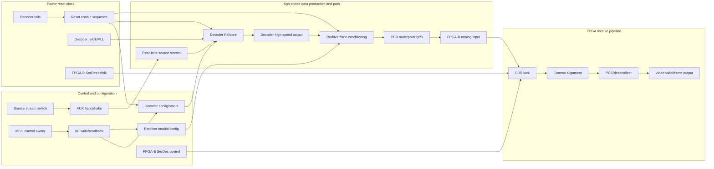
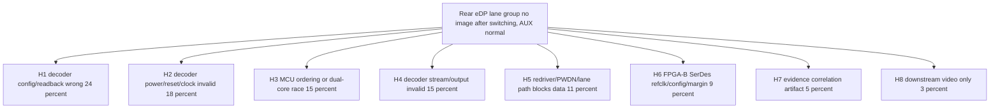
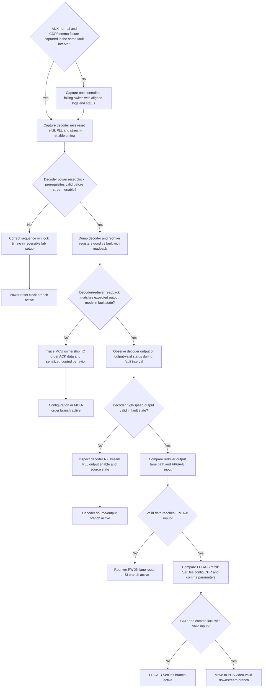

# Architecture-First Debug Decision Tree

## 1. Project Context Summary

Issue: a four-lane eDP video path is split across two FPGA receivers. The front two lanes are received by FPGA-A and are relatively stable. The rear two lanes are received by FPGA-B and intermittently show no image after video-stream switching.

Latest confirmed boundary: rear-lane AUX communication and command handshake complete normally. The direct failure symptom is still at the high-speed receive side: FPGA-B SerDes CDR does not lock, comma alignment fails or periodically misbehaves, and manual FPGA-B SerDes reset does not recover the fault.

This rerun uses the strengthened natural-language debug contract. It treats AUX-normal as a routing revision, uses `LM-EDP-DECODER-FPGA-LINK`, and makes the required deliverable explicit: evidence-aware link model, hypothesis tree with probability estimates, cost/probability ranking, action decision tree, and node table.

The working conclusion is not "decoder is proven bad." The working conclusion is narrower: if AUX is alive but CDR/comma remain dead after reset, the next highest-value boundary is whether the decoder/redriver path is producing valid high-speed data at the failing instant.

## 2. Input Cleaning Snapshot

### Raw Input Boundary

The raw input is a project issue-sync note plus follow-up clarification. It contains architecture facts, earlier suspected AUX/aux_in issues, the newer confirmation that AUX handshake is normal, observed FPGA-B receive failures, actions already tried, and proposed next steps around power timing, IIC configuration, decoder output, redriver state, and dual-core MCU control.

### Entity / Alias Normalization

| alias | normalized entity | role in model |
|---|---|---|
| front two lanes / eDP0-1 | FPGA-A comparison branch | passed or more stable comparison path |
| rear two lanes / eDP2-3 | FPGA-B failing branch | intermittent no-image branch |
| AUX | eDP sideband/control handshake | confirmed normal in latest evidence |
| IIC / I2C | MCU configuration path | writes decoder and redriver state |
| decoder | front-end eDP decoder for failing branch | must produce valid high-speed output |
| redriver | high-speed conditioning or enable path | may preserve, distort, or block decoder output |
| CDR / comma | FPGA-B receive symptoms | receiver lock/alignment indicators, not root cause by themselves |

### Cleaned Facts

| id | fact | source_in_input | confidence | affected_link_or_node |
|---|---|---|---|---|
| F1 | Four-lane eDP is split across FPGA-A front lanes and FPGA-B rear lanes | issue-sync note | high | architecture |
| F2 | Rear lanes intermittently show no image after stream switching | issue-sync note | high | data path |
| F3 | Rear-lane AUX handshake and command flow complete normally | latest clarification | high | AUX control path |
| F4 | FPGA-B SerDes CDR does not lock in the fault state | issue-sync note | high | receiver CDR |
| F5 | FPGA-B comma alignment fails or periodically misbehaves | issue-sync note | high | receiver alignment |
| F6 | Manual FPGA-B SerDes reset does not recover the fault | issue-sync note | high | FPGA receiver control |
| F7 | Earlier aux_in initial-level difference did not block command flow and weak pull-down did not solve the issue | prior investigation note | medium | stale AUX branch |
| F8 | DEV3-only behavior is worse, while DEV3 plus DEV4 improves receive behavior | prior investigation note | medium | lane/output/redriver path |

### Judgments / Revisions

| id | statement | based_on | confidence | routing impact |
|---|---|---|---|---|
| J1 | AUX-blocked is no longer the dominant branch | F3,F7 | high | demote AUX-first debug |
| J2 | CDR/comma failure is a symptom at the receiver, not yet a proven FPGA root cause | F4,F5,F6 | high | require upstream data-valid evidence |
| J3 | Decoder config, decoder power/reset/clock, decoder output, and redriver/lane path are now higher-value boundaries | F3,F4,F5,F6 | medium-high | use architecture-first link model |
| J4 | FPGA-B SerDes configuration remains possible but should move later unless valid input reaches FPGA-B | F4,F5,F6 | medium | keep as downstream hypothesis |

### Actions Already Tried

| id | action | target | result | interpretation | evidence_refs |
|---|---|---|---|---|---|
| M1 | Verified rear-lane AUX command flow | AUX control path | handshake completes | proves control handshake, not pixel-data validity | F3 |
| M2 | Manually reset FPGA-B SerDes | FPGA-B receiver | no recovery | weakens reset-only receiver-state branch | F6 |
| M3 | Applied weak pull-down around aux_in initial-level difference | AUX-related input state | no recovery | demotes stale aux_in branch | F7 |

### Router-Ready Case Brief

Architecture-first case. Rear eDP lanes fail intermittently after switching. AUX completes normally, but FPGA-B CDR and comma fail and SerDes reset does not recover. Current debug must move from AUX/handshake to evidence boundaries around decoder configuration, decoder power/reset/clock, decoder output validity, redriver/lane path integrity, and only after valid FPGA-B input is proven, FPGA-B SerDes configuration or margin.

## 3. Architecture / Link Understanding

The failure crosses at least four coupled layers:

- Control/configuration path: source switching, AUX status, MCU ownership, IIC transactions, decoder config, redriver config, FPGA SerDes reset/config.
- Power/reset/clock prerequisites: decoder rails, reset/enable timing, decoder reference clock and PLL base, redriver enable timing, FPGA-B SerDes reference clock.
- High-speed data path: source rear-lane stream, decoder receiver/core/output, redriver, PCB lane route, FPGA-B analog input.
- FPGA receive pipeline: CDR lock, comma alignment, PCS/deserializer state, video-valid/frame output.

The key architectural trap is treating "AUX ok" as "eDP ok." AUX only proves a sideband/control path. It does not prove the decoder is configured, clocked, stream-enabled, outputting the correct lane mode/rate, or that the redriver/lane path delivers valid data to FPGA-B.

## 4. Evidence-Aware Link Model

| node | layer | known evidence | unknown evidence | why it matters |
|---|---|---|---|---|
| N2 AUX handshake | control | completes normally | whether status is stale or only partial | demotes AUX-blocked but not data-output branches |
| N4 IIC write/readback | control | planned/pending | good vs fault command and readback diff | can prove config did or did not reach decoder/redriver |
| N5 decoder config/status | control/data boundary | not yet dumped in fault state | output enable, lane mode, PLL, stream-detect bits | first major boundary after AUX |
| N8-N10 decoder power/reset/clock | prerequisite | planned/pending | time-aligned rails/reset/refclk/PLL | invalid timing can leave decoder alive on AUX but dead on output |
| N14 decoder output | data | not yet proven in fault interval | high-speed output or output-valid status | cleanly splits decoder/upstream from redriver/FPGA |
| N15-N17 redriver/path/input | data path | redriver control partly checked; PWDN/path not fully bounded | redriver output and FPGA-B input activity | separates lost data path from receiver logic |
| N18-N19 CDR/comma | FPGA RX | fail in fault state | whether input is valid at N17 | symptom location, not root cause boundary |

## 5. Fact / Assumption Table

| id | type | content | confidence | evidence/link refs |
|---|---|---|---|---|
| F1 | fact | Four-lane eDP is split across two FPGA receivers | high | N12-N21 |
| F2 | fact | Rear lane group intermittently fails after stream switching | high | N1,N12-N21 |
| F3 | fact | AUX handshake completes normally | high | N2 |
| F4 | fact | FPGA-B CDR does not lock in fault state | high | N18 |
| F5 | fact | FPGA-B comma alignment fails or periodically misbehaves | high | N19 |
| F6 | fact | FPGA-B SerDes reset does not recover | high | N7,N18 |
| F7 | fact | aux_in pull-down did not solve the issue | medium | N2 |
| F8 | fact | DEV3-only versus DEV3+DEV4 behavior differs | medium | N14-N17 |
| A1 | assumption | Decoder has readable config/status bits for PLL, stream, output enable, lane mode, or equivalent state | medium | N5,N13,N14 |
| A2 | assumption | Redriver enable/PWDN/EQ state can be measured or read back | medium | N6,N15 |
| A3 | assumption | Safe probing/status methods exist for decoder output or equivalent output-valid indication | medium | N14 |
| M1 | missing | Good-state and fault-state decoder/redriver register dumps | high impact | N4-N6 |
| M2 | missing | Time-aligned power/reset/clock/IIC/status capture during failing switch | high impact | N1,N4,N8-N11,N18-N19 |
| M3 | missing | Physical or logical proof of decoder output during the fault interval | high impact | N14 |

## 6. Fault-Domain Localization

The fault boundary should now be localized by crossing from receiver symptoms backward toward the source of valid high-speed data:

1. `AUX normal` removes the easy sideband-blocked explanation.
2. `CDR/comma fail` tells us the FPGA-B receiver is not seeing a usable serial stream, but not why.
3. `SerDes reset ineffective` lowers the probability of a pure reset-state glitch and raises invalid-input, decoder-output, or prerequisite-state branches.
4. The next decisive boundary is `N14 decoder output in the same fault interval`.
5. Only if `N17 FPGA-B analog input is valid` should the debug center move to FPGA-B SerDes configuration, reference clock, margin, polarity, or comma parameters.

| domain | probability | why plausible | evidence that would raise it | evidence that would lower it |
|---|---:|---|---|---|
| Decoder config/readback not correct | 0.24 | AUX can pass while output mode, stream enable, or lane config is wrong | good/fault readback differs; re-init fixes | readback matches expected in fault |
| Decoder power/reset/clock sequence invalid | 0.18 | bad sequencing can leave control alive but output dead | reset/refclk/PLL timing violates spec | time-aligned sequence is valid |
| MCU dual-core/order race | 0.15 | intermittent switching failures often come from ownership or ordering | serialized init changes failure rate | exact same ordered writes in good/fault |
| Decoder stream/output not valid despite config | 0.15 | CDR cannot lock if decoder output is absent/wrong rate | no output-valid or no activity at N14 | valid output during fault |
| Redriver/PWDN/lane path blocks valid output | 0.11 | DEV3/DEV4 behavior and redriver/PWDN remain open | N14 valid but N17 invalid | N17 valid and clean |
| FPGA-B SerDes refclk/config/margin issue | 0.09 | direct CDR/comma failure is in FPGA-B | N17 valid while CDR/comma fail | N17 absent/invalid |
| Measurement correlation artifact | 0.05 | current evidence may not be time-aligned | aligned capture contradicts assumptions | logs/waveforms/status align |
| Downstream video pipeline only | 0.03 | possible in general but inconsistent with CDR/comma fail | CDR/comma/PCS valid but no frame | CDR/comma still fail |

## 7. Hypothesis Tree With Probabilities

| id | hypothesis | probability | first discriminating action | confirm evidence | falsify/lower evidence |
|---|---|---:|---|---|---|
| H1 | Decoder config/readback wrong | 0.24 | A4 good vs fault decoder dump | wrong mode/output enable/lane config/readback | expected readback in fault |
| H2 | Decoder power/reset/clock invalid | 0.18 | A2 time-aligned rails/reset/refclk capture | sequence or PLL/refclk invalid | sequence and clock valid before stream |
| H3 | MCU dual-core/order race | 0.15 | A5 timestamped ownership/IIC trace or serialized control | race/skipped/reordered writes; serialization improves | deterministic identical writes/readbacks |
| H4 | Decoder stream/output invalid | 0.15 | A6 observe decoder output/status in fault interval | no output activity or output-valid false | valid N14 output in fault |
| H5 | Redriver/PWDN/lane path blocks data | 0.11 | A8 compare N14 to N17 | N14 valid, N17 invalid | N17 valid |
| H6 | FPGA-B SerDes refclk/config/margin | 0.09 | A9 compare FPGA refclk/config with valid input | N17 valid but CDR/comma fail | N17 absent or invalid |
| H7 | Evidence correlation artifact | 0.05 | A1 aligned capture around one failure | observations do not overlap in time | all observations align |
| H8 | Downstream video only | 0.03 | A10 frame/video-valid after lock | CDR/comma/PCS valid but no video | CDR/comma fail |

## 8. Candidate Matching Report

| Asset | Type | Decision | Reason | Evidence Refs |
|---|---|---|---|---|
| LM-EDP-DECODER-FPGA-LINK | link_model | Adopted | Directly models AUX-normal plus CDR/comma-fail eDP decoder-to-FPGA receiver path | F2,F3,F4,F5,F6 |
| LM-VIDEO-LINK | link_model | Adopted | Parent ordering from source/decoder/receiver/downstream video | F1,F2 |
| LM-CLOCK-RESET-TREE | link_model | Adopted | Decoder and FPGA receiver prerequisites include rails/reset/refclk sequencing | M2 |
| LM-I2C-BUS | link_model | Adopted | IIC write/readback is the config-delivery proof path | M1 |
| DP-DYNAMIC-EVIDENCE-BEFORE-STATIC-RATING | debug_principle | Adopted | Switching-related intermittent fault needs aligned transient evidence | F2,M2 |
| DP-MEASUREMENT-BEFORE-DESIGN-CHANGE | debug_principle | Adopted | Decoder output and FPGA input evidence must precede parameter churn | F4,F5,F6 |
| AUX-root-cause-first heuristic | heuristic | Not Applied | AUX is currently confirmed normal | F3 |
| Downstream-video-first heuristic | heuristic | Not Applied | CDR/comma fail before downstream video | F4,F5 |

## 9. Adopted / Deferred / Not Applied

Adopted: `LM-EDP-DECODER-FPGA-LINK`, `LM-VIDEO-LINK`, `LM-CLOCK-RESET-TREE`, `LM-I2C-BUS`, `DP-DYNAMIC-EVIDENCE-BEFORE-STATIC-RATING`, `DP-MEASUREMENT-BEFORE-DESIGN-CHANGE`.

Deferred: FPGA-B SerDes tuning, equalization, comma-parameter changes, or RTL receive-path changes. They become first-class only after valid data reaches FPGA-B input.

Not Applied: AUX-first debug, repeated SerDes reset loops, downstream display/panel/framebuffer debug before receiver lock, and blind decoder parameter changes without readback/output evidence.

## 10. Cost / Probability Ranking

| node | action | p_hit | p_exclude | time_min | safety | priority_reason |
|---|---|---:|---:|---:|---|---|
| A1 | Reproduce one controlled failing switch with aligned log/scope/FPGA status | 0.05 | 0.60 | 20 | S0 | prerequisite that prevents false boundaries |
| A2 | Capture decoder rails/reset/refclk/PLL timing around switch | 0.18 | 0.45 | 30 | S1 | high value for H2 and prerequisite validity |
| A4 | Dump decoder/redriver good vs fault registers and readback | 0.24 | 0.50 | 25 | S0 | highest low-risk discriminator for H1/H3/H5 |
| A5 | Trace MCU ownership/IIC order with timestamps or run serialized control test | 0.15 | 0.40 | 40 | S0 | tests race without hardware modification |
| A6 | Observe decoder output or output-valid status during fault interval | 0.15 | 0.65 | 45 | S1 | decisive split between decoder/upstream and downstream path |
| A8 | Compare redriver output/lane path/FPGA-B input after valid decoder output | 0.11 | 0.50 | 60 | S1 | only useful after N14 is proven valid |
| A9 | Compare FPGA-B refclk/SerDes config/margin after valid input | 0.09 | 0.50 | 45 | S0 | gated behind N17 validity |

## 11. Optimal Troubleshooting Path

1. Capture one failing switch with aligned timestamps across command log, IIC, power/reset/clock, decoder status, and FPGA CDR/comma.
2. Check decoder power/reset/refclk/PLL validity before stream enable.
3. Dump decoder and redriver good-state versus fault-state registers with readback, not only writes.
4. Trace MCU ownership/order or serialize control to test race conditions.
5. Prove decoder output validity in the same fault interval.
6. If decoder output is valid, trace redriver/lane path to FPGA-B input.
7. If FPGA-B input is valid, move to FPGA-B SerDes refclk/config/margin/comma path.

## 12. Decision Tree

## 13. Node Explanation Table

| id | type | action_type | check_or_action | tool_required | expected_observation | interpretation | safety_level | cost | reversibility | next_branch | evidence_refs | p_hit | p_exclude | time_min |
|---|---|---|---|---|---|---|---|---|---|---|---|---:|---:|---:|
| D1 | decision | none | Check whether AUX-normal and CDR/comma failure are captured in the same fault interval | log/LA/FPGA status | time-aligned evidence exists | Prevents routing on stale or mismatched observations | S0 | low | n/a | A1 or A2 | F3,F4,F5 | 0.05 | 0.60 | 5 |
| A1 | action | reproduce | Capture one controlled failing switch with aligned logs and status | log LA FPGA status | one failure has aligned AUX IIC power decoder and FPGA status | Establishes reliable evidence boundary | S0 | medium | reversible | A2 | F2,F3,F4,F5 | 0.05 | 0.60 | 20 |
| A2 | action | observe | Capture decoder rails reset refclk PLL and stream-enable timing | oscilloscope and register readback | prerequisite timing is valid or invalid | Tests power reset clock branch before config churn | S1 | medium | reversible | D2 | M2,H2 | 0.18 | 0.45 | 30 |
| D2 | decision | none | Decide whether decoder power reset clock prerequisites are valid before stream enable | scope/register status | sequence passes or fails expected timing | Invalid prerequisite makes decoder-output debug premature | S1 | low | n/a | A3 or A4 | H2 | 0.18 | 0.45 | 10 |
| A3 | action | reconfigure | Correct sequence or clock timing in reversible lab setup | MCU config/scope | failure rate or status changes after timing correction | Confirms or lowers H2 without hardware change | S1 | medium | reversible | T1 | H2 | 0.18 | 0.50 | 40 |
| T1 | terminal | none | Power reset clock branch active | none | invalid prerequisite found | Continue sequence/clock fix path | S0 | low | n/a | terminal | H2 | 0.18 | 0.50 | 0 |
| A4 | action | observe | Dump decoder and redriver registers good vs fault with readback | IIC tool/LA | expected config and status match or differ | Tests H1/H3/H5 before physical probing | S0 | medium | reversible | D3 | M1,H1,H3,H5 | 0.24 | 0.50 | 25 |
| D3 | decision | none | Decide whether decoder/redriver readback matches expected output mode in fault state | IIC tool | readback matches expected mode or exposes delta | Bad readback points to config/order branch | S0 | low | n/a | A5 or A6 | H1,H3,H5 | 0.24 | 0.50 | 10 |
| A5 | action | isolate | Trace MCU ownership IIC order ACK data and serialized-control behavior | MCU log/LA | core owner, order, ACK/data, and serialized outcome are known | Confirms or lowers MCU race/config delivery branch | S0 | medium | reversible | T2 | H1,H3 | 0.15 | 0.40 | 40 |
| T2 | terminal | none | Configuration or MCU-order branch active | none | readback/order evidence explains fault | Continue controlled config/state-machine fix path | S0 | low | n/a | terminal | H1,H3 | 0.24 | 0.40 | 0 |
| A6 | action | observe | Observe decoder output or output-valid status during fault interval | scope/status register | decoder output is valid or absent | Decisive split between decoder/upstream and downstream path | S1 | high | reversible | D4 | H4 | 0.15 | 0.65 | 45 |
| D4 | decision | none | Decide whether decoder high-speed output is valid in fault state | scope/status register | output present at expected mode/rate or absent | Missing output keeps fault upstream of redriver/FPGA | S1 | medium | n/a | A7 or A8 | H4,H5,H6 | 0.15 | 0.65 | 10 |
| A7 | action | observe | Inspect decoder RX stream PLL output enable and source state | status register/scope | source stream, PLL, and output enable states are known | Localizes H4 to source, decoder RX/core, or output enable | S1 | medium | reversible | T3 | H4 | 0.15 | 0.50 | 35 |
| T3 | terminal | none | Decoder source/output branch active | none | decoder output invalid | Continue decoder/source status and mode-table investigation | S0 | low | n/a | terminal | H4 | 0.15 | 0.50 | 0 |
| A8 | action | isolate | Compare redriver output lane path and FPGA-B input | scope/schematic/FPGA input status | valid output is preserved or lost before FPGA-B | Tests redriver PWDN lane route and SI branch | S1 | high | reversible | D5 | H5,F8 | 0.11 | 0.50 | 60 |
| D5 | decision | none | Decide whether valid data reaches FPGA-B input | scope/FPGA status | valid activity reaches N17 or is lost earlier | Splits lane path from FPGA receiver branch | S1 | medium | n/a | T4 or A9 | H5,H6 | 0.11 | 0.50 | 10 |
| T4 | terminal | none | Redriver PWDN lane route or SI branch active | none | decoder output valid but FPGA-B input invalid | Continue redriver/path/SI investigation | S0 | low | n/a | terminal | H5,F8 | 0.11 | 0.50 | 0 |
| A9 | action | observe | Compare FPGA-B refclk SerDes config CDR and comma parameters | FPGA status/JTAG/ILA | refclk/config/status differences are known | Tests receiver branch only after valid input is proven | S0 | medium | reversible | D6 | H6,F4,F5,F6 | 0.09 | 0.50 | 45 |
| D6 | decision | none | Decide whether CDR and comma lock with valid input | FPGA status | lock/alignment succeed or fail | Failure with valid input promotes H6 | S0 | medium | n/a | T5 or T6 | H6 | 0.09 | 0.50 | 10 |
| T5 | terminal | none | FPGA-B SerDes branch active | none | valid input reaches FPGA-B but CDR/comma fail | Continue FPGA refclk/config/margin/polarity debug | S0 | low | n/a | terminal | H6 | 0.09 | 0.50 | 0 |
| T6 | terminal | none | Move to PCS video-valid downstream branch | none | CDR and comma lock with valid input | Downstream-only debug is now justified | S0 | low | n/a | terminal | H8 | 0.03 | 0.40 | 0 |

## 14. Missing Architecture Information

- Decoder part number, register map, PLL lock/status bits, stream-detect bits, output-enable bits, and lane mode fields.
- Redriver part number, PWDN/enable polarity, EQ/polarity settings, readback capability, and exact lane topology.
- MCU switch-flow trace with core ownership, command order, delay points, and IIC ACK/data timestamps.
- Good-state and fault-state dumps for decoder, redriver, and FPGA-B SerDes status.
- Safe measurement points or indirect status alternatives for decoder output, redriver output, and FPGA-B input.
- Whether DEV3/DEV4 behavior follows lane enable, output mode, redriver channel enable, or FPGA receiver grouping.

## 15. Next 3-5 Actions

1. Capture one controlled failing switch with aligned AUX/IIC logs, decoder power/reset/refclk/PLL status, decoder output status, and FPGA-B CDR/comma status.
2. Dump decoder and redriver registers in good state and fault state; compare readback, not only write intent.
3. Serialize or swap MCU control ownership for the rear path and compare failure rate plus register readback.
4. Prove decoder high-speed output or output-valid status during the same fault interval.
5. If decoder output is valid, measure redriver output/lane path/FPGA-B input before any FPGA-B SerDes tuning.

## 16. Stop / Escalation Conditions

- Stop using AUX-first debug while AUX continues to complete normally.
- Stop repeating SerDes reset as the main experiment until decoder output or FPGA-B input validity is proven in the same fault interval.
- Stop changing decoder, redriver, or FPGA SerDes parameters unless the change maps to a hypothesis and has expected pass/fail evidence.
- Escalate to decoder vendor/schematic review if config, rails, reset, and refclk are correct but decoder output is absent.
- Escalate to board/SI review if decoder output is valid but FPGA-B input is invalid.
- Escalate to FPGA SerDes owner if valid data reaches FPGA-B input and CDR/comma still fail.

## 17. Retrospective Trigger

Run retrospective when one boundary is proven by evidence: decoder config/readback fault, power/reset/clock prerequisite violation, MCU ordering race, decoder stream/output invalidity, redriver/lane path loss, FPGA-B SerDes failure with valid input, or downstream-only video failure after receiver lock is restored.
