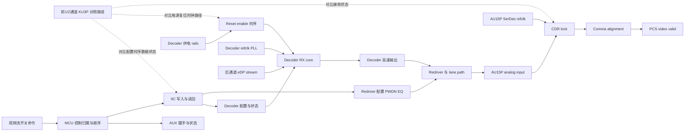
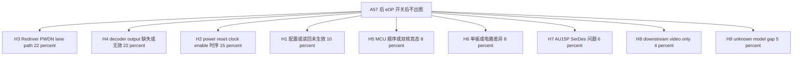
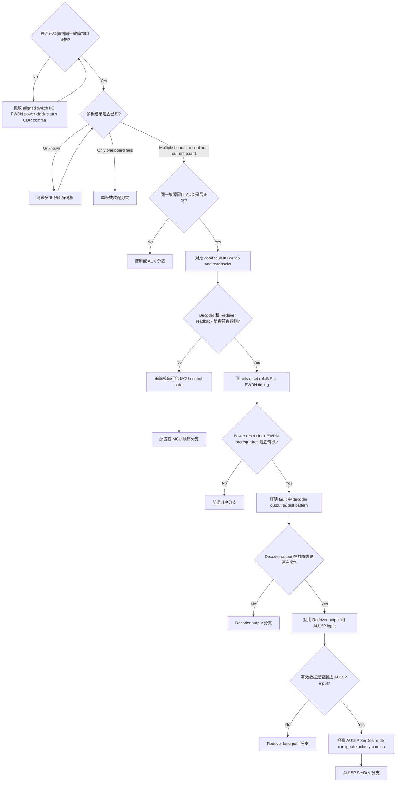

# Architecture-First Debug Decision Tree

## 1. Project Context Summary

案子：A57 项目，984 解码板，eDP 后两通道概率性不出图。

选用模式：Architecture-First。这个案子同时涉及软件控制、AUX/IIC 配置、上电/复位/时钟时序、解码芯片输出、Redriver/链路路径状态，以及 AU15P FPGA SerDes 接收状态。当前没有要求使用 my-wiki、联网学习或相似案例扩展，因此本轮只基于已清洗输入、现有 DebugTool 资产和显式假设。

当前工程边界：

- 前 1、2 通道已有 1000 次开关视频流测试结果，未报告不出图问题。
- 后两通道是否属于共性问题尚未证明，因为现有讨论明确指出当前结论只基于 1 块板。
- 最新证据表明后两通道 AUX 握手和命令读写流程能正常走完。
- 直接异常仍在 AU15P 接收侧：SerDes CDR 不锁、comma 对齐失败或周期性异常，手动复位 SerDes 不恢复。
- 因此当前不应直接下 root cause 结论。最有价值的下一步是证明故障态下后级 decoder / Redriver / AU15P input 哪一段仍有有效高速数据。

## 2. Input Cleaning Snapshot

### 已确认事实

| id | fact | source | confidence | affected boundary |
|---|---|---|---|---|
| F1 | A57 项目正在排查 eDP 后两通道不出图或输出异常 | 用户案子背景 | high | 项目范围 |
| F2 | 相关板卡为 984 解码板 | 用户案子背景 | high | 板卡范围 |
| F3 | 1、2 通道开关视频流测试 1000 次，未发现问题 | 吴志安 09:03 聊天记录 | high | 前通道对照 |
| F4 | 当前结论基于 1 块板，吴锋要求多测几块确认是否共性 | 吴锋 11:07 聊天记录 | high | 样本边界 |
| F5 | 上午讨论形成 5 项排查：多板测试、前后 IIC 指令对比、decoder 寄存器读回、eDP 上电时序、前后 SerDes 电路差异 | 吴志安 09:24 聊天记录 | high | 行动基线 |
| F6 | 邱永恒提醒需要对比 Redriver 控制 | 邱永恒 09:25 聊天记录 | high | Redriver 控制 |
| F7 | Candy / 罗奇军反馈 Redriver 控制波形已经抓过，控制一致 | Candy / 罗奇军 09:25 聊天记录 | high | Redriver 控制 |
| F8 | Candy / 罗奇军补充 Redriver PWDN 也需要检查 | Candy / 罗奇军 09:37 聊天记录 | high | Redriver 使能 |
| F9 | Candy / 罗奇军称手册显示 Redriver PWDN 为拉低使能 | Candy / 罗奇军 09:37 聊天记录 | medium | Redriver 使能极性 |
| F10 | Redriver PWDN 板上实际电平和时序尚未提供 | 聊天记录缺失项 | high | Redriver 使能 |
| F11 | 最新讨论称后两通道 AUX 握手和命令读写正常 | 最新 issue 同步信息 | high | AUX sideband |
| F12 | 最新讨论称 AU15P SerDes CDR 在故障态不能锁定 | 最新 issue 同步信息 | high | FPGA 接收侧 |
| F13 | 最新讨论称 comma 对齐失败或周期性异常 | 最新 issue 同步信息 | high | FPGA 接收侧 |
| F14 | 最新讨论称手动复位 AU15P SerDes 无改善 | 最新 issue 同步信息 | high | FPGA 接收复位 |
| F15 | 之前发现 aux_in 初始电平差异，尝试弱下拉未解决 | 前期 issue context | medium; requires_re_verification | stale AUX/电平分支 |
| F16 | DEV3 单独勾选时更差，DEV3+DEV4 同时勾选时接收有所改善 | 前期 issue context | medium | 后通道 lane/path 行为 |

### 判断，不是事实

| id | judgment | basis | confidence | could change if |
|---|---|---|---|---|
| J1 | AUX 已不应作为当前主攻分支 | F11; F15 仅作为待复核背景 | high | 同一故障窗口发现 AUX retry、NACK、stale read 或链路训练状态失败 |
| J2 | CDR/comma failure 是接收侧症状，不等于 FPGA root cause 已确认 | F12,F13,F14 | high | 已证明 AU15P input 有有效高速数据但 CDR/comma 仍失败 |
| J3 | decoder 配置、power/reset/clock、decoder 输出、Redriver/PWDN、lane path 是更高价值边界 | F11,F12,F13,F14 | medium-high | decoder output 与 AU15P input 在故障态都被证明有效 |
| J4 | Redriver 控制波形一致不能完全排除 Redriver，因为 PWDN 与输入/输出活动仍未闭合 | F7,F8,F10 | high | 故障态实测 PWDN 正确，Redriver input/output 均正确 |
| J5 | 不能把问题判定为共性问题 | F4 | high | 多板测试稳定复现同样后通道异常 |
| J6 | decoder 未输出有效数据是强假设，不是已确认 root cause | F11,F12,F13,F14 | high | decoder 输出或状态在故障态证明 absence/invalidity |

### 已尝试方法

| id | action | result | interpretation |
|---|---|---|---|
| M1 | 前 1、2 通道开关视频流测试 1000 次 | 未报告问题 | 作为前通道对照，不证明后通道 root cause |
| M2 | 抓取 Redriver 控制波形 | 报告控制一致 | 降低“普通控制差异”分支，但不覆盖 PWDN/output |
| M3 | 核对后通道 AUX 握手 | 报告正常 | 降低 AUX-first 分支优先级 |
| M4 | 手动复位 AU15P SerDes | 无改善 | 降低“纯接收复位状态异常”分支 |
| M5 | 对 aux_in 做弱下拉尝试 | 未解决 | 降低 aux_in 初始电平作为主因的可能 |

## 3. Architecture / Link Understanding

当前 link model 必须是分层模型，不是线性“源头到屏”的单线模型：

1. 控制/配置链路：视频流开关命令、MCU core ownership、AUX 状态、IIC 写入/读回、decoder 配置、Redriver 配置、FPGA SerDes reset/config。
2. 上电/复位/时钟前提：decoder rails、reset/enable 时序、decoder refclk/PLL、Redriver PWDN 或 enable、AU15P SerDes refclk。
3. 主数据产生与路径：AP/source 后 eDP stream、decoder receiver/core/output、Redriver、lane routing/polarity/termination/SI、AU15P analog input。
4. FPGA 接收链路：CDR lock、comma alignment、PCS/deserializer、video-valid/frame output。
5. 对照轴：前 1/2 vs 后 3/4、good state vs fault state、单板 vs 多板、DEV3-only vs DEV3+DEV4。

关键提醒：AUX 正常只证明 sideband path 正常，不证明后通道 pixel-data output、decoder PLL/output enable、Redriver enable、lane activity 或 AU15P input quality 正常。

## 4. Evidence-Aware Link Model

| node | input | output | control signals | observable evidence | failure modes | downstream impact |
|---|---|---|---|---|---|---|
| C1 视频流开关命令 | 操作者或 AP switch event | 命令时间戳 | stream on/off command | 命令日志 | 重复开关竞态、命令顺序错误 | 影响所有下游时序判断 |
| C2 MCU 控制归属与顺序 | firmware state、core ownership | AUX/IIC/reset 操作 | core1/core2 ownership、delay sequencing | 带时间戳 firmware log | 双核竞态、漏写、操作重排 | decoder 或 Redriver 状态错误 |
| C3 AUX 握手与状态 | AUX 物理路径和命令 | AUX ACK/status | AUX enable、link-training command | AUX transaction log、DPCD/status read | stale status、partial status、training-state mismatch | 若被当作 data-valid proof 会误导 |
| C4 IIC 写入与读回 | MCU IIC transaction | decoder 与 Redriver config state | IIC SCL/SDA、device address、write order | 逻辑分析仪、readback table | 地址错误、漏写、写入不保持、读回不一致 | decoder 或 Redriver output 错误 |
| C5 decoder 配置与状态 | IIC register writes | decoder mode、output enable、lane rate | reset、enable、mode bits | good/fault register dump | output disabled、lane mode 错、stream 未检测 | D3 无有效输出 |
| C6 Redriver 配置 PWDN EQ | IIC/GPIO/manual control | Redriver enabled path | PWDN、EQ、mux、enable | PWDN voltage、control waveform、readback | PWDN 错、EQ 错、path disabled | D4 阻断或劣化数据 |
| P1 decoder 供电 rails | board power tree | 有效供电 rails | power enable、PG | scope waveform | rail droop、late rail、ramp 不稳定 | decoder 控制可通但输出无效 |
| P2 reset enable 时序 | reset 与 enable nets | decoder core release | reset、PWDN、enable | time-aligned waveform | 顺序错误、delay 过短、状态机卡住 | 配置或输出状态异常 |
| P3 decoder refclk PLL | oscillator/refclk | decoder clock 与 PLL lock | clock enable | clock waveform、PLL lock bit | clock 缺失、PLL unlock、频率错误 | decoder 无法输出有效数据 |
| D1 后通道 eDP stream | AP/source stream | 后 lane eDP input | stream enable | source status、lane activity | 无 stream、rate 错、lane count mismatch | decoder 没有有效输入 |
| D2 decoder RX core | D1、配置、clock | decoded stream state | mode/registers | stream detect、PLL/status bits | stream 未检测、mode 错 | D3 缺失或无效 |
| D3 decoder 高速输出 | decoded stream 与 output formatter | 到 Redriver 的高速输出 | output enable、lane mode | output-valid bit、scope、test pattern | 无输出、rate 错、lane mapping 错 | AU15P CDR 无法锁定 |
| D4 Redriver 与 lane path | D3 output | 调理后的 lane signal | PWDN、EQ、mux | input/output activity、eye/activity、PWDN | path disabled、polarity/lane/SI 问题 | D5 无效 |
| D5 AU15P analog input | board lane signal | SerDes analog input | termination、polarity | near-FPGA activity/eye、AC coupling | 信号缺失、polarity 错、SI margin 差 | R1 失败 |
| R1 CDR lock | D5 + refclk | recovered clock lock | SerDes reset/config | CDR lock bit | 无有效输入、refclk 异常、rate 错 | R2 无法对齐 |
| R2 comma alignment | recovered serial data | aligned stream | comma config | comma/align status | encoding/lane/rate 错、数据无效 | PCS/video invalid |
| R3 PCS video valid | aligned stream | valid video/frame | PCS/video logic | counters、video-valid | 只有 R1/R2 正常后才进入 downstream 判断 | no image |

### Link Evidence Boundary Table

| node | known | inferred | unknown | evidence that moves boundary |
|---|---|---|---|---|
| F0 前 KU3P 对照路径 | 前 1/2 通道 1000 次开关测试通过；这是 reference_axis 虚拟节点，不是失效链路节点 | 前通道是有价值对照基线 | 前后 config、power timing、Redriver path、FPGA receive setup 是否真正对称 | 前后 command、waveform、circuit、receiver-status 对比 |
| C1 视频流开关命令 | switch-flow 是触发场景 | 开关顺序可能暴露 transient state | 后通道准确失败次数和触发时刻 | 带 pass/fail 标记的 aligned command log |
| C2 MCU 控制归属与顺序 | 双核控制变量被提出验证 | order/ownership 会影响 IIC、reset、enable state | 前后通道 core ownership 是否不同 | timestamped MCU log 或 serialized-control experiment |
| C3 AUX 握手与状态 | 后通道 AUX 报告正常 | AUX 不能证明 pixel data 有效 | AUX status 是否来自同一故障窗口 | same-interval AUX log 与 status readback |
| C4 IIC 写入与读回 | IIC 对比是计划项 | intended writes 可能不同于 persistent chip state | good/fault readback values 与 write ordering | 前后、good/fault write/readback table |
| C5 decoder 配置与状态 | decoder 寄存器读回是计划项 | output mode 错或 output disabled 可导致 AUX alive data dead | stream-detect、PLL、output-enable、lane-mode bits | decoder good/fault register dump |
| C6 Redriver 配置 PWDN EQ | 控制波形报告一致，PWDN 仍未闭合 | 不能因 generic control sameness 排除 Redriver | PWDN、EQ、mux、output state 是否被覆盖 | PWDN waveform + Redriver input/output evidence |
| P1 decoder rails | power timing measurement 是计划项 | 控制可通但输出 rail/ramp 可能边缘 | switch 期间 rail ramp、droop、sequencing | 带 timing markers 的 scope capture |
| P2 reset enable 时序 | reset/enable sequence 是待查硬件分支 | 顺序错误可导致持续 output invalid | reset width、release order、与 config writes 的关系 | aligned reset/enable/IIC/status capture |
| P3 decoder refclk PLL | decoder output 依赖 clock/PLL | CDR failure 可能源于 AU15P 之前 | fault 中 clock frequency、stability、PLL status | refclk waveform 与 PLL/readback status |
| D1 后通道 eDP stream | source-side rear stream 尚未证明 | source stream 缺失会伪装成 decoder/path fault | fault 中 source lane activity/rate | source-side status 或 decoder stream-detect evidence |
| D2 decoder RX core | decoder 被怀疑但未证明 | RX core 可能配置成功但不输出有效数据 | stream detect 与 internal error state | status bits、counters 或 test-pattern split |
| D3 decoder 高速输出 | 故障态未测 | output 缺失/无效可解释 AU15P CDR/comma failure | output activity、rate、lane mode、test-pattern behavior | decoder output measurement 或 output-valid status |
| D4 Redriver 与 lane path | generic control sameness 已报告 | PWDN/path/SI 仍可能阻断数据 | DEV3/DEV4 选择下 Redriver output 与 lane mapping | PWDN、EQ/mux、input/output、lane/polarity 对比 |
| D5 AU15P analog input | AU15P 报告 CDR/comma failure | receiver failure 可能由输入无效引起 | 有效数据是否到达 AU15P pin | near-FPGA activity/eye/status proxy |
| R1 CDR lock | 故障态失败 | CDR failure 是症状，不是 root cause | input 有效时 refclk/config 是否有效 | 有效 D5 之后检查 AU15P refclk/config |
| R2 comma alignment | 失败或异常 | invalid encoding/lane/rate 可导致 no video | comma config 是否匹配 incoming stream | 有效 input/rate 后检查 comma status |
| R3 PCS video valid | no image 是下游结果 | R1/R2 未通过前 downstream-only 分支优先级低 | PCS/video counters 是否曾有效 | R1/R2 pass 后看 counters |

## 5. Fact / Assumption Table

| id | type | content | confidence | evidence_refs |
|---|---|---|---|---|
| F1 | fact | A57 984 解码板后 eDP 通道是当前故障焦点 | high | input cleaning |
| F2 | fact | 前 1、2 通道开关视频流测试 1000 次正常 | high | 吴志安 09:03 |
| F3 | fact | 当前结论受限于单板样本 | high | 吴锋 11:07 |
| F4 | fact | 后通道 AUX handshake 报告正常 | high | latest issue-sync |
| F5 | fact | AU15P CDR 和 comma 在故障态失败 | high | latest issue-sync |
| F6 | fact | 手动 AU15P SerDes reset 不恢复 | high | latest issue-sync |
| F7 | fact | Redriver 控制波形报告一致 | high | Candy 09:25 |
| F8 | fact | Redriver PWDN 板级实际状态未提供 | high | absence from chat |
| F9 | documented claim | Redriver 手册称 PWDN 为拉低使能 | medium | Candy 09:37 |
| A1 | assumption | decoder 有 stream detect、PLL、output enable、lane mode 或类似状态位 | medium | device-dependent |
| A2 | assumption | Redriver PWDN 与 output activity 可在故障态安全测量 | medium | board-dependent |
| A3 | assumption | AU15P CDR/comma 状态来自 no-image 同一时间窗口 | medium | needs aligned capture |
| A4 | assumption | 前通道结果可作为 switching stress 对照基线 | medium-high | F2 |
| A5 | assumption | 第一轮 debug strategy 不需要外部知识 | medium | this rerun default |

## 6. Fault-Domain Localization

### Root Cause Hypothesis Probability Table

以下概率是证据不完整时的工程先验，不是精确统计。这里为行动排序做了归一化；真实系统中多个机制可能重叠。修订后的排序遵循“直接物理症状最简解释优先”：AU15P CDR/comma 失败且 SerDes reset 无效，首先指向 AU15P input 之前没有有效高速数据，因此 H3/H4 进入 top two。

| id | root-cause hypothesis | probability | why it is plausible now | evidence that raises it | evidence that lowers it |
|---|---:|---|---|---|---|
| H3 | Redriver PWDN、enable、EQ、mux、lane selection 或物理路径阻断有效数据 | 0.22 | 最接近 AU15P input 的物理路径边界，且 F16 的 DEV3-only vs DEV3+DEV4 差异指向 selection/path dependency | D3 有效但 D5 无效、PWDN 未按要求拉低、Redriver output 缺失、DEV selection 改变边界、F16 可复现 | PWDN 正确且 D5 在故障态有效 |
| H4 | decoder 尽管控制看似正常，但输出缺失或无效 | 0.22 | CDR/comma 不锁且 SerDes reset 无效，最简解释之一是 AU15P 前级没有有效高速数据 | 无 decoder output activity、output-valid false、test pattern fail | 同一故障窗口 decoder output 有效 |
| H2 | 后通道 decoder power/reset/clock/enable 时序导致 output path 无效 | 0.15 | control path 可活着，但 output PLL/core 未 ready | rail/reset/refclk/PWDN timing 违反规格或不同于前通道 | aligned timing 与 PLL status 干净 |
| H1 | 后通道 decoder 或 Redriver 配置未正确下发，或开关后未保持 | 0.10 | AUX 可正常，但 output mode 或 lane config 仍可能错误；但它比 D3/D4/D5 物理边界更远 | fault readback 不同、output enable 缺失、串行化写入后恢复 | good/fault readback 均符合预期 |
| H5 | MCU 双核归属或命令顺序在开关视频流时产生竞态 | 0.08 | 间歇性 switch-flow failure 可能来自 ordering | timestamped log 显示 race、serialized control 改变失败率 | good/fault ordered writes 与 readbacks 一致 |
| H6 | 单板装配或后通道电路差异 | 0.08 | 当前结论只来自 1 块板 | 多板测试只有 1 块失败，或电路/测量发现本板差异 | 多块板稳定复现相同 signature |
| H7 | AU15P SerDes refclk、配置、polarity、rate 或 margin 问题 | 0.06 | 直接症状在 CDR/comma，但必须等 D5 input 有效后才上调 | D5 input 有效但 CDR/comma 仍 fail，refclk/config 与前通道不同 | D5 input 缺失或无效 |
| H8 | PCS 之后 downstream video pipeline 问题 | 0.04 | 一般显示故障中仍可能存在 | CDR/comma/PCS 全有效但无 frame/video | CDR/comma 仍失败 |
| H9 | unknown / model gap：当前 link model 漏掉某层或某个耦合机制 | 0.05 | 架构信息不完整，且存在 DEV selection 相关线索 | 前述 H1-H8 都被排除但故障仍存在，或出现未建模 thermal/SI/ownership coupling | 新证据能完整落入 H1-H8 之一 |

## 7. Hypothesis Tree With Probabilities

| branch | current state | first falsifier |
|---|---|---|
| H1 | 中优先级；需要 readback，但不是最接近 CDR/comma fail 的物理边界 | good/fault readbacks 均符合预期 |
| H2 | 高优先级，因为 output prerequisite 未测 | rails/reset/refclk/PWDN/PLL aligned waveform 干净 |
| H3 | top-2；PWDN/output activity 未完成，且 F16 selection-dependent 线索支持 path 分支 | Redriver enabled 且有效信号到达 AU15P input |
| H4 | top-2；decoder output 未证明，且最简物理解释之一是前级无有效高速数据 | 故障态 decoder output/test pattern 有效 |
| H5 | 开放，因为双核控制变量被明确提出验证 | serialized/single-core control 不改变失败且 logs 一致 |
| H6 | 开放，因为样本量只有 1 块板 | 多板复现同一 signature |
| H7 | 暂缓，直到证明 AU15P input 有效 | AU15P input 缺失或无效 |
| H8 | 低优先级，因为 CDR/comma 仍失败 | receiver lock pipeline 仍异常 |
| H9 | 保留小概率 model-gap，避免把答案强行限制在当前 8 个分支内 | H1-H8 已覆盖新证据 |

## 8. Candidate Matching Report

| asset | type | decision | reason | evidence_refs |
|---|---|---|---|---|
| assets/link_models/LM-EDP-DECODER-FPGA-LINK.yaml | link_model | Adopted | 直接匹配：AUX/IIC 可正常，但 CDR/comma/video-valid 可失败 | F4,F5,F6 |
| assets/link_models/LM-VIDEO-LINK.yaml | link_model | Adopted | 保留 source/decoder/receiver/downstream 分层 | F1,F5 |
| assets/link_models/LM-CLOCK-RESET-TREE.yaml | link_model | Adopted | power/reset/clock timing 是核心待查分支 | H2 |
| assets/link_models/LM-I2C-BUS.yaml | link_model | Adopted | 需要 IIC write/readback 对比，不能只相信 write intent | H1,H5 |
| assets/debug_principles/DP-DYNAMIC-EVIDENCE-BEFORE-STATIC-RATING.yaml | debug_principle | Adopted | switch fault 需要 time-aligned dynamic evidence | F5,F6 |
| assets/debug_principles/DP-MEASUREMENT-BEFORE-DESIGN-CHANGE.yaml | debug_principle | Adopted | 调 SerDes 或改 FPGA logic 前先测 output/input | H4,H7 |
| Knowledge-Linked point check: PWDN polarity | mode | Adopted | F9 只是聊天转述的手册 claim，低成本 datasheet 点查可将 medium confidence 升到 high | F9,H3 |
| Knowledge-Linked broad exploration | mode | Deferred | 用户未显式要求，且首轮动作不依赖广泛 web/wiki | A5 |
| Similar-problem expansion | mode | Deferred | 若第一轮模型停滞可用，但不应早于板级测量 | A5 |
| AUX-first debug | heuristic | Not Applied | AUX 报告正常，weak pull-down 未解决 | F4,F15 |
| downstream-video-first debug | heuristic | Not Applied | CDR/comma failure 在 downstream video 之前 | F5 |

## 9. Adopted / Deferred / Not Applied

Adopted：

- Architecture-First mode。
- 多层 eDP decoder-to-FPGA receiver link model。
- 输入清洗纪律：facts、judgments、methods、pending results、missing data 分开。
- 当前证据权重：AUX 正常会降低 stale AUX-first branch。

Deferred：

- my-wiki 或 web 的 Knowledge-Linked retrieval。
- Similar-problem expansion。
- 在证明 AU15P input 有效前，暂缓 AU15P SerDes tuning、equalization、comma 参数、RTL/constraint 修改。

Not Applied：

- 不直接下结论说 decoder 已证明异常。
- 不因为一次 Redriver control waveform 一致就说 Redriver 已排除。
- 不把单板现象判定为共性问题。
- 不重复执行无新假设的手动 SerDes reset。

## 10. Cost / Probability Ranking

本表使用 `reasoning/cost_priors.yaml` 的经验中位数，并按 Architecture-First 模式的 `exclude_weight = 0.7` 计算。分数用于排序参考；若存在依赖关系，§11 的执行路径可以覆盖单项 score。

| action_id | action | primary hypotheses | p_hit | p_exclude | time_min | safety | priority_score | reason |
|---|---|---|---:|---:|---:|---|---:|---|
| A3 | 对比 good vs fault 的后通道 decoder/Redriver IIC writes 与 readbacks | H1,H5 | 0.22 | 0.55 | 30 | S0 | 0.020 | 快速区分配置保持和命令送达问题 |
| A5 | 证明故障态 decoder 高速输出、output-valid 或 test-pattern 行为 | H4,H1,H2 | 0.20 | 0.70 | 75 | S1 | 0.009 | 关键切分 decoder side 与 downstream path |
| A4 | 开关过程中测 decoder rails、reset、refclk、PLL/status、Redriver PWDN | H2,H3 | 0.24 | 0.60 | 90 | S1 | 0.007 | 高价值 prerequisite proof，但多信号测量成本高 |
| A1 | 抓一次受控失败的开关过程，时间对齐 command、IIC、PWDN、power、clock、decoder status、AU15P CDR/comma | H1,H2,H5,H7 | 0.18 | 0.70 | 120 | S0 | 0.006 | 防止 stale-state 和错误时序推断；受多仪器对齐成本影响 |
| A6 | 在 decoder output 证明有效后，对比 Redriver output 与 AU15P analog input | H3,H7 | 0.14 | 0.55 | 90 | S1 | 0.006 | 受 decoder output 有效性 gating |
| A8 | 检查 AU15P refclk、SerDes config、rate、polarity、reset sequence、comma settings | H7 | 0.07 | 0.45 | 75 | S0 | 0.005 | 应等待 D5 input validity 被证明 |
| A2 | 执行多块 984 解码板 reproduction matrix | H6 | 0.10 | 0.65 | 120 | S0 | 0.005 | 判断共性必要，但比本地边界测量更慢 |
| A7 | 对前后通道控制强制 serialized 或交换 MCU core control | H5 | 0.12 | 0.45 | 120 | S0 | 0.004 | 验证 proposed dual-core variable |

### Hypothesis To Action Mapping Table

| hypothesis | first action | second action | stop condition for branch |
|---|---|---|---|
| H1 config/readback issue | A3 | A7 | good/fault states readback 符合预期 |
| H2 power/reset/clock issue | A4 | A1 | aligned waveform 与 PLL/status 干净 |
| H3 Redriver/PWDN/path issue | A4 | A6 | PWDN 正确且 AU15P input 有效 |
| H4 decoder output invalid | A5 | A3/A4 | fault 中 decoder output 或 test pattern 有效 |
| H5 MCU order race | A1 | A7 | serialized control 不改变失败且 logs 一致 |
| H6 single-board issue | A2 | circuit/assembly inspection | 多板复现相同 signature |
| H7 AU15P SerDes issue | A8 | AU15P front/rear config comparison | AU15P input 缺失或无效 |
| H8 downstream video only | receiver status/counters after lock | video pipeline check | CDR/comma/PCS 仍失败 |
| H9 unknown/model gap | REVIEW + link model update | Knowledge-Linked point/broad check if needed | 新证据能落入 H1-H8 或补齐缺失层 |

## 11. Optimal Troubleshooting Path

1. 首先抓一次 time-aligned failing capture。必须包含 stream switch command、IIC write/readback、Redriver PWDN、decoder power/reset/refclk/PLL/status、AU15P CDR/comma。
2. 如果资源允许，同步扩大样本量，多测几块 984 解码板。没有 matrix 前不要说这是共性问题。
3. 对比前/后通道、good/fault 的 IIC commands 与 readbacks。只看 writes 不够，readback 更关键。
4. 在同一故障态测 decoder output 或 output-valid/test-pattern。
5. 只有 decoder output 有效时，才继续比较 Redriver output、lane path、AU15P input。
6. 只有 AU15P input 有效时，才把 AU15P SerDes config/refclk/rate/polarity/comma 提升为首要分支。

累计成本估算：若按依赖路径走到 AU15P SerDes 分支，A1 + A3 + A4 + A5 + A6 + A8 的标称成本约为 580 min；若 A3/A4/A2 可并行，现场日程约 6-10 小时更现实。多板矩阵 A2 可与 A1/A3 并行启动，不应阻塞同板边界测量。

## 12. Decision Tree

## 13. Node Explanation Table

| id | type | action_type | check_or_action | tool_required | expected_observation | interpretation | safety_level | cost | reversibility | next_branch | evidence_refs |
|---|---|---|---|---|---|---|---|---|---|---|---|
| D1 | decision | none | 检查 command、IIC、PWDN、power、clock、decoder status、AU15P CDR/comma 是否来自同一故障窗口 | log plus scope plus FPGA status | yes or no | 若没有同一窗口数据，容易形成 stale conclusion | S0 | low | n/a | A1 or D2 | F11,F12,F13 |
| A1 | action | observe | 抓取 aligned switch、IIC、PWDN、power、clock、status、CDR、comma 证据 | oscilloscope, logic analyzer, FPGA status log | 一次带时间戳的 failing switch | 确定哪个边界最先变化 | S0 | medium | reversible | D1 | H1,H2,H5,H7 |
| D2 | decision | none | 检查多板复现状态是否已知 | test matrix | unknown, one-board only, or multiple-board reproduction | 防止把单板问题过度泛化为共性问题 | S0 | low | n/a | A2 or T1 or D3 | F3,F4 |
| A2 | action | reproduce | 在相同 switching 条件下测试多块 984 解码板 | test bench and logging | 每块板 pass/fail table | 区分共性设计/软件问题和单板问题 | S0 | high | reversible | D2 | H6 |
| T1 | terminal | none | 暂按单板或装配分支分类，直到证据反驳 | inspection and board comparison | only one board fails | 优先看装配、连接器、本地路径、器件差异 | S0 | low | n/a | terminal | H6 |
| D3 | decision | none | 确认 AUX 正常来自同一故障窗口，而非另一轮运行 | AUX log or analyzer | normal or abnormal | AUX 异常则重新打开 control branch | S0 | low | n/a | T2 or A3 | F11 |
| T2 | terminal | none | 重新打开 control 或 AUX 分支 | AUX tool and status readback | AUX fails or status stale | 先做 control-bus debug，再做 data-path assumption | S0 | medium | n/a | terminal | F11 |
| A3 | action | observe | 对比前/后、good/fault 的 decoder 和 Redriver IIC writes plus readbacks | logic analyzer and register dump | same or different write/readback table | 找 missing writes、wrong address、non-persistent config、stale readback | S0 | medium | reversible | D4 | H1,H5 |
| D4 | decision | none | 判断故障态 decoder 和 Redriver readbacks 是否匹配预期 output mode | register dump | match or mismatch | mismatch 指向 config 或 MCU ordering | S0 | low | n/a | A7 or A4 | H1,H5 |
| A7 | action | reconfigure | 追踪 MCU ownership/IIC order，或运行 serialized/single-core control test | firmware log or controlled firmware option | race found or failure rate changes | 确认或降低 dual-core/order hypothesis | S0 | medium | reversible | T3 | H5 |
| T3 | terminal | none | 配置或 MCU-order 分支激活 | firmware trace | reordered, skipped, or non-persistent config | 先修 command ownership/order，再继续硬件 probing | S0 | low | n/a | terminal | H1,H5 |
| A4 | action | observe | 开关期间测 decoder rails、reset、refclk、PLL/status、Redriver PWDN timing | oscilloscope and register status | valid or invalid prerequisite timing | 确认或降低 power/reset/clock/PWDN 分支 | S1 | medium | reversible | D5 | H2,H3 |
| D5 | decision | none | 判断 power、reset、clock、PLL、PWDN prerequisites 是否有效 | waveform and status table | valid or invalid | prerequisite 异常可导致 AUX alive 但 data dead | S0 | low | n/a | T4 or A5 | H2,H3 |
| T4 | terminal | none | prerequisite timing 分支激活 | scope evidence | bad sequence, missing clock, wrong PWDN, or PLL not locked | 深入 debug 前先修 timing 或 enable 条件 | S0 | medium | n/a | terminal | H2,H3 |
| A5 | action | observe | 证明故障态 decoder output activity、output-valid status 或 test pattern | scope, status register, or test pattern | valid or invalid decoder output | 切分 decoder/output 与 Redriver/path/AU15P | S1 | high | reversible | D6 | H4 |
| D6 | decision | none | 判断故障态 decoder output 是否有效 | output evidence | valid or invalid | output invalid 支持 decoder/source branch | S0 | low | n/a | T5 or A6 | H4 |
| T5 | terminal | none | decoder output 分支激活 | decoder status or output measurement | decoder output absent, wrong, or test pattern fails | 聚焦 decoder source、config、PLL、output enable 或芯片状态 | S0 | medium | n/a | terminal | H4 |
| A6 | action | observe | decoder output 证明有效后，对比 Redriver output 和 AU15P analog input | high-speed probe or status proxy | valid at decoder but invalid or valid at AU15P | 切分 Redriver/lane path 与 AU15P receiver | S1 | high | reversible | D7 | H3,H7 |
| D7 | decision | none | 判断有效数据是否到达 AU15P input | input activity or eye/status proxy | valid or invalid | valid input 才进入 AU15P SerDes branch | S0 | low | n/a | T6 or A8 | H3,H7 |
| T6 | terminal | none | Redriver lane path 分支激活 | Redriver and lane evidence | decoder output valid but AU15P input invalid | 检查 PWDN、EQ、mux、polarity、lane mapping、AC coupling、connector、SI | S0 | medium | n/a | terminal | H3 |
| A8 | action | observe | 检查 AU15P SerDes refclk、config、rate、polarity、reset sequence、comma settings | FPGA debug status and clock measurement | valid input but CDR/comma still fail | 确认或降低 AU15P receiver branch | S0 | medium | reversible | T7 | H7 |
| T7 | terminal | none | AU15P SerDes 分支激活 | FPGA receiver evidence | valid input reaches AU15P while CDR/comma fail | 只有证明 input 有效后才调试或修正 AU15P receiver | S0 | medium | n/a | terminal | H7 |

## 14. Missing Architecture Information

| id | missing information | why it changes the plan |
|---|---|---|
| G1 | 后通道准确失败次数、条件、失败率 | 用于和前通道 1000-cycle baseline 对比 |
| G2 | 多块 984 解码板测试矩阵 | 判断共性问题还是单板分支 |
| G3 | 前/后、good/fault IIC write/readback table | 直接验证 H1 和 H5 |
| G4 | decoder good/fault register dump | 判断 stream detect、PLL、output enable、lane mode、error state |
| G5 | switch 期间 decoder rails、reset、refclk、PLL/status、Redriver PWDN waveform | 直接验证 H2/H3 |
| G6 | Redriver PWDN 实测电平，以及此前 Redriver waveform 是否包含 PWDN | 防止误把 Redriver 排除 |
| G7 | 故障态 decoder output 或 output-valid/test-pattern evidence | 主要切分 decoder/upstream 与 path/FPGA |
| G8 | decoder output 证明有效后 AU15P analog input activity | 主要切分 Redriver/path 与 AU15P receiver |
| G9 | 前后 SerDes 电路差异 checklist | 量化 path/circuit asymmetry |
| G10 | 板卡版本、decoder/Redriver 料号、手册片段 | Knowledge-Linked 或 datasheet-specific 结论前必需 |
| G11 | F15 aux_in 弱下拉相关证据是否仍适用于当前版本和当前故障窗口 | stale evidence 需要重新确认后才能影响概率 |

## 15. Next 3-5 Actions

### First Actions

1. 抓一次 aligned failing switch event：command timestamp、IIC writes/readbacks、decoder status、Redriver PWDN、decoder rails/reset/refclk/PLL、AU15P CDR/comma。
2. 建立多块 984 解码板 reproduction matrix：board id、channel、test count、fail count、DEV selection、condition。
3. 输出前/后、good/fault 的 IIC/readback 对比，不只列 intended writes。
4. 在 fault interval 中测量或证明 decoder output/test-pattern/output-valid state。
5. 若 decoder output 有效，再比较 Redriver output 和 AU15P input；若 AU15P input 有效，才进入 AU15P SerDes tuning/config。

### Action Items by Candidate Owner

以下 owner 是基于聊天发言和被 @ 关系推断的候选执行人，不代表正式项目分工。实际责任人需 PM 或项目负责人确认后生效。

| candidate_owner | action item | expected output | priority |
|---|---|---|---|
| 吴锋 | 用示波器抓后通道 decoder power/reset/refclk/PWDN timing，覆盖 switch 与 fault | 带 timing labels 和 pass/fail notes 的 waveform package | P0 |
| 何鹏程 | 在可行情况下测量或确认故障态 rear decoder output、Redriver output、AU15P input activity | boundary table：decoder output valid、Redriver output valid、AU15P input valid | P0 |
| 张纪琦 | 提供 switch 期间 MCU control ownership 与 ordered operation log，包括双核控制变量 | timestamped control and IIC sequence | P0 |
| Candy / 罗奇军 | 提供 decoder 与 Redriver 的前/后、good/fault IIC write/readback 对比，并确认此前 Redriver waveform 是否包含 PWDN | comparison table 与 PWDN coverage note | P0 |
| 吴志安 | 维护前通道 baseline 和多板后通道复现统计 | test matrix 与 failure-rate summary | P1 |
| 邱永恒 | 在补充 PWDN 与 output activity 后复核 Redriver 控制证据是否足够 | Redriver branch review decision | P1 |
| 陈斌 | 原始聊天中未明确分配任务 | none unless project owner assigns | none |

## 16. Stop / Escalation Conditions

停止或降级分支：

- 若同一故障窗口 AUX 仍正常且 readbacks 是 fresh，停止 AUX-first debug。
- 多板数据出来前，停止把问题表述为共性问题。
- 未证明有效数据到达 AU15P input 前，停止把 AU15P SerDes tuning 作为主路径。
- 未覆盖 PWDN 和 fault state input/output activity 前，停止把 Redriver 视为已排除。

升级到 Knowledge-Linked 的条件：

- 料号、板卡版本、寄存器含义或 PWDN 极性阻塞解释；
- decoder 或 Redriver status bits 无法用当前项目知识解释；
- “984 解码板”、decoder part、Redriver part、KU3P/AU15P ownership、channel naming 之间出现模型冲突；
- 第一轮测量产生互相矛盾的证据。

升级到 similar-problem 或 web exploration 的条件：

- 直接测量仍无法切分 decoder、Redriver/path、AU15P receiver；
- 团队需要更多“control path normal but high-speed data invalid”的相似案例；
- 需要官方 datasheet 或 vendor app note 来解释 CDR/comma、AUX、PWDN 或 decoder output state。

## 17. Retrospective Trigger

出现以下任一情况时，开启 retrospective 并起草 case_record：

- 测量确认 root cause，且修复动作改变失败率。
- 多板证据证明共性设计/软件问题或单板装配问题。
- 某个高概率分支被强证据推翻，应沉淀为 counterexample。
- 最终解决方案改变可复用 eDP link model、Redriver/PWDN rule、MCU dual-core control rule 或 AU15P receiver debug order。
