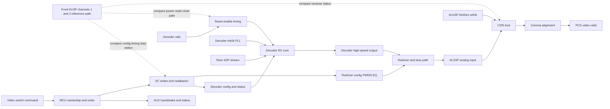
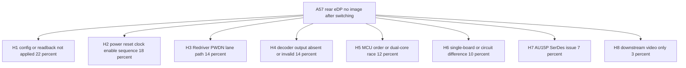
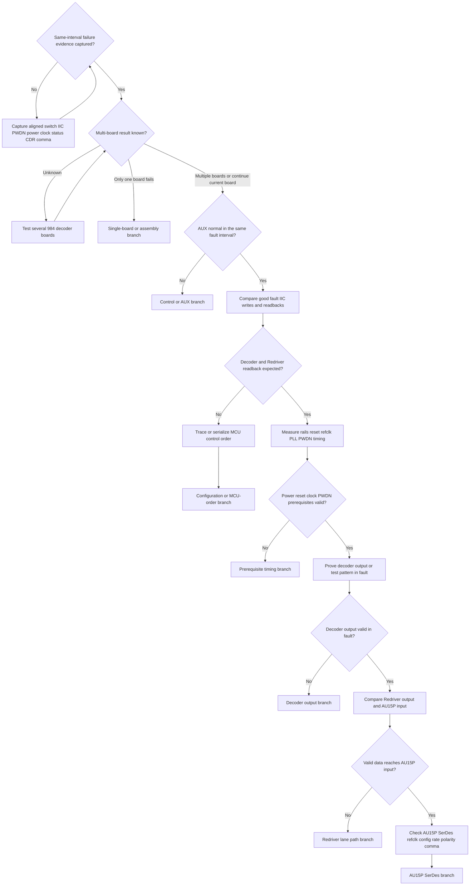

# Architecture-First Debug Decision Tree

## 1. Project Context Summary

Case: A57 project, 984 decoder board, eDP rear two-channel intermittent no-image issue.

Selected mode: Architecture-First. The case spans software control, AUX/IIC configuration, power/reset/clock timing, decoder output, Redriver/path state, and FPGA AU15P SerDes receive status. The current request does not explicitly ask for my-wiki, online learning, or similar-case expansion, so this rerun uses cleaned input, existing DebugTool assets, and explicit assumptions only.

Current engineering boundary:

- Front channels 1 and 2 have a 1000-cycle switch-video-flow comparison result with no reported issue.
- Current rear-channel commonality is not proven because one source explicitly limits the conclusion to one tested board.
- Later evidence says rear-channel AUX handshake and command flow complete normally.
- The direct failing symptom is still at the AU15P receive side: SerDes CDR does not lock, comma alignment fails or periodically misbehaves, and manual SerDes reset does not recover the fault.
- Therefore, the strongest current plan is not to declare a root cause, but to prove whether the rear decoder or Redriver/path is producing valid high-speed data in the failing state.

## 2. Input Cleaning Snapshot

### Confirmed Facts

| id | fact | source | confidence | affected boundary |
|---|---|---|---|---|
| F1 | A57 project is debugging eDP rear two-channel no-image or output abnormality | user case background | high | project scope |
| F2 | Related board is a 984 decoder board | user case background | high | board scope |
| F3 | Channels 1 and 2 passed 1000 switch-video-flow tests with no issue reported | Wu Zhian 09:03 chat | high | front-channel comparison |
| F4 | Existing conclusion was based on one tested board, and Wu Feng asked to test more boards | Wu Feng 11:07 chat | high | sample-size boundary |
| F5 | Planned checks include multi-board test, front/rear eDP IIC command comparison, decoder register readback, eDP power-on timing, and front/rear SerDes circuit comparison | Wu Zhian 09:24 chat | high | action baseline |
| F6 | Qiu Yongheng asked to compare Redriver control | Qiu Yongheng 09:25 chat | high | Redriver control |
| F7 | Candy/Luo Qijun said Redriver control waveform had been captured and control was the same | Candy/Luo Qijun 09:25 chat | high | Redriver control |
| F8 | Candy/Luo Qijun later said Redriver PWDN should also be checked | Candy/Luo Qijun 09:37 chat | high | Redriver enable |
| F9 | Candy/Luo Qijun stated that the Redriver manual indicates PWDN is low-enable | Candy/Luo Qijun 09:37 chat | medium | Redriver enable polarity |
| F10 | Actual Redriver PWDN board-level voltage and timing are not yet provided | absence from chat record | high | Redriver enable |
| F11 | Later discussion says rear-channel AUX handshake and command read/write complete normally | latest issue-sync note | high | AUX sideband |
| F12 | Later discussion says AU15P SerDes CDR cannot lock in fault state | latest issue-sync note | high | FPGA receiver |
| F13 | Later discussion says comma alignment fails or periodically behaves abnormally | latest issue-sync note | high | FPGA receiver |
| F14 | Later discussion says manual AU15P SerDes reset does not recover the issue | latest issue-sync note | high | FPGA receiver reset |
| F15 | Prior aux_in initial-level difference and weak pull-down attempt did not solve the issue | prior issue context | medium | stale AUX/level branch |
| F16 | DEV3-only behavior is worse, while DEV3 plus DEV4 improves receive behavior | prior issue context | medium | rear lane/path behavior |

### Judgments, Not Facts

| id | judgment | basis | confidence | could change if |
|---|---|---|---|---|
| J1 | AUX is no longer the dominant branch | F11,F15 | high | same-interval capture shows AUX retries, NACKs, stale reads, or failed link-training status |
| J2 | CDR/comma failure is a receiver-side symptom, not a proven FPGA root cause | F12,F13,F14 | high | valid high-speed data is measured at AU15P input while CDR/comma still fail |
| J3 | Decoder config, decoder power/reset/clock, decoder output, Redriver/PWDN, and lane path are now higher-value boundaries | F11,F12,F13,F14 | medium-high | decoder output and AU15P input are both proven valid in fault state |
| J4 | Redriver control waveform sameness does not fully exclude Redriver because PWDN and output activity are still not bounded | F7,F8,F10 | high | PWDN and Redriver input/output are measured correct in the failing state |
| J5 | It is not valid to call this a common board issue yet | F4 | high | multi-board testing reproduces the same rear-channel failure consistently |
| J6 | Decoder not outputting valid data is a strong hypothesis, not a confirmed root cause | F11,F12,F13,F14 | high | direct N14 decoder output or status proves absence/invalidity in the fault state |

### Methods Already Tried

| id | action | result | interpretation |
|---|---|---|---|
| M1 | Front channels 1 and 2 switch-video-flow test, 1000 cycles | no issue reported | establishes front branch as comparison, not rear root cause |
| M2 | Redriver control waveform capture | reported same control | lowers generic control-difference branch, but does not cover PWDN/output unless measured |
| M3 | Rear-channel AUX handshake verification | reported normal | demotes AUX-first branch |
| M4 | Manual AU15P SerDes reset | no improvement | lowers pure receiver reset-state branch |
| M5 | aux_in weak pull-down attempt | no solution | demotes initial aux_in level as primary branch |

## 3. Architecture / Link Understanding

The current link model must be layered, not linear:

1. Control/configuration: video switch command, MCU core ownership, AUX status, IIC writes/readbacks, decoder config, Redriver config, FPGA SerDes reset/config.
2. Power/reset/clock prerequisites: decoder rails, reset/enable sequence, decoder reference clock/PLL, Redriver PWDN or enable, AU15P SerDes reference clock.
3. Main data production and path: source rear eDP stream, decoder receiver/core/output, Redriver, lane routing/polarity/termination/SI, AU15P analog input.
4. FPGA receive pipeline: CDR lock, comma alignment, PCS/deserializer, video-valid/frame output.
5. Comparison axes: front 1/2 vs rear 3/4, good state vs fault state, one board vs multiple boards, DEV3-only vs DEV3 plus DEV4.

Primary model warning: AUX normal only proves a sideband path. It does not prove rear-lane pixel-data output, decoder PLL/output enable, Redriver enable, lane activity, or AU15P input quality.

## 4. Evidence-Aware Link Model

| node | input | output | control signals | observable evidence | failure modes | downstream impact |
|---|---|---|---|---|---|---|
| C1 video switch command | operator or AP switch event | command timestamp | stream on/off command | command log | repeated switching race, wrong order | affects all downstream timing |
| C2 MCU ownership and order | firmware state, core ownership | AUX/IIC/reset operations | core 1 or core 2 ownership, delay sequencing | timestamped firmware log | dual-core race, skipped write, reordered operation | wrong decoder or Redriver state |
| C3 AUX handshake and status | AUX physical path and command | AUX ACK/status | AUX enable, link-training command | AUX transaction log, DPCD/status read | stale status, partial status, training-state mismatch | can mislead if treated as data-valid proof |
| C4 IIC writes and readbacks | MCU IIC transaction | decoder and Redriver config state | IIC SCL/SDA, device address, write order | logic analyzer, readback table | wrong address, missing write, write no persist, readback mismatch | decoder or Redriver output wrong |
| C5 decoder config and status | IIC register writes | decoder mode, output enable, lane rate | reset, enable, mode bits | good/fault register dump | output disabled, wrong lane mode, stream not detected | no valid D3 output |
| C6 Redriver config PWDN EQ | IIC/GPIO/manual control | Redriver enabled path | PWDN, EQ, mux, enable | PWDN voltage, control waveform, readback | PWDN wrong, EQ wrong, path disabled | D4 blocks or distorts data |
| P1 decoder rails | board power tree | valid supply rails | power enable, PG | scope waveform | rail droop, late rail, unstable ramp | decoder control alive but output invalid |
| P2 reset enable timing | reset and enable nets | released decoder core | reset, PWDN, enable | time-aligned waveform | wrong order, too short delay, state-machine stuck | config or output state invalid |
| P3 decoder refclk PLL | oscillator/refclk | decoder clock and PLL lock | clock enable | clock waveform, PLL lock bit | missing clock, unlocked PLL, bad frequency | decoder cannot output valid data |
| D1 rear eDP stream | AP/source stream | rear-lane eDP input | stream enable | source status, lane activity | no stream, wrong rate, lane count mismatch | decoder has no valid input |
| D2 decoder RX core | D1 plus config plus clock | decoded stream state | mode/registers | stream detect, PLL/status bits | stream not detected, wrong mode | D3 absent or invalid |
| D3 decoder high-speed output | decoded stream and output formatter | high-speed output to Redriver | output enable, lane mode | output-valid bit, scope, test pattern | no output, wrong rate, wrong lane mapping | AU15P CDR cannot lock |
| D4 Redriver and lane path | D3 output | conditioned lane signal | PWDN, EQ, mux | input/output activity, eye/activity, PWDN | disabled path, polarity/lane/SI issue | D5 invalid |
| D5 AU15P analog input | board lane signal | SerDes analog input | termination, polarity | near-FPGA activity/eye, AC coupling | missing signal, bad polarity, SI margin | R1 fails |
| R1 CDR lock | D5 plus refclk | recovered clock lock | SerDes reset/config | CDR lock bit | no valid input, bad refclk, wrong rate | R2 cannot align |
| R2 comma alignment | recovered serial data | aligned stream | comma config | comma/align status | wrong encoding/lane/rate, invalid data | PCS/video invalid |
| R3 PCS video valid | aligned stream | valid video/frame | PCS/video logic | counters, video-valid | downstream only if R1/R2 good | no image |

### Link Evidence Boundary Table

| node | known | inferred | unknown | evidence that moves boundary |
|---|---|---|---|---|
| F0 front KU3P reference path | channels 1 and 2 survived 1000 switch tests | front path is a useful comparison baseline | whether front/rear config, power timing, Redriver path, and FPGA receive setup are truly symmetric | front/rear command, waveform, circuit, and receiver-status comparison |
| C1 video switch command | switch-flow testing is the trigger context | switching order may expose transient state | exact rear failure count and trigger timing | aligned command log with pass/fail mark |
| C2 MCU ownership and order | dual-core control variable was proposed for validation | order or ownership can affect IIC, reset, and enable state | whether core ownership differs between front and rear | timestamped MCU log or serialized-control experiment |
| C3 AUX handshake and status | rear AUX is reported normal | AUX is not enough to prove pixel data validity | whether AUX status is fresh in the same fault interval | same-interval AUX log and status readback |
| C4 IIC writes and readbacks | IIC comparison is planned | intended writes may differ from persistent chip state | good/fault readback values and write ordering | front/rear and good/fault write/readback table |
| C5 decoder config and status | decoder register readback is planned | wrong output mode or disabled output can leave AUX alive | actual stream-detect, PLL, output-enable, lane-mode bits | decoder good/fault register dump |
| C6 Redriver config PWDN EQ | control waveform was reported same and PWDN remains open | Redriver cannot be cleared by generic control sameness | whether PWDN, EQ, mux, and output state were covered | PWDN waveform plus Redriver input/output evidence |
| P1 decoder rails | power timing measurement is planned | control can work while output rails or ramp are marginal | rail ramp, droop, and sequencing around switch | scope capture with timing markers |
| P2 reset enable timing | reset/enable sequence is a pending hardware branch | wrong ordering can create persistent invalid output state | reset width, release order, and relation to config writes | aligned reset/enable/IIC/status capture |
| P3 decoder refclk PLL | decoder output depends on valid clock and PLL | CDR failure may originate before AU15P | clock frequency, stability, and PLL status in fault | refclk waveform and PLL/readback status |
| D1 rear eDP stream | source-side rear stream validity is not proven | absent source stream can look like decoder/path fault | source lane activity/rate during fault | source-side status or decoder stream-detect evidence |
| D2 decoder RX core | decoder is suspected but not proven | RX core may be configured yet not producing valid output | stream detect and internal error state | status bits, counters, or test-pattern split |
| D3 decoder high-speed output | not measured in fault | absent or invalid output explains AU15P CDR/comma failure | output activity, rate, lane mode, and test-pattern behavior | decoder output measurement or output-valid status |
| D4 Redriver and lane path | generic control sameness was reported | PWDN/path/SI can still block data | Redriver output and lane mapping under DEV3/DEV4 selections | PWDN, EQ/mux, input/output, lane/polarity comparison |
| D5 AU15P analog input | AU15P reports CDR/comma failure | receiver failure may be caused by invalid input | whether valid data reaches pins | near-FPGA activity/eye/status proxy |
| R1 CDR lock | fails in fault | CDR failure is symptom, not root cause | whether refclk/config are valid while input is valid | AU15P refclk/config check after valid D5 proof |
| R2 comma alignment | fails or behaves abnormally | invalid encoding/lane/rate can explain no video | whether comma config matches incoming stream | comma status after valid input and rate proof |
| R3 PCS video valid | no image is downstream result | downstream-only branch is low while R1/R2 fail | whether PCS/video counters ever become valid | counters after R1/R2 pass |

## 5. Fact / Assumption Table

| id | type | content | confidence | evidence_refs |
|---|---|---|---|---|
| F1 | fact | A57 984 decoder-board rear eDP channels are the current failure focus | high | input cleaning |
| F2 | fact | Front channels 1 and 2 passed 1000 switch-video-flow tests | high | Wu Zhian 09:03 |
| F3 | fact | Current conclusion is limited by one-board sample | high | Wu Feng 11:07 |
| F4 | fact | Rear-channel AUX handshake is reported normal | high | latest issue-sync |
| F5 | fact | AU15P CDR and comma fail in the fault state | high | latest issue-sync |
| F6 | fact | Manual AU15P SerDes reset does not recover | high | latest issue-sync |
| F7 | fact | Redriver control waveform was reported same | high | Candy 09:25 |
| F8 | fact | Redriver PWDN actual board-level state is not provided | high | absence from chat |
| F9 | documented claim | Redriver manual says PWDN is low-enable | medium | Candy 09:37 |
| A1 | assumption | Decoder has useful status bits for stream detect, PLL, output enable, lane mode, or equivalent | medium | device-dependent |
| A2 | assumption | Redriver PWDN and output activity can be measured safely in fault state | medium | board-dependent |
| A3 | assumption | AU15P CDR/comma status is sampled in the same interval as no-image failure | medium | needs aligned capture |
| A4 | assumption | Existing front-channel result is a valid comparison baseline for switching stress | medium-high | F2 |
| A5 | assumption | No external knowledge is needed for the first-pass debug strategy | medium | this rerun default |

## 6. Fault-Domain Localization

### Root Cause Hypothesis Probability Table

Probabilities are current engineering priors under incomplete evidence, not precise statistics. They are normalized for action prioritization; several mechanisms may overlap in the real system.

| id | root-cause hypothesis | probability | why it is plausible now | evidence that raises it | evidence that lowers it |
|---|---:|---|---|---|---|
| H1 | Rear decoder or Redriver configuration not correctly applied or not persistent after switching | 0.22 | AUX can pass while output mode or lane config is wrong | fault-state readback differs, missing output enable, serialized writes fix issue | readback matches expected in good and fault states |
| H2 | Rear decoder power/reset/clock/enable sequence leaves output path invalid | 0.18 | control path can be alive while output PLL/core is not ready | rail/reset/refclk/PWDN timing violates spec or differs from front path | time-aligned timing and PLL status are clean |
| H3 | Redriver PWDN, enable, EQ, mux, lane selection, or physical signal path blocks valid data | 0.14 | PWDN actual level is open and DEV3-only vs DEV3+DEV4 behavior suggests selection/path dependency | D3 valid but D5 invalid, PWDN not low when required, Redriver output absent, DEV selection changes the boundary | PWDN correct and D5 valid in fault |
| H4 | Decoder output is absent or invalid despite apparently normal control | 0.14 | CDR/comma cannot lock and SerDes reset does not help | no decoder output activity, output-valid false, test pattern fails | valid decoder output in same fault interval |
| H5 | MCU dual-core ownership or command-order race during stream switching | 0.12 | intermittent switch-flow failures often come from ordering | timestamped log shows race, serialized control changes failure rate | identical ordered writes and readbacks in good/fault |
| H6 | Single-board assembly or rear-channel circuit difference | 0.10 | current conclusion is one-board-limited | multi-board test shows only one board fails, schematic/measurement finds path difference | multiple boards reproduce similarly |
| H7 | AU15P SerDes refclk, configuration, polarity, rate, or margin issue | 0.07 | direct symptom is CDR/comma fail | valid D5 input but CDR/comma still fail, refclk/config differs | D5 is absent or invalid |
| H8 | Downstream video pipeline after PCS | 0.03 | possible in general display failures | CDR/comma/PCS all valid but no frame/video | CDR/comma still fail |

## 7. Hypothesis Tree With Probabilities

| branch | current state | first falsifier |
|---|---|---|
| H1 | high-priority because IIC/readback comparison is pending | good/fault readbacks match expected values |
| H2 | high-priority because output prerequisites are not measured | aligned rails/reset/refclk/PWDN/PLL are clean |
| H3 | open because PWDN actual state and output activity are pending | Redriver enabled and valid signal reaches AU15P input |
| H4 | open because decoder output is not proven | decoder output/test pattern valid in fault |
| H5 | open because dual-core control was explicitly proposed for validation | serialized/single-core control does not change failure and logs match |
| H6 | open because sample size is one board | multiple boards reproduce with same signature |
| H7 | deferred until valid AU15P input is proven | invalid or absent input at AU15P |
| H8 | low while CDR/comma fail | receiver lock pipeline remains bad |

## 8. Candidate Matching Report

| asset | type | decision | reason | evidence_refs |
|---|---|---|---|---|
| assets/link_models/LM-EDP-DECODER-FPGA-LINK.yaml | link_model | Adopted | Direct match: AUX/IIC can work while CDR/comma/video-valid fail | F4,F5,F6 |
| assets/link_models/LM-VIDEO-LINK.yaml | link_model | Adopted | Keeps source/decoder/receiver/downstream split visible | F1,F5 |
| assets/link_models/LM-CLOCK-RESET-TREE.yaml | link_model | Adopted | Power/reset/clock timing is a core pending branch | H2 |
| assets/link_models/LM-I2C-BUS.yaml | link_model | Adopted | IIC write/readback comparison is needed, not write-only confidence | H1,H5 |
| assets/debug_principles/DP-DYNAMIC-EVIDENCE-BEFORE-STATIC-RATING.yaml | debug_principle | Adopted | Switching fault needs time-aligned dynamic evidence | F5,F6 |
| assets/debug_principles/DP-MEASUREMENT-BEFORE-DESIGN-CHANGE.yaml | debug_principle | Adopted | Measure output/input before tuning SerDes or changing FPGA logic | H4,H7 |
| Knowledge-Linked broad exploration | mode | Deferred | Not explicitly requested, and first-pass actions do not require web/wiki | A5 |
| Similar-problem expansion | mode | Deferred | Useful if first-pass model stalls, but not needed before pending board measurements | A5 |
| AUX-first debug | heuristic | Not Applied | AUX is reported normal and weak pull-down did not solve | F4,F15 |
| downstream-video-first debug | heuristic | Not Applied | CDR/comma fail before downstream video boundary | F5 |

## 9. Adopted / Deferred / Not Applied

Adopted:

- Architecture-First mode.
- Multi-layer eDP decoder-to-FPGA receiver link model.
- Input-cleaning discipline: facts, judgments, methods, pending results, and missing data remain separate.
- Current evidence weighting: AUX normal demotes stale AUX-first branch.

Deferred:

- Knowledge-Linked retrieval from my-wiki or web.
- Similar-problem expansion.
- AU15P SerDes tuning, equalization, comma parameter changes, or RTL/constraint changes before valid AU15P input is proven.

Not Applied:

- Direct conclusion that decoder is proven bad.
- Direct conclusion that Redriver is cleared because one control waveform was same.
- Direct conclusion that the issue is common across boards.
- Repeated manual SerDes reset loops without a changed hypothesis.

## 10. Cost / Probability Ranking

| action_id | action | primary hypotheses | p_hit | p_exclude | time_min | safety | priority_score | reason |
|---|---|---|---:|---:|---:|---|---:|---|
| A1 | Capture one controlled failing switch with aligned command, IIC, PWDN, power, clock, decoder status, and AU15P CDR/comma timestamps | H1,H2,H5,H7 | 0.18 | 0.70 | 25 | S0 | 0.021 | prevents false ordering and stale-state conclusions |
| A3 | Compare good vs fault IIC writes and readbacks for rear decoder and Redriver | H1,H5 | 0.22 | 0.55 | 30 | S0 | 0.017 | fast discriminator for config persistence and command delivery |
| A4 | Measure decoder rails, reset, refclk, PLL/status, Redriver PWDN around stream switching | H2,H3 | 0.24 | 0.60 | 45 | S1 | 0.012 | high-value prerequisite proof |
| A5 | Prove decoder high-speed output or output-valid/test-pattern behavior in the failing state | H4,H1,H2 | 0.20 | 0.70 | 60 | S1 | 0.009 | decisive split between decoder side and downstream path |
| A6 | Compare Redriver input/output and AU15P analog input after decoder output is proven valid | H3,H7 | 0.14 | 0.55 | 75 | S1 | 0.006 | gated by decoder output validity |
| A7 | Force serialized or swapped MCU core control for front/rear channel control | H5 | 0.12 | 0.45 | 60 | S0 | 0.006 | tests the proposed dual-core variable |
| A2 | Run multi-board 984 decoder-board reproduction matrix | H6 | 0.10 | 0.65 | 90 | S0 | 0.005 | necessary for commonality, slower than local boundary checks |
| A8 | Check AU15P refclk, SerDes config, rate, polarity, reset sequence, and comma settings | H7 | 0.07 | 0.45 | 60 | S0 | 0.005 | should wait until D5 input validity is proven |

### Hypothesis To Action Mapping Table

| hypothesis | first action | second action | stop condition for branch |
|---|---|---|---|
| H1 config/readback issue | A3 | A7 | readback expected in good and fault states |
| H2 power/reset/clock issue | A4 | A1 | aligned waveform and PLL/status clean |
| H3 Redriver/PWDN/path issue | A4 | A6 | PWDN correct and AU15P input valid |
| H4 decoder output invalid | A5 | A3/A4 | decoder output or test pattern valid in fault |
| H5 MCU order race | A1 | A7 | serialized control does not change failure and logs match |
| H6 single-board issue | A2 | circuit/assembly inspection | multiple boards reproduce same signature |
| H7 AU15P SerDes issue | A8 | AU15P front/rear config comparison | AU15P input absent or invalid |
| H8 downstream video only | receiver status/counters after lock | video pipeline check | CDR/comma/PCS remain failed |

## 11. Optimal Troubleshooting Path

1. First, get one time-aligned failing capture. The capture must include stream switch command, IIC write/readback, Redriver PWDN, decoder power/reset/refclk/PLL/status, and AU15P CDR/comma.
2. In parallel if resources allow, expand sample size with more 984 decoder boards. Do not call the issue common until this matrix exists.
3. Compare front vs rear and good vs fault IIC commands plus readbacks. Writes alone are weaker than readback.
4. Measure decoder output or output-valid/test-pattern behavior in the exact fault state.
5. Only if decoder output is valid, compare Redriver output/lane path/AU15P input.
6. Only if AU15P input is valid, move AU15P SerDes config/refclk/rate/polarity/comma into the first branch.

## 12. Decision Tree

## 13. Node Explanation Table

| id | type | action_type | check_or_action | tool_required | expected_observation | interpretation | safety_level | cost | reversibility | next_branch | evidence_refs |
|---|---|---|---|---|---|---|---|---|---|---|---|
| D1 | decision | none | Check whether command, IIC, PWDN, power, clock, decoder status, and AU15P CDR/comma are captured in the same fault interval | log plus scope plus FPGA status | yes or no | Without same-interval data, stale conclusions are likely | S0 | low | n/a | A1 or D2 | F11,F12,F13 |
| A1 | action | observe | Capture aligned switch, IIC, PWDN, power, clock, status, CDR, and comma evidence | oscilloscope, logic analyzer, FPGA status log | one failing switch with aligned timestamps | Establishes which boundary changed first | S0 | medium | reversible | D1 | H1,H2,H5,H7 |
| D2 | decision | none | Check whether multi-board reproduction status is known | test matrix | unknown, one-board only, or multiple-board reproduction | Prevents overclaiming common issue | S0 | low | n/a | A2 or T1 or D3 | F3,F4 |
| A2 | action | reproduce | Test several 984 decoder boards under the same switching condition | test bench and logging | per-board fail or pass table | Separates common design or software issue from single-board issue | S0 | high | reversible | D2 | H6 |
| T1 | terminal | none | Classify as single-board or assembly branch until contradicted | inspection and board comparison | only one board fails | Prioritize assembly, connector, local path, or component variance | S0 | low | n/a | terminal | H6 |
| D3 | decision | none | Confirm AUX is normal in the same fault interval, not only in a different run | AUX log or analyzer | normal or abnormal | Abnormal AUX reopens control branch | S0 | low | n/a | T2 or A3 | F11 |
| T2 | terminal | none | Reopen control or AUX branch | AUX tool and status readback | AUX fails or status stale | Use control-bus debug before data-path assumptions | S0 | medium | n/a | terminal | F11 |
| A3 | action | observe | Compare front/rear and good/fault IIC writes plus readbacks for decoder and Redriver | logic analyzer and register dump | same or different write/readback table | Finds missing writes, wrong address, non-persistent config, or stale readback | S0 | medium | reversible | D4 | H1,H5 |
| D4 | decision | none | Decide whether decoder and Redriver readbacks match expected output mode in fault | register dump | match or mismatch | Mismatch points to config or MCU ordering | S0 | low | n/a | A7 or A4 | H1,H5 |
| A7 | action | reconfigure | Trace MCU ownership and IIC order or run serialized/single-core control test | firmware log or controlled firmware option | race found or failure rate changes | Confirms or lowers dual-core/order hypothesis | S0 | medium | reversible | T3 | H5 |
| T3 | terminal | none | Configuration or MCU-order branch active | firmware trace | reordered, skipped, or non-persistent config | Fix command ownership/order before hardware probing | S0 | low | n/a | terminal | H1,H5 |
| A4 | action | observe | Measure decoder rails, reset, refclk, PLL/status, Redriver PWDN timing during switch | oscilloscope and register status | valid or invalid prerequisite timing | Confirms or lowers power/reset/clock/PWDN branch | S1 | medium | reversible | D5 | H2,H3 |
| D5 | decision | none | Decide whether power, reset, clock, PLL, and PWDN prerequisites are valid | waveform and status table | valid or invalid | Invalid prerequisites can leave AUX alive but data dead | S0 | low | n/a | T4 or A5 | H2,H3 |
| T4 | terminal | none | Prerequisite timing branch active | scope evidence | bad sequence, missing clock, wrong PWDN, or PLL not locked | Correct timing or enable condition before deeper debug | S0 | medium | n/a | terminal | H2,H3 |
| A5 | action | observe | Prove decoder output activity, output-valid status, or test pattern in the fault state | scope, status register, or test pattern | valid or invalid decoder output | Splits decoder/output from Redriver/path/AU15P | S1 | high | reversible | D6 | H4 |
| D6 | decision | none | Decide whether decoder output is valid in the fault state | output evidence | valid or invalid | Invalid output supports decoder/source branch | S0 | low | n/a | T5 or A6 | H4 |
| T5 | terminal | none | Decoder output branch active | decoder status or output measurement | decoder output absent, wrong, or test pattern fails | Focus on decoder source, config, PLL, output enable, or chip state | S0 | medium | n/a | terminal | H4 |
| A6 | action | observe | Compare Redriver output and AU15P analog input after decoder output is proven valid | high-speed probe or status proxy | valid at decoder but invalid or valid at AU15P | Splits Redriver/lane path from AU15P receiver | S1 | high | reversible | D7 | H3,H7 |
| D7 | decision | none | Decide whether valid data reaches AU15P input | input activity or eye/status proxy | valid or invalid | Valid input moves branch into AU15P SerDes | S0 | low | n/a | T6 or A8 | H3,H7 |
| T6 | terminal | none | Redriver lane path branch active | Redriver and lane evidence | decoder output valid but AU15P input invalid | Check PWDN, EQ, mux, polarity, lane mapping, AC coupling, connector, SI | S0 | medium | n/a | terminal | H3 |
| A8 | action | observe | Check AU15P SerDes refclk, config, rate, polarity, reset sequence, and comma settings | FPGA debug status and clock measurement | valid input but CDR/comma still fail | Confirms or lowers AU15P receiver branch | S0 | medium | reversible | T7 | H7 |
| T7 | terminal | none | AU15P SerDes branch active | FPGA receiver evidence | valid input reaches AU15P while CDR/comma fail | Tune or correct AU15P receiver only after input validity is proven | S0 | medium | n/a | terminal | H7 |

## 14. Missing Architecture Information

| id | missing information | why it changes the plan |
|---|---|---|
| G1 | Exact rear-channel failure count, condition, and failure rate | Needed to compare rear behavior against the 1000-cycle front baseline |
| G2 | Multi-board 984 decoder-board test matrix | Determines common issue vs single-board branch |
| G3 | Front vs rear and good vs fault IIC write/readback table | Directly tests H1 and H5 |
| G4 | Decoder register dump in good and fault states | Needed for stream detect, PLL, output enable, lane mode, and error state |
| G5 | Decoder rails, reset, refclk, PLL/status, Redriver PWDN waveform during switch | Directly tests H2/H3 |
| G6 | Redriver PWDN actual level and whether prior Redriver waveform included PWDN | Prevents falsely clearing Redriver |
| G7 | Decoder output or output-valid/test-pattern evidence in the exact fault state | Primary split between decoder/upstream and path/FPGA |
| G8 | AU15P analog input activity after decoder output is proven valid | Primary split between Redriver/path and AU15P receiver |
| G9 | Front/rear SerDes circuit-difference checklist | Needed to quantify path/circuit asymmetry |
| G10 | Board revision, decoder and Redriver part numbers, and manual excerpts | Required before Knowledge-Linked or datasheet-specific conclusions |

## 15. Next 3-5 Actions

### First Actions

1. Capture one aligned failing switch event: command timestamp, IIC writes/readbacks, decoder status, Redriver PWDN, decoder rails/reset/refclk/PLL, AU15P CDR/comma.
2. Build the multi-board 984 decoder-board reproduction matrix: board id, channel, test count, fail count, DEV selection, condition.
3. Produce front vs rear and good vs fault IIC/readback comparison, not only intended write lists.
4. Measure or otherwise prove decoder output/test-pattern/output-valid state in the fault interval.
5. If decoder output is valid, compare Redriver output and AU15P input; if AU15P input is valid, only then move to AU15P SerDes tuning/config.

### Action Items by Owner

| owner | action item | expected output | priority |
|---|---|---|---|
| Wu Feng | Capture rear decoder power/reset/refclk/PWDN timing with oscilloscope during switch and fault | waveform package with timing labels and pass/fail notes | P0 |
| He Pengcheng | Measure or confirm rear decoder output, Redriver output, and AU15P input activity in the fault state where practical | boundary table: decoder output valid, Redriver output valid, AU15P input valid | P0 |
| Zhang Jiqi | Provide MCU control ownership and ordered operation log during switch, including dual-core control variable if applicable | timestamped control and IIC sequence | P0 |
| Candy / Luo Qijun | Provide front/rear and good/fault IIC write/readback comparison for decoder and Redriver, and confirm whether previous Redriver waveform included PWDN | comparison table and PWDN coverage note | P0 |
| Wu Zhian | Maintain front-channel baseline and rear-channel reproduction statistics across boards | test matrix and failure-rate summary | P1 |
| Qiu Yongheng | Review whether Redriver control evidence is sufficient after PWDN and output activity are added | Redriver branch review decision | P1 |
| Chen Bin | No explicit task assigned in original chat | none unless project owner assigns | none |

## 16. Stop / Escalation Conditions

Stop or demote branches:

- Stop AUX-first debug if same-interval AUX remains normal and readbacks are fresh.
- Stop calling this a common issue until multi-board data exists.
- Stop AU15P SerDes tuning as the primary path unless valid data is proven at AU15P input.
- Stop treating Redriver as cleared until PWDN and input/output activity are covered in the fault state.

Escalate to Knowledge-Linked only if:

- part numbers, board revision, register meanings, or PWDN polarity block interpretation;
- decoder or Redriver status bits cannot be interpreted from current project knowledge;
- link model conflicts appear between "984 decoder board", decoder part, Redriver part, KU3P/AU15P ownership, or channel naming;
- the first measurement pass produces contradictory evidence.

Escalate to similar-problem or web exploration only if:

- direct measurements do not split decoder, Redriver/path, and AU15P receiver;
- the team needs broader examples of "control path normal but high-speed data invalid";
- official datasheet or vendor app-note behavior is needed to interpret CDR/comma, AUX, PWDN, or decoder output state.

## 17. Retrospective Trigger

Open a retrospective and draft a case_record when one of these becomes true:

- A measured root cause is confirmed and a fix changes the failure rate.
- Multi-board evidence proves a common design/software issue or a single-board assembly issue.
- A previously high-probability branch is disproven by strong evidence and should become a counterexample.
- The final solution changes the reusable eDP link model, Redriver/PWDN rule, MCU dual-core control rule, or AU15P receiver debug order.
