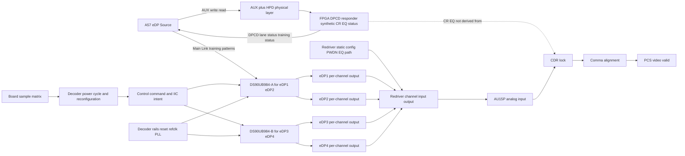
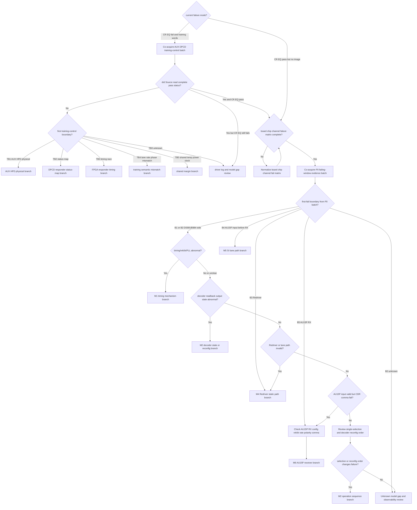

# Architecture-First Debug Decision Tree

## Artifact Navigation

- Start with `visual-architecture-brief.md` for the current system/subsystem frame and Mode A / Mode B gate.
- Use this file for detailed boundary, mechanism, evidence, probability, and decision-tree reasoning.
- Execute captures from `field-action-plan.md`; do not treat action rows here as the field checklist.
- Use `latest-input-cleaning.md` for raw-fact provenance and `README.md` for archive context.

## 1. Project Context Summary

案子：A57 项目，DS90UB984 解码板，Issue4 eDP 概率性出图异常。

本次补充改变了 case 的基本形状：它不再应被描述成“后两通道独有问题”。现在的已知情况是：

- eDP1、eDP2 来自一颗 DS90UB984；eDP3、eDP4 来自另一颗 DS90UB984。
- eDP1、eDP2、eDP3、eDP4 都有概率出图异常。
- 已测试 4 块解码板，板间表现不同：一块板 eDP3/4 异常概率更高，另外三块板 eDP1/2 异常概率更高。
- 同一颗 DS90UB984 下的两个 eDP 通道没有严格一致性，会出现一个好、一个不好。
- eDP mainstream 中间有 Redriver；Redriver 在设备上电后配置好，重复测试期间不重新配置。
- 重复测试的实际变量是 DS90UB984 重新上下电和重新配置。
- 2026-05-13 群聊更新把当前症状进一步前移：现在出现 A57/eDP Source 侧 CR/EQ 概率失败、持续发送训练字、无图像。
- 当前实现不是标准 eDP Sink 根据高速链路实际训练结果回填 CR/EQ；而是 FPGA/逻辑在 AUX/DPCD 上代答训练状态，CR/EQ OK 不来自 SerDes feedback。

选用模式：Architecture-First。当前没有新资料要求联网、查 wiki 或找相似案例；厂家寄存器确认属于低成本 point check，不等同于 broad web exploration。

当前不能下 root cause 结论，但需要先按症状模式分流：

- 模式 A：`CR/EQ fail + 持续训练字`。首查 AUX/DPCD transaction、FPGA/DPCD responder 状态图、HPD/AUX 物理层和返回时序。
- 模式 B：`CR/EQ pass + 仍无图`。再回到 DS90UB984 per-channel 状态、Redriver 静态状态、AU15P input/CDR/comma 的主数据链路边界切分。

## 2. Input Cleaning Snapshot

### 已确认事实

| id | fact | source | confidence | staleness | affected boundary |
|---|---|---|---|---|---|
| F1 | eDP1/2 对应一颗 DS90UB984，eDP3/4 对应另一颗 DS90UB984 | Issue4 update | high | fresh | decoder mapping |
| F2 | eDP1、eDP2、eDP3、eDP4 都有概率出现问题 | Issue4 update | high | fresh | symptom distribution |
| F3 | 已测试 4 块解码板，板间表现有差异 | Issue4 update | high | fresh | multi-board matrix |
| F4 | 一块板 eDP3/4 异常概率较高，另外三块板 eDP1/2 异常概率较高 | Issue4 update | high | fresh | board/channel variation |
| F5 | 同一 DS90UB984 下的两个 eDP 通道没有严格一致性，会一个好、一个不好 | Issue4 update | high | fresh | per-channel behavior |
| F6 | Redriver 位于 eDP mainstream 中间 | Issue4 update | high | fresh | data path |
| F7 | Redriver 设备上电后配置好，后续重复测试中不重新配置 | Issue4 update | high | fresh | Redriver static config |
| F8 | 重复测试方式是对 DS90UB984 解码芯片重新上下电和重新配置 | Issue4 update | high | fresh | decoder reinit loop |
| F9 | 前后 2 通道 eDP SerDes 电路差异已确认无差异 | project action table | high | fresh | circuit comparison |
| F10 | 前 2 通道与后 2 通道 DS90UB984 IIC 指令、ini 和参数下发对比未发现问题 | project action table | high | fresh | IIC/config intent |
| F11 | eDP 上电时序、SerDes 参考时钟、Redriver PWDN/I2C、DS90UB984 寄存器和关键管脚仍待测或待厂家确认 | project action table | high | fresh | missing evidence |
| F12 | 旧版 context 中有 AUX 正常、AU15P CDR/comma 异常、SerDes reset 无改善等信息，但本次补充未重新给出同一故障窗口证据 | previous A57 latest | medium | requires_re_verification | prior receiver symptom |
| F13 | 当前出现 EQ、CR 概率失败，A57/eDP Source 持续发训练字且无图像 | group chat update 2026-05-13 | high | fresh | training-control boundary |
| F14 | 当前 CR/EQ 状态不是 SerDes 实际反馈，而是 FPGA/逻辑在 AUX/DPCD 上代答 | group chat update 2026-05-13 | high | fresh | synthetic training status |
| F15 | FPGA/逻辑会根据 eDP 侧读写请求返回训练状态，例如速率、lane 数配置后直接返回训练 OK | group chat update 2026-05-13 | high | fresh | DPCD responder |
| F16 | 当前 AUX 通信不需要 SerDes feedback；SerDes 眼图好坏不会直接影响 AUX training-status 返回 | group chat update 2026-05-13 | high | fresh | scope separation |
| F17 | 用户已开始怀疑 AUX 三根信号线的问题可能导致 CR/EQ 概率失败 | group chat update 2026-05-13 | high | fresh | AUX/HPD physical layer |
| F18 | 降温只能降低异常概率，严格风冷也不能绝对消除 | group chat update 2026-05-13 | high | fresh | temperature / margin |
| F19 | 换解码板或机械扰动也会影响复现 | group chat update 2026-05-13 | high | fresh | board/mechanical sensitivity |
| F20 | 如果 CR/EQ 不失败但仍无图，才进入 SerDes/图像链路稳定性怀疑分支 | group chat update 2026-05-13 | high | fresh | routing gate |

### 当前判断，不是事实

| id | judgment | basis | confidence | could change if |
|---|---|---|---|---|
| J1 | case 应改写为四通道概率性出图异常，不再是后两通道独有问题 | F2,F3,F4 | high | 完整矩阵显示只有固定后通道组失败 |
| J2 | 整颗 DS90UB984 共同前提失效作为唯一解释被削弱 | F5 | medium | 同芯片共享 PLL/reset/output block 的故障状态被读回证明 |
| J3 | per-channel DS90UB984 output、Redriver/lane path、AU15P input 是优先切边界 | F2,F5,F6,F12 | high | 同一故障窗口证明这些边界都有效 |
| J4 | Redriver 动态 reconfig 错误分支降级，但 Redriver static PWDN/I2C/path 仍不能排除 | F6,F7,F11 | high | 证明重复测试期间 Redriver 被隐式改写或 PWDN 抖动 |
| J5 | IIC 指令/ini 对比完成只能降低“下发 intent 不同”，不能替代故障态 readback/status | F10,F11 | high | 故障态 readback 证明所有状态均符合预期 |
| J6 | 对当前 CR/EQ fail 模式，优先边界是 AUX/DPCD 代答链路、HPD/AUX 物理层和训练状态机，而不是 AU15P/SerDes 眼图 | F13,F14,F15,F16,F17 | high | AUX/DPCD 交易证明完整正确，但 Source 仍因真实 Main Link 判据失败 |
| J7 | A57 侧 CR/EQ fail 的直接含义是 Source 没有读到或没有接受认可的 DPCD pass 状态 | F13,F14,F15 | high | Source 驱动日志或硬件设计证明 CR/EQ fail 来自另一个非 AUX 判据 |
| J8 | 温度影响说明系统存在 margin/时序/电气敏感性，但不能直接锁定 SerDes；AUX/HPD、FPGA responder、公共电源/时钟都可能受影响 | F17,F18,F19 | medium | 温度扫描证明 AUX/DPCD 交易完全无误且只影响主链路接收 |
| J9 | 原 DS90UB984/Redriver/AU15P 数据链路树仍有效，但应作为 CR/EQ pass 后无图的 Mode B，而不是当前 CR/EQ fail 的第一路径 | F13,F20 | high | 当前现场重新确认 CR/EQ 始终通过 |

### 已尝试方法

| id | action | result | interpretation |
|---|---|---|---|
| M1 | 测试 4 块 DS90UB984 解码板 | 4 块都有异常倾向，且板间分布不同 | 从单板样本升级为多板概率性问题，但仍缺标准化矩阵 |
| M2 | 观察同芯片 eDP pair 是否一致 | eDP1/2、eDP3/4 都可出现一个好、一个不好 | per-channel 边界优先级上升 |
| M3 | 重复对 DS90UB984 上下电和重新配置 | 概率性异常仍存在 | 重复变量主要在 decoder reinit loop，不是 Redriver 动态重配 |
| M4 | 确认前后 2 通道 eDP SerDes 电路差异 | 已确认无差异 | 降低前后电路设计差异分支，但不排除板级装配/SI |
| M5 | 对比前后 DS90UB984 IIC 指令、ini 和参数下发 | 未发现问题，已完成 | 降低 intent/config-diff 分支，但 readback/status 未闭合 |
| M6 | 复盘 AUX/DPCD training status 返回方式 | CR/EQ 由 FPGA/逻辑代答，不来自 SerDes feedback | 当前 CR/EQ fail 首查对象切到 AUX transaction、DPCD status map、HPD 和 responder 时序 |

## 3. Architecture / Link Understanding

当前 link model 应按 “board -> decoder chip -> decoder channel -> Redriver static path -> AU15P receiver” 分层，而不是按“前两通道好、后两通道坏”的旧对照轴。

1. 板级样本轴：4 块已测板，计划表中还有 6 块目标或另外 2 块待确认，需统一成标准矩阵。
2. 芯片映射轴：DS90UB984-A 输出 eDP1/2；DS90UB984-B 输出 eDP3/4。
3. 通道轴：同一 DS90UB984 的两个通道可能一个好一个坏，所以 per-channel output/path/status 必须单独看。
4. 重复测试变量：DS90UB984 重新上下电和重新配置。
5. Redriver 边界：Redriver 上电后配置好，重复测试期间不重新配置；因此动态重配分支降级，但 PWDN、I2C 初始状态、EQ、path、input/output activity 仍是开放边界。
6. 接收边界：旧证据中的 AU15P CDR/comma 异常需要按 eDP1-4 重新对齐到同一故障窗口。
7. 训练控制面：A57/eDP Source 通过 AUX/DPCD 读写 link rate、lane count、training pattern 和 CR/EQ/lane-align status。
8. 非标准代答边界：当前 CR/EQ status 由 FPGA/逻辑合成返回，不由 SerDes feedback 生成。
9. 模式门：只要当前失败仍表现为 CR/EQ fail 和持续训练字，必须先证明 Source 通过 AUX 读到了完整一致的 pass 状态，再进入主数据链路。
10. 温度/机械扰动是 margin 线索，不自动归因到 SerDes；需要同步记录 AUX/HPD transaction、responder log 和物理波形。

## 4. Evidence-Aware Link Model

| node | known | inferred | unknown | evidence that moves boundary |
|---|---|---|---|---|
| SRC/AUXPHY/AUXR training-control plane | CR/EQ status 当前由 FPGA/DPCD responder 代答，Source 仍概率性报 CR/EQ fail | Source 未读到或未接受完整一致的 pass 状态 | AUX transaction、HPD/AUX 波形、状态机日志、驱动 fail reason | success/fail AUX transaction diff + DPCD status map audit |
| B0 board sample matrix | 4 块板已测，板间异常倾向不同 | 既不是纯单板，也不能直接叫共性同一 root cause | 每块板、每通道 test_count/fail_count | 标准化 board_id/chip_id/channel_id matrix |
| T0 decoder power cycle/reconfig | 重复测试变量是 DS90UB984 上下电和重配 | 故障可能在 decoder reinit 后状态不稳定 | 操作顺序、单独勾选含义、重配时序 | 带 pass/fail 标记的 operation log |
| C1 control command/IIC intent | 前后 IIC 指令、ini、参数下发对比未发现问题 | intent 正确不等于 fault-state persistent state 正确 | 故障态 readback、ACK/data、关键寄存器保持性 | good/fault readback table |
| U1/U2 DS90UB984 chips | eDP1/2 与 eDP3/4 分属两颗芯片 | 整颗芯片共同前提失效不能解释全部通道不一致 | per-chip rails/reset/refclk/PLL/status | 同一故障窗口 chip status + per-channel status |
| CH1-CH4 per-channel output | 四个通道都可能失败，同芯片 pair 不一致 | per-channel output/status/path 是强边界 | output-valid、stream-detect、error/status、test pattern | 厂家确认寄存器 + fault-state readback/output evidence |
| R0 Redriver static config | Redriver 上电后配置，重复测试期间不重配 | 动态 reconfig 不是主要重复变量 | PWDN/I2C/EQ/mux 是否稳定正确 | 上电初始化波形/readback/PWDN + 重复测试期间保持性 |
| R1 Redriver channel input/output | Redriver 在 mainstream 中间 | static path 或通道 SI 可造成 per-channel 差异 | 每通道 input/output activity | Redriver input/output 或安全 proxy |
| A0 AU15P analog input | 旧 context 中接收侧异常需要复核 | 若 AU15P input 无效，receiver tuning 不应优先 | eDP1-4 同窗口 input activity | near-FPGA activity/eye/status proxy |
| A1/A2 CDR/comma | 旧 context 中 CDR/comma 异常 | CDR/comma 是症状，不是 root cause | 是否覆盖所有通道和当前重复方式 | 同窗口 CDR/comma + input evidence |

## 5. Fact / Assumption Table

本节使用类型化 ID，避免和 §2 Input Cleaning Snapshot 中的 F 编号漂移混淆。§2 保留输入清洗快照的证据 ID；本节只做 architecture-first 的压缩视图。

| id | type | content | confidence | evidence_refs |
|---|---|---|---|---|
| AF-F1 | fact | eDP1/2 与 eDP3/4 分属两颗 DS90UB984 | high | Issue4 update |
| AF-F2 | fact | eDP1-4 都有概率出图异常 | high | Issue4 update |
| AF-F3 | fact | 4 块板表现出板间差异 | high | Issue4 update |
| AF-F4 | fact | 同芯片 pair 不严格一致 | high | Issue4 update |
| AF-F5 | fact | Redriver 重复测试期间不重配 | high | Issue4 update |
| AF-F6 | fact | 重复测试变量是 DS90UB984 上下电和重配 | high | Issue4 update |
| AF-F7 | fact | SerDes 电路差异已确认无差异 | high | project table |
| AF-F8 | fact | IIC 指令、ini 和参数下发对比未发现问题 | high | project table |
| AF-F9 | fact | 当前出现 CR/EQ 概率失败并持续训练字 | high | group chat 2026-05-13 |
| AF-F10 | fact | CR/EQ status 由 FPGA/DPCD responder 代答，不来自 SerDes feedback | high | group chat 2026-05-13 |
| AF-F11 | fact | 降温、换板、机械扰动会影响复现概率但不根治 | high | group chat 2026-05-13 |
| AF-M1 | missing | DS90UB984 fault-state readback、output-valid、stream/status 仍缺 | high | project table |
| AF-M2 | missing | Redriver PWDN/I2C/static config/input-output 仍缺 | high | project table |
| AF-M3 | missing | 成功/失败 AUX transaction、DPCD status-map、HPD/AUX 波形和 FPGA responder log 仍缺 | high | current CR/EQ fail mode |
| AF-S1 | stale_context | AUX normal、CDR/comma fail、SerDes reset no recovery 需要新矩阵同窗口复核 | medium | previous latest |
| AF-A1 | assumption | DS90UB984 有可用的 per-channel stream/output/status 寄存器或厂家可确认诊断方式 | medium | vendor-dependent |
| AF-A2 | assumption | Redriver 4 通道 PWDN/I2C/input-output 可以安全测量或用状态代理确认 | medium | board-dependent |
| AF-A3 | assumption | AU15P CDR/comma 状态可按 eDP1-4 单独导出 | medium | FPGA debug-dependent |

## 6. Fault-Domain Localization

以下不再使用单一 flat root-cause probability table。A57 当前证据同时包含“Source 训练控制面为什么没通过”的 Mode A，以及“CR/EQ 通过后主数据链路哪里第一次失效”的 Mode B。两者不能混在同一张互斥表里。

### Boundary Distribution

本表是 validator-friendly 的合并边界索引，表示当前最新 CR/EQ fail 窗口下的路由权重；Mode A 是当前直接症状，Mode B 是 CR/EQ pass 后无图的 fallback 分支。直接物理症状 / direct symptom 的最简解释在 top two：TB1 AUX/HPD physical 与 TB2 DPCD responder status-map。

| id | type | first_fail_boundary | p | evidence_refs | mode | why now |
| --- | --- | --- | ---: | --- | --- | --- |
| TB1 | boundary | AUX/HPD physical layer | 0.20 | AF-F9,AF-F16 | Mode A | 当前 CR/EQ fail 依赖 Source 是否通过 AUX/HPD 读到状态 |
| TB2 | boundary | FPGA/DPCD responder status-map | 0.20 | AF-F6,AF-F9 | Mode A | CR/EQ OK 是代答，status bit 语义是首要边界 |
| TB3 | boundary | FPGA responder timing race or stale status | 0.16 | AF-F3,AF-F9 | Mode A | 概率性和温度敏感可由返回时序边缘触发 |
| TB4 | boundary | link rate / lane count / training pattern semantic mismatch | 0.12 | AF-F9 | Mode A | Source 可能交叉检查训练阶段和返回状态 |
| TB5 | boundary | shared temperature / power / clock margin affecting training control | 0.08 | AF-F3,AF-F9 | Mode A | 风冷影响概率但不根治 |
| TB0 | boundary | training-control unknown / model gap | 0.04 | AF-F9 | Mode A | 仍缺 Source driver fail reason |
| B1 | boundary | DS90UB984 internal lock/PLL/state boundary | 0.07 | AF-F1,AF-F6 | Mode B fallback | CR/EQ pass 后仍无图时保留 |
| B2 | boundary | DS90UB984 output pin / mainstream boundary | 0.05 | AF-F1,AF-F2 | Mode B fallback | CR/EQ pass 后仍需确认 decoder output |
| B3 | boundary | Redriver input-output boundary | 0.025 | AF-F5 | Mode B fallback | Redriver static state 未闭合 |
| B4 | boundary | AU15P input pin before RX | 0.02 | AF-F9 | Mode B fallback | 板/通道差异可能落在 lane path |
| B5 | boundary | AU15P SerDes RX CDR/comma/rate boundary | 0.02 | AF-F9 | Mode B fallback | 仅在 input 有效后进入 |
| B6 | boundary | downstream video pipeline | 0.005 | AF-F2 | Mode B fallback | 只在 receiver/framing 全部正常后进入 |
| B0 | boundary | unknown / model gap | 0.01 | AF-F9 | Mode B fallback | 主数据链未解释时保留 |

### Mode A Boundary Distribution: CR/EQ Fail / Training Words

本表是当前群聊新线索对应的优先表，表示 A57/eDP Source 没有进入正常视频发送前，训练控制面第一次偏离预期的位置。概率和为 1.00。

| id | type | first_fail_boundary | p | why now | evidence that raises it | evidence that lowers it |
|---|---|---|---:|---|---|---|
| TB1 | boundary | AUX+/AUX-/HPD 物理层、电平、毛刺、复位或温度敏感 | 0.25 | 用户已观察 AUX 三线并怀疑存在问题；降温/机械扰动影响概率 | failure-window AUX waveform 异常、HPD 抖动、AUX retry/timeout 与失败同步 | 成功/失败窗口 AUX/HPD 波形和 transaction 完全一致且 clean |
| TB2 | boundary | FPGA/DPCD responder 返回位不完整或语义不符合 Source 期望 | 0.25 | 当前 CR/EQ OK 是代答，最容易出现 status-map 与驱动期望不一致 | 0x202/0x203/0x204/0x206/0x207 返回缺位、lane 数不匹配、lane align 缺失 | status map 审核通过且 Source 抓包确认读到完整 pass |
| TB3 | boundary | 训练状态机时序 race：返回过早/过晚、阶段切换瞬间返回 stale/zero/DEFER/NACK | 0.20 | 概率性、温度敏感和重配循环都可表现为时序边缘 | responder log 显示状态更新时间与 Source read 时序冲突 | timestamp 对齐证明状态先于读取稳定，且无 retry/NACK/DEFER |
| TB4 | boundary | link rate、lane count、training pattern 或 ADJUST_REQUEST 与 Source 状态机不一致 | 0.15 | Source 不一定只看单个 OK 位，可能交叉检查配置和阶段 | 配置写入与返回状态不一致，2-lane/4-lane 或 rate 映射错误 | 配置、readback、返回状态在成功/失败窗口一致 |
| TB5 | boundary | 公共电源/时钟/温度影响 AUX responder 或 Source training controller | 0.10 | 风冷降低概率但不根治，说明有 margin 敏感 | 温度/电源/时钟扰动与 AUX 错误或 responder race 同步 | 温度只影响主链路模拟指标，AUX responder 全程稳定 |
| TB0 | boundary | unknown / model gap | 0.05 | 仍缺 Source driver 直接 fail reason | driver log 显示未建模错误码或 HPD/event sequence | P0 training-control batch 定位到 TB1-TB5 |

### Mode B Boundary Distribution: CR/EQ Pass But No Image

本表只在 CR/EQ 已稳定通过、Source 已切到正常视频数据后使用。它表示主数据链第一次偏离 spec 的位置，概率和为 1.00。

| id | type | first_fail_boundary | p | why now | evidence that raises it | evidence that lowers it |
|---|---|---|---:|---|---|---|
| B1 | boundary | DS90UB984 内部 lock/PLL/CDR/state machine 或 per-channel internal state | 0.40 | 重复变量在 DS90UB984 上下电/重配；同芯片通道不一致仍可能来自内部 per-channel state | fault-state readback 显示 internal lock/PLL/output state 异常 | good/fault DS90UB984 internal status 均稳定有效 |
| B2 | boundary | DS90UB984 output pin / mainstream 离开 decoder 前后 | 0.20 | 四通道概率性异常和 per-channel 行为最直接要求确认 decoder output 是否真的有效 | per-channel output-valid false 或 output pin/activity 缺失 | decoder output pin/activity 对失败通道有效 |
| B3 | boundary | Redriver input 到 output 之间 | 0.10 | Redriver 是 mainstream 中间边界，static PWDN/I2C/EQ/path 未闭合 | Redriver input 有效但 output 无效，或 PWDN/I2C/static config 错 | Redriver input/output 同窗口均有效 |
| B4 | boundary | AU15P input pin 前的 SI/lane path | 0.08 | 板间/通道间差异可能落在 lane path、连接器、AC coupling、SI margin | Redriver output 有效但 AU15P input proxy 无效 | AU15P input activity 对失败通道有效 |
| B5 | boundary | AU15P SerDes RX CDR/comma/polarity/rate | 0.10 | 旧 context 有 CDR/comma 异常，但需要同窗口复核 | AU15P input 有效但 CDR/comma 失败 | AU15P input 缺失，或 CDR/comma 在新窗口有效 |
| B6 | boundary | downstream video pipeline | 0.02 | 理论存在但当前前级边界未闭合 | CDR/comma/PCS 有效但无 video | input/CDR/comma 仍异常 |
| B0 | boundary | unknown / model gap：同窗口证据不足，无法定位 first-fail boundary | 0.10 | DS90UB984 status、Redriver、AU15P input/CDR/comma 都缺同窗口证据 | P0 batch 后仍无法解释或出现未建模 shared resource | P0 batch 明确落入 B1-B6 |

### Mode A Training-Control Mechanism Prior

本表是独立 prior，多项可同时为真，不相加到 1.00。

### Mechanism Prior

本表是合并机制索引；Mode A 机制使用 M8-M12，避免与原有 Mode B 的 M1-M7 混淆。机制概率是 independent active prior，不要求求和。

| id | type | mechanism | p_active | affects_boundaries | mode |
|---|---|---|---:|---|---|
| M8 | mechanism | AUX/HPD physical margin, glitch, termination, level, common-mode, or reset-window issue | 0.35 | TB1,TB5 | Mode A |
| M9 | mechanism | DPCD responder status-map does not match Source driver expectations | 0.40 | TB2,TB4 | Mode A |
| M10 | mechanism | FPGA responder timing race or stale status | 0.35 | TB3,TB5 | Mode A |
| M11 | mechanism | lane/rate/training-pattern phase mismatch | 0.25 | TB4 | Mode A |
| M12 | observability_gap | Source driver fail reason, AUX transaction, and responder log missing | 0.45 | TB0 | Mode A |
| M1 | mechanism | DS90UB984 power/reset/refclk/PLL/SerDes reference timing edge | 0.45 | B1,B2,B5 | Mode B |
| M2 | mechanism | DS90UB984 reconfig/register retention/output enable or stream state sequence issue | 0.40 | B1,B2 | Mode B |
| M3 | observability_gap | DS90UB984 fault-state/status not read or diagnostic bits missing | 0.35 | B0 | Mode B |
| M4 | mechanism | Redriver static config, PWDN, I2C, EQ, or path state abnormal | 0.20 | B3 | Mode B |
| M5 | mechanism | board assembly, SI margin, lane mapping, or channel-id fixed difference | 0.30 | B2,B3,B4 | Mode B |
| M6 | mechanism | AU15P RX config, refclk, rate, polarity, or comma condition abnormal | 0.10 | B5 | Mode B |
| M7 | mechanism | downstream video pipeline abnormal | 0.05 | B6 | Mode B |

| id | type | mechanism | p_active | affects_boundaries | why now | evidence gate |
|---|---|---|---:|---|---|---|
| M8 | mechanism | AUX/HPD 物理层 margin、毛刺、终端/电平/共模或复位窗口问题 | 0.35 | TB1,TB5 | 用户聚焦 AUX 三线，温度/机械扰动影响概率 | failure-window waveform + transaction log |
| M9 | mechanism | DPCD emulator status-map 与 Source 驱动期望不匹配 | 0.40 | TB2,TB4 | CR/EQ OK 是人工代答，不是完整标准 Sink 行为 | 0x202/0x203/0x204/0x206/0x207 返回审核 |
| M10 | mechanism | FPGA responder 状态机时序 race 或 stale status | 0.35 | TB3,TB5 | 概率性和温度敏感常见于时序边缘 | timestamped responder log + A57 fail timestamp |
| M11 | mechanism | lane/rate/training-pattern 阶段状态不一致 | 0.25 | TB4 | Source 可能交叉检查训练阶段和返回状态 | write/read sequence diff |
| M12 | observability_gap | 缺少 Source driver fail reason、AUX transaction 和 responder log | 0.45 | TB0 | 目前只有群聊描述，缺逐笔证据 | P0 training-control evidence batch |

### Mode B Mechanism Prior

本表是独立 prior，表示机制是否 active；多项可同时为真，不相加到 1.00。`observability_gap` 是观测能力缺口，不是物理 root cause。

| id | type | mechanism | p_active | affects_boundaries | why now | evidence gate |
|---|---|---|---:|---|---|---|
| M1 | mechanism | DS90UB984 power/reset/refclk/PLL/SerDes reference timing 边缘或不一致 | 0.45 | B1,B2,B5 | 重复测试变量包含 DS90UB984 上下电；上电时序和 SerDes refclk 尚未测 | failing vs passing timing capture |
| M2 | mechanism | DS90UB984 reconfig sequence、register retention、output enable 或 stream state 序列问题 | 0.40 | B1,B2 | 重复测试包含 decoder reconfig；IIC intent 正常但 fault-state readback 未闭合 | good/fault raw readback + operation log |
| M3 | observability_gap | DS90UB984 fault-state/status 未读或关键诊断位未覆盖 | 0.35 | B0 | 缺 per-channel raw readback，导致 boundary 不能被压缩 | P0a raw dump + vendor semantic point check |
| M4 | mechanism | Redriver static config、PWDN、I2C、EQ 或 path 状态异常 | 0.20 | B3 | Redriver 不动态重配，但 static state/PWDN/input-output 仍缺 | failing-window Redriver state + input/output |
| M5 | mechanism | 板间装配、SI margin、lane mapping 或 channel-id 固定差异 | 0.30 | B2,B3,B4 | 4 块板分布不同，同芯片双通道可一好一坏 | board/chip/channel matrix + lane/path evidence |
| M6 | mechanism | AU15P RX config、refclk、rate、polarity、comma 条件异常 | 0.10 | B5 | 旧 CDR/comma context 需要同窗口复核 | AU15P input 有效但 CDR/comma 仍 fail |
| M7 | mechanism | downstream video pipeline 异常 | 0.05 | B6 | 只作为低位保留 | CDR/comma/PCS 全有效但 video 无效 |

### Coverage Matrix

`H/M/L/-` 表示该 mechanism 对 boundary 的解释力。当前 CR/EQ fail 模式优先看 TB*；B* 是 CR/EQ pass 后无图的 data-path fallback。

| mechanism_id | TB1 AUX HPD | TB2 DPCD map | TB3 responder timing | TB4 training semantic | TB5 shared margin | TB0 training model gap | B1 DS90 internal | B2 decoder output | B3 Redriver | B4 AU15P input SI | B5 AU15P RX | B6 downstream | B0 data model gap |
|---|---|---|---|---|---|---|---|---|---|---|---|---|---|
| M8 AUX/HPD margin | H | L | L | L | M | L | - | - | - | - | - | - | - |
| M9 DPCD status mismatch | L | H | M | H | - | L | - | - | - | - | - | - | - |
| M10 responder timing race | M | M | H | M | M | L | - | - | - | - | - | - | - |
| M11 lane/rate phase mismatch | L | M | M | H | - | L | - | - | - | - | - | - | - |
| M1 power/reset/refclk/PLL | - | - | L | - | M | - | H | M | - | - | M | - | L |
| M2 reconfig/register/output enable | - | L | M | M | L | L | H | M | - | - | L | - | L |
| M4 Redriver static/PWDN/EQ | - | - | - | - | - | - | - | - | H | L | L | - | - |
| M5 SI/assembly/lane mapping | - | - | - | - | L | - | L | M | M | H | M | - | L |
| M6 AU15P RX config/refclk/rate | - | - | - | - | - | - | - | - | - | - | H | - | - |
| M7 downstream pipeline | - | - | - | - | - | - | - | - | - | - | - | H | - |

### Evidence Ledger

当 `status=missing` 且 `criticality=critical` 时，`gates_boundaries` / `gates_mechanisms` 指向的概率不允许超过 `P <= 0.50`，除非 `local_override` 明确说明从哪个 cap 覆盖到哪个值以及原因。

| id | evidence | status | criticality | gates_boundaries | gates_mechanisms | probability_effect | local_override |
|---|---|---|---|---|---|---|---|
| EV-T1 | 成功/失败两组 AUX transaction 逐笔记录，含 DPCD 地址、数据、ACK/NACK/DEFER/timeout、retry、timestamp | missing | critical | TB1,TB2,TB3,TB4,TB0 | M8,M9,M10,M11,M12 | Mode A 不能越过 AUX/DPCD 直接归 SerDes | none |
| EV-T2 | FPGA/DPCD responder status-map 审核，覆盖 CR_DONE、EQ_DONE、SYMBOL_LOCKED、LANE_ALIGN_DONE、ADJUST_REQUEST、lane/rate 映射 | missing | critical | TB2,TB4 | M9,M11 | 不证明 status-map 完整前，CR/EQ fail 优先保留在代答链路 | none |
| EV-T3 | AUX+/AUX-/HPD failure-window 物理波形和温度/风冷条件对齐 | missing | critical | TB1,TB5 | M8 | 温度影响不能直接解释为 SerDes，必须先关联到 AUX/HPD 或排除 | none |
| EV-T4 | A57/eDP Source driver fail reason 和 FPGA responder timestamp log | missing | critical | TB3,TB4,TB0 | M10,M11,M12 | 防止把状态位 fail、AUX read fail、HPD event 混成同一个 CR/EQ fail | none |
| EV1 | eDP/DS90UB984 上电时序 scope capture | missing | critical | B1,B2 | M1 | M1 不可压缩，但不能超过 0.50 | none |
| EV2 | SerDes refclk 频率/稳定性/抖动或 lock proxy | missing | critical | B1,B5 | M1 | M1 和 B5 保留 | none |
| EV3 | Redriver PWDN/I2C/EQ/static state in failing window | missing | critical | B3 | M4 | B3/M4 不可排除 | none |
| EV4 | DS90UB984 fault-state/per-channel status raw 同窗口 | missing | critical | B1,B2,B0 | M2,M3 | B0 和 M3 保留；B1/B2 不能被确认 | none |
| EV5 | AU15P input/CDR/comma status 同窗口 | missing | critical | B4,B5 | M6 | B4/B5/M6 不可排除 | none |
| EV6 | 前后 DS90UB984 IIC 指令、ini、参数对比 | present | supporting | - | M2 | 压低显式 intent 错误，但不压低 fault-state retention/output enable | none |
| EV7 | 前后 SerDes 电路差异确认 | present | supporting | - | M5 | 压低 schematic-level 前后差异，但不排除板级 SI/装配/lane mapping | none |

## 7. Hypothesis Tree With Probabilities

```mermaid
flowchart TD
  H0[A57 eDP no image]
  H0 --> S0{Current failure mode}
  S0 -->|CR EQ fail training words| TA0[Mode A training control plane]
  S0 -->|CR EQ pass no image| DA0[Mode B main data path]
  TA0 --> TB1[TB1 AUX HPD physical 25 percent]
  TA0 --> TB2[TB2 DPCD responder status map 25 percent]
  TA0 --> TB3[TB3 responder timing race 20 percent]
  TA0 --> TB4[TB4 lane rate pattern mismatch 15 percent]
  TA0 --> TB5[TB5 shared temp power clock 10 percent]
  TA0 --> TB0[TB0 model gap 5 percent]
  M8[M8 AUX HPD margin active 35 percent] -.-> TB1
  M9[M9 DPCD status mismatch active 40 percent] -.-> TB2
  M10[M10 responder race active 35 percent] -.-> TB3
  M11[M11 lane rate phase mismatch active 25 percent] -.-> TB4
  DA0 --> B1[B1 DS90UB984 internal boundary 40 percent]
  DA0 --> B2[B2 DS90UB984 output boundary 20 percent]
  DA0 --> B3[B3 Redriver boundary 10 percent]
  DA0 --> B4[B4 AU15P input SI boundary 8 percent]
  DA0 --> B5[B5 AU15P RX boundary 10 percent]
  DA0 --> B6[B6 downstream boundary 2 percent]
  DA0 --> B0[B0 unknown model gap 10 percent]
  M1[M1 power reset refclk PLL timing active 45 percent] -.-> B1
  M1 -.-> B2
  M1 -.-> B5
  M2[M2 decoder reconfig register output state active 40 percent] -.-> B1
  M2 -.-> B2
  M5[M5 SI assembly lane mapping active 30 percent] -.-> B2
  M5 -.-> B3
  M5 -.-> B4
  M4[M4 Redriver static path active 20 percent] -.-> B3
  M6[M6 AU15P RX mechanism active 10 percent] -.-> B5
```

| item | probability semantics | how to read it |
|---|---|---|
| TB1-TB5/TB0 | Mode A boundary distribution，互斥，sum=1.00 | 回答“为什么 Source 没接受训练通过状态” |
| M8-M12 | Mode A mechanism prior，独立，不 sum=1.00 | 回答“哪些 AUX/DPCD/responder 机制可能 active” |
| B1-B6/B0 | Mode B boundary distribution，互斥，sum=1.00 | 回答“CR/EQ 通过后主数据链第一次在哪里失效” |
| M1-M7 | Mode B mechanism prior，独立，不 sum=1.00 | 回答“哪些主数据链机制可能 active” |
| P0 training-control batch | information-gain action set | 对当前 CR/EQ fail 模式先压缩 TB/TM |
| P0 data-path batch | information-gain action set | 只在 CR/EQ pass 后压缩 B/M |

## 8. Candidate Matching Report

| asset | type | decision | reason | evidence_refs |
|---|---|---|---|---|
| assets/link_models/LM-EDP-DECODER-FPGA-LINK.yaml | link_model | Adopted with new variant | 仍匹配 decoder -> Redriver/path -> FPGA receiver 的多层链路；本次补充增加 synthetic DPCD training status variant | F1-F20 |
| assets/link_models/LM-VIDEO-LINK.yaml | link_model | Adopted | 需要保留 source/decoder/path/receiver/downstream 分层 | F2,F12 |
| assets/link_models/LM-CLOCK-RESET-TREE.yaml | link_model | Adopted | DS90UB984 上下电、reset、refclk/PLL 是当前待测前提 | F8,F11 |
| assets/link_models/LM-I2C-BUS.yaml | link_model | Adopted | IIC intent 已比对，但 readback/status 仍需用总线模型闭合 | F10,F11 |
| Knowledge-Linked point check: eDP DPCD link-training status semantics | mode | Adopted | 只需点查 CR_DONE/EQ_DONE/SYMBOL_LOCK/LANE_ALIGN/ADJUST_REQUEST 等状态位语义，不需要 broad exploration | F13-F17,TB2,TB4 |
| AUX/HPD physical-layer capture | measurement strategy | Adopted | 当前 CR/EQ fail 直接依赖 Source 是否读到代答状态，AUX/HPD 是 P0 证据 | F13,F17,TB1 |
| assets/debug_principles/DP-DYNAMIC-EVIDENCE-BEFORE-STATIC-RATING.yaml | debug_principle | Adopted | 概率性失败需要同一故障窗口动态证据，不能只看静态参数 | F3,F4 |
| assets/debug_principles/DP-MEASUREMENT-BEFORE-DESIGN-CHANGE.yaml | debug_principle | Adopted | 在证明 AU15P input 有效前不应优先调 receiver | B5,M6 |
| Knowledge-Linked point check: DS90UB984 output/status registers | mode | Adopted | 厂家确认寄存器属于点查，可降低 M3 并切分 B1/B2，不是 broad exploration | F19,B1,B2,M3 |
| Knowledge-Linked point check: Redriver PWDN/I2C behavior | mode | Adopted | PWDN/I2C 初始状态需要 datasheet/board 证据闭合 | F15,B3,M4 |
| Broad web/wiki exploration | mode | Deferred | 当前首批动作依赖板级测量和厂家点查，不依赖广泛资料 | current scope |
| 后两通道专属模型 | heuristic | Not Applied | 新证据显示 eDP1-4 都可能失败 | F2-F5 |
| Redriver dynamic reconfiguration-first | heuristic | Not Applied | Redriver 重复测试期间不重新配置 | F7,F8 |
| downstream-video-first debug | heuristic | Not Applied | input/CDR/comma 边界未闭合 | B4,B5 |

## 9. Adopted / Deferred / Not Applied

Adopted：

- Architecture-First mode。
- CR/EQ fail 与 CR/EQ pass 后无图拆成 Mode A / Mode B 两套边界表。
- 对当前 CR/EQ fail，优先采用 AUX/DPCD transaction、DPCD responder status-map、HPD/AUX waveform、FPGA responder log 四件套。
- 四通道 board/chip/channel 矩阵视角。
- Boundary / mechanism / observability_gap 四表分离；不再把 DS90UB984 output/status boundary 和 power/refclk/PLL mechanism 放进同一张互斥表。
- Mode A boundary distribution 的 top two 是 AUX/HPD physical TB1 与 DPCD responder status-map TB2；Mode B boundary distribution 的 top two 是 DS90UB984 内部边界 B1 与 DS90UB984 output boundary B2。
- 厂家寄存器说明和 PWDN/I2C 极性作为 Knowledge-Linked point checks。

Deferred：

- broad web exploration。
- similar-problem expansion。
- AU15P SerDes tuning、receiver 参数修改、downstream video debug，直到 CR/EQ pass 且 AU15P input 有效被证明。
- DS90UB984/Redriver/AU15P data-path P0 batch，在当前 CR/EQ fail 仍未闭合 AUX/DPCD 前只作为 Mode B 预案。

Not Applied：

- 不再把 eDP1/2 当作稳定好通道 baseline。
- 不把“同一颗 DS90UB984”自动当成两个通道同好同坏。
- 不把 IIC intent/ini 对比正常写成 readback/status 已闭合。
- 不把 Redriver 动态 reconfiguration 当成当前重复变量。
- 不用旧 AUX/CDR/comma context 直接改概率；需要同一故障窗口复核。
- 不把 CR/EQ fail 直接解释成 SerDes 眼图问题；当前 CR/EQ 状态不取自 SerDes feedback。

## 10. Cost / Probability Ranking

本表使用 `reasoning/cost_priors.yaml` 的经验中位数，并按 Architecture-First 模式的 `exclude_weight = 0.7` 计算。当前若仍是 CR/EQ fail，A_TP0a/A_TP0b/A_TP0c/A_TP0d 共享 `CO-A57-AUX-CR-EQ-FAILWIN-1`，优先级高于 data-path batch。A_P0a/A_P0b/A_P0c/A_P0d 共享 `CO-A57-EDP-FAILWIN-1`，只在 CR/EQ pass 后仍无图，或 training-control batch 已闭合后进入。A_P0m 是 standalone matrix-normalization action，不要求同窗口。

| action_id | tier | co_acq_group_id | same_failure_window | capture_channel | action | boundary_subset | mechanism_subset | prior_source | p_hit | p_exclude | time_min | safety | priority_score | reason |
| --- | --- | --- | --- | --- | --- | --- | --- | --- | ---: | ---: | ---: | --- | ---: | --- |
| A_TP0a | P0 | CO-A57-AUX-CR-EQ-FAILWIN-1 | true | aux_transaction_log | 抓成功/失败两组 AUX transaction，含 DPCD 地址、数据、ACK/NACK/DEFER/timeout、retry、timestamp | TB1,TB2,TB3,TB4,TB0 | M8,M9,M10,M11,M12 | cost_priors.yaml:bus_log_capture | 0.35 | 0.70 | 45 | S0 | 0.031 | 当前症状是 CR/EQ fail，先证明 Source 实际读到了什么 |
| A_TP0b | P0 | CO-A57-AUX-CR-EQ-FAILWIN-1 | true | dpcd_status_map_audit | 审核 FPGA/DPCD responder 对 CR_DONE、EQ_DONE、SYMBOL_LOCKED、LANE_ALIGN_DONE、ADJUST_REQUEST、lane/rate 映射的返回 | TB2,TB4 | M9,M11 | cost_priors.yaml:register_audit | 0.30 | 0.65 | 60 | S0 | 0.020 | 代答架构下最直接检查 status bit 是否完整一致 |
| A_TP0c | P0 | CO-A57-AUX-CR-EQ-FAILWIN-1 | true | aux_hpd_waveform | 同窗口测 AUX+/AUX-/HPD 电平、毛刺、复位窗口、温度/风冷条件 | TB1,TB5 | M8 | cost_priors.yaml:scope_capture | 0.25 | 0.60 | 75 | S1 | 0.014 | 解释温度/机械扰动概率影响，避免直接跳到 SerDes |
| A_TP0d | P0 | CO-A57-AUX-CR-EQ-FAILWIN-1 | true | fpga_responder_log | 导出 FPGA AUX responder 日志：Source 写入、Source 读取、返回值、状态更新时间、HPD event | TB3,TB4,TB0 | M10,M11,M12 | cost_priors.yaml:fpga_log_capture | 0.25 | 0.60 | 75 | S0 | 0.014 | 切分返回时序 race、stale status 和驱动阶段不一致 |
| A_P0a | P0 | CO-A57-EDP-FAILWIN-1 | true | register_dump + vendor_point_check | DS90UB984 per-channel fault-state/status raw readback，厂家寄存器语义并行点查 | B1,B2,B0 | M2,M3 | cost_priors.yaml:register_dump | 0.22 | 0.65 | 45 | S0 | 0.015 | 低成本同时压缩 observability gap 和 DS90UB984 boundary |
| A_P0m | P0 | CO-A57-MATRIX-STANDALONE | false | test_matrix_spreadsheet | 补齐 board/chip/channel/test_count/fail_count/operation 标准矩阵 | B0,B2,B3,B4 | M5 | cost_priors.yaml:matrix_normalization | 0.12 | 0.65 | 60 | S0 | 0.010 | standalone prerequisite：防止继续用混乱样本描述做概率判断，不要求同窗口 |
| A_P0b | P0 | CO-A57-EDP-FAILWIN-1 | true | scope_rails_reset_refclk | DS90UB984 rails、reset、refclk/PLL、SerDes reference failing-vs-passing scope capture | B1,B2,B5 | M1 | cost_priors.yaml:scope_capture | 0.25 | 0.55 | 90 | S1 | 0.007 | 直接验证“上电时序/参考时钟”机制，但不和 boundary 项竞争 |
| A_P0d | P0 | CO-A57-EDP-FAILWIN-1 | true | redriver_status_and_io | Redriver PWDN/I2C/EQ/static state 与每通道 input/output activity | B3,B4 | M4,M5 | cost_priors.yaml:status_io_capture | 0.18 | 0.55 | 90 | S1 | 0.007 | 切 Redriver/static path、lane path 与 AU15P input 前边界 |
| A_P0c | P0 | CO-A57-EDP-FAILWIN-1 | true | fpga_status_cdr_comma | AU15P input activity、CDR、comma、lane status 按 eDP1-4 同窗口记录 | B4,B5 | M6,M5 | cost_priors.yaml:fpga_status_capture | 0.15 | 0.50 | 90 | S1 | 0.006 | 切 AU15P input 前后边界，刷新旧 CDR/comma context |
| A_P1a | P1 | none | false | fpga_register_review | 只有 AU15P input 有效后，检查 AU15P SerDes refclk/config/rate/polarity/comma 设置 | B5 | M6 | cost_priors.yaml:generic_debug_action | 0.07 | 0.45 | 75 | S0 | 0.005 | receiver mechanism 的前置条件是 input 有效 |
| A_P1b | P1 | none | false | operation_sequence_log | 复核单独勾选、decoder reconfig 顺序和串行化/固定顺序测试 | B1,B2 | M2 | cost_priors.yaml:generic_debug_action | 0.12 | 0.45 | 120 | S0 | 0.004 | 验证 operation/selection coupling，但应在 P0 batch 后解释 |

## 11. Optimal Troubleshooting Path

1. 先判定当前复现模式：如果日志/现象仍是 CR/EQ fail、持续训练字、无图，进入 Mode A；如果 CR/EQ 已 pass 但无图，进入 Mode B。
2. Mode A 下，下一次失败复现时同窗口采集 A_TP0a/A_TP0b/A_TP0c/A_TP0d：AUX transaction、DPCD status-map、AUX/HPD 物理波形、FPGA responder log。四组数据必须带同一 failure timestamp 或同一复现窗口标记。
3. 用 training-control batch 先判断 TB1/TB2/TB3/TB4/TB5/TB0；只有证明 Source 已稳定读到完整 pass 状态，才允许把 CR/EQ fail 转给主链路解释。
4. 并行补齐标准矩阵：`board_id / DS90UB984_A_or_B / eDP_channel / test_count / fail_count / operation / decoder_reconfig_params / Redriver_static_config_id`。这不要求和 Mode A batch 同窗口。
5. Mode B 下，再采集 A_P0a/A_P0b/A_P0c/A_P0d：DS90UB984 raw status、rails/reset/refclk/PLL、Redriver static/input-output、AU15P input/CDR/comma。
6. 只有 CR/EQ pass 且 AU15P input 有效后，才进入 AU15P SerDes config/refclk/rate/polarity/comma 分支。

累计成本估算：Mode A training-control batch 标称约 255 min；若 FPGA 日志、AUX 抓包和示波器测量可并行，现场约半天。Mode B data-path batch 仍约 375 min；只有在 Mode A 闭合或 CR/EQ pass 后执行。

## 12. Decision Tree

## 13. Node Explanation Table

| id | type | action_type | check_or_action | tool_required | expected_observation | interpretation | safety_level | cost | reversibility | next_branch | evidence_refs |
|---|---|---|---|---|---|---|---|---|---|---|---|
| S0 | decision | none | 判断当前复现是 CR/EQ fail 还是 CR/EQ pass 后无图 | driver log and observation | Mode A or Mode B | 防止把训练控制面和主数据链混在一起 | S0 | low | n/a | A_TP0 or D1 | F13,F20 |
| A_TP0 | action | observe | 同窗口采集 AUX transaction、DPCD status-map、AUX/HPD waveform、FPGA responder log | AUX analyzer scope FPGA log driver log | 带同一 failure timestamp 的 training-control evidence batch | 先判断 Source 是否读到并接受代答 pass 状态 | S1 | medium | reversible | TD1 | TB1-TB5,M8-M12 |
| TD1 | decision | none | 判断 Source 是否读到完整一致的 CR/EQ/lane-align pass 状态 | transaction diff and driver log | complete pass / incomplete / read fail | 未读到 pass 则不是 SerDes-first；读到 pass 才可进入数据链 | S0 | low | n/a | TD2 or D1 or TT0 | EV-T1,EV-T2,EV-T4 |
| TD2 | decision | none | 定位 training-control first-fail boundary | AUX/HPD/status/log pack | TB1/TB2/TB3/TB4/TB5/TB0 | 分流到物理层、status-map、状态机或模型缺口 | S0 | low | n/a | TT1-TT5 or TT0 | TB1-TB5 |
| TT1 | terminal | none | AUX/HPD physical branch | waveform and transaction | HPD 抖动、AUX timeout/retry、物理波形异常 | 聚焦 AUX 三线、电平、终端、毛刺、上电复位窗口和温度敏感 | S0 | medium | n/a | terminal | TB1,M8 |
| TT2 | terminal | none | DPCD responder status-map branch | DPCD audit | CR/EQ/lane-align/status bit 或 lane/rate 映射不符合 Source 期望 | 修正 FPGA/DPCD responder 返回表和状态语义 | S0 | medium | n/a | terminal | TB2,M9 |
| TT3 | terminal | none | FPGA responder timing branch | timestamped log | 返回过早/过晚、stale status、阶段切换 race | 修正状态更新时间、握手、缓存和 read-after-write 时序 | S0 | medium | n/a | terminal | TB3,M10 |
| TT4 | terminal | none | training semantic mismatch branch | write/read sequence diff | link rate、lane count、training pattern、ADJUST_REQUEST 不一致 | 修正训练阶段语义和 Source 驱动期望 | S0 | medium | n/a | terminal | TB4,M11 |
| TT5 | terminal | none | shared margin branch | temp/power/clock correlation | 温度/电源/时钟扰动与 responder 或 AUX 错误同步 | 聚焦公共电源、时钟、复位和温度 margin | S0 | medium | n/a | terminal | TB5,M8,M10 |
| TT0 | terminal | none | Source driver fail reason and model gap review | driver log source code trace evidence pack | Source 读到 pass 仍报 CR/EQ fail，或错误码未建模 | 复查驱动判据、HPD event、训练阶段和协议假设 | S0 | medium | n/a | terminal | TB0,M12 |
| D1 | decision | none | 检查 board/chip/channel/fail matrix 是否完整 | test log | complete or incomplete | 矩阵不完整时不能稳定判断共性、板差或通道差 | S0 | low | n/a | A_P0m or A_P0 | F2,F3,F4 |
| A_P0m | action | observe | 统一整理 board_id、chip_id、channel_id、test_count、fail_count、operation 条件 | test log spreadsheet | 标准化失败率矩阵 | 把混乱样本描述变成可排序证据 | S0 | medium | reversible | D1 | B0,M5 |
| A_P0 | action | observe | 同窗口采集 DS90UB984 raw status、timing/refclk、Redriver state/input-output、AU15P input/CDR/comma | register dump scope FPGA status Redriver status | 带同一 failure timestamp 的 boundary evidence batch | 同时压缩 boundary distribution、mechanism prior 和 observability gap | S1 | high | reversible | D2 | B1-B5,M1-M6 |
| D2 | decision | none | 用 P0 batch 判断 first-fail boundary | evidence batch table | B1/B2/B3/B4/B5/B0 | 先定位 boundary，再谈 mechanism | S0 | low | n/a | D3 or T3 or T4 or A_P1a or T7 | B0-B5 |
| D3 | decision | none | 判断 DS90UB984 timing/refclk/PLL 是否异常 | waveform and status table | abnormal or clean | abnormal 支持 M1；clean 则查 readback/output state | S0 | low | n/a | T1 or D4 | M1 |
| T1 | terminal | none | M1 timing mechanism 分支激活 | aligned waveform | rail reset refclk PLL abnormal | 聚焦 DS90UB984 上电时序、参考时钟、PLL/lock margin | S0 | medium | n/a | terminal | M1,B1,B2 |
| D4 | decision | none | 判断 decoder readback/output state 是否异常 | register table | abnormal or clean | abnormal 支持 M2；clean 则 boundary 推后 | S0 | low | n/a | T2 or D5 | M2,B1,B2 |
| T2 | terminal | none | M2 decoder state/reconfig 分支激活 | raw readback and operation log | output enable、stream state、retention 或 reconfig sequence 异常 | 聚焦 DS90UB984 reinit sequence、output enable、stream detect、厂家建议寄存器 | S0 | medium | n/a | terminal | M2,B1,B2 |
| D5 | decision | none | 判断 Redriver 或 lane path 是否无效 | Redriver evidence | valid or invalid | invalid 支持 B3/M4 或 B4/M5 | S0 | low | n/a | T3 or D6 | B3,B4,M4,M5 |
| T3 | terminal | none | M4 Redriver static path 分支激活 | Redriver evidence | PWDN/I2C/path/input-output invalid | 聚焦 PWDN、EQ、mux、lane mapping、Redriver static state | S0 | medium | n/a | terminal | B3,M4 |
| T4 | terminal | none | M5 SI/lane path 分支激活 | input evidence and matrix | valid upstream but invalid AU15P input 或与 board/channel/lane 相关 | 聚焦 lane path、connector、AC coupling、SI margin、board/channel distribution | S0 | medium | n/a | terminal | B4,M5 |
| A_P1a | action | observe | 检查 AU15P SerDes refclk、config、rate、polarity、comma 设置 | FPGA debug status and clock measurement | receiver config/refclk valid or invalid | 只有 input 有效时才确认或降低 AU15P receiver mechanism | S0 | medium | reversible | T5 | B5,M6 |
| D6 | decision | none | 判断 AU15P input 有效但 CDR/comma 是否失败 | FPGA status | input valid with receiver fail or not | valid input + CDR/comma fail 才进入 receiver 分支 | S0 | low | n/a | A_P1a or A_P1b | B5,M6 |
| T5 | terminal | none | M6 AU15P receiver 分支激活 | receiver evidence | valid input but receiver abnormal | 此时才调 SerDes/refclk/rate/polarity/comma | S0 | medium | n/a | terminal | B5,M6 |
| A_P1b | action | reconfigure | 复核单独勾选语义、decoder reconfig 顺序、串行化或固定顺序测试 | firmware log controlled test | failure rate changes or stays same | 验证 operation/selection coupling 是否解释 B1/B2 | S0 | medium | reversible | D7 | M2 |
| D7 | decision | none | 判断 selection 或 reconfig order 是否改变失败 | operation matrix | changes or no change | 改变则 M2 operation branch 激活，否则进入 model gap review | S0 | low | n/a | T6 or T7 | M2,B0 |
| T6 | terminal | none | M2 operation sequence 分支激活 | controlled operation evidence | single-selection or order changes failure | 聚焦 DS90UB984 reinit sequence、delay、channel enable order | S0 | medium | n/a | terminal | M2 |
| T7 | terminal | none | unknown / model gap and observability review | evidence pack | B1-B6 与 M1-M7 未解释故障 | 重新审查 link model、厂家资料、未建模耦合和诊断盲区 | S0 | medium | n/a | terminal | B0,M3 |

## 14. Missing Architecture Information

| id | missing information | why it changes the plan |
|---|---|---|
| G1 | 4 块已测板和计划 6 块之间的完整 test matrix，含 board_id、DS90UB984 chip_id、channel_id、operation、test_count、fail_count、fail_condition、同芯片内具体失败 channel | 决定 B0/M5 是否上调或降级，并区分 channel-id 固定失效与板级随机失效 |
| G2 | DS90UB984 per-channel stream/output/status 寄存器定义和故障态 readback | 直接验证 B1/B2，并压缩 M2/M3 |
| G3 | DS90UB984 rails、reset、refclk/PLL、SerDes 参考时钟波形 | 直接验证 M1 及其对 B1/B2/B5 的解释力 |
| G4 | Redriver PWDN/I2C/static config、每通道 input/output activity | 直接验证 B3/M4，并辅助判断 B4/M5 |
| G5 | AU15P input/CDR/comma 是否按 eDP1-4 同窗口记录 | 决定 B4/B5/M6 是否能上调 |
| G6 | “单独勾选无法出图”的操作语义、勾选对象、时序和寄存器变化 | 影响 M2 |
| G7 | 旧 AUX/CDR/comma 证据是否适用于新的四通道多板矩阵 | stale context 需要重新确认后才能影响概率 |
| G8 | 成功/失败 AUX transaction 逐笔记录，含 DPCD 地址、数据、ACK/NACK/DEFER/timeout、retry、timestamp | 决定 Source 是否读到完整训练通过状态 |
| G9 | FPGA/DPCD responder 的 0x202/0x203/0x204/0x206/0x207 等 link-training 状态返回表 | 决定 CR/EQ/lane-align/status bit 是否符合 Source 期望 |
| G10 | AUX+/AUX-/HPD 同窗口物理波形、复位窗口、温度/风冷条件 | 决定温度和机械扰动是否通过 AUX/HPD 触发 |
| G11 | FPGA responder 状态机日志，含 Source 写入、Source 读取、返回值、状态更新时间、HPD event | 决定是否有返回时序 race 或 stale status |
| G12 | A57/eDP Source driver 的直接 fail reason | 区分 AUX read fail、status bit fail、lane align fail、timeout 和 HPD event |

## 15. Next 3-5 Actions

### First Actions

1. 下一次复现先确认模式：CR/EQ fail 还是 CR/EQ pass 后无图。当前群聊描述属于 CR/EQ fail。
2. CR/EQ fail 时，同窗口抓 AUX transaction、DPCD responder status-map、AUX/HPD waveform、FPGA responder log，并拿到 A57 driver fail reason。
3. 用 Mode A batch 判断是 AUX/HPD physical、DPCD status-map、responder timing、training semantic mismatch 还是 shared margin。
4. 并行补齐 4/6 块板的 board/chip/channel/test_count/fail_count 矩阵，作为温度/换板/扰动影响的统计背景。
5. 只有 CR/EQ pass 但仍无图，才执行 DS90UB984/Redriver/AU15P data-path 同窗口 batch。

### Action Items by Candidate Owner

以下 candidate_owner 来自用户提供的项目事项表。表中已有责任人字段，但正式排期、交付口径和 owner 仍建议由 PM/project lead 确认。

| candidate_owner | action item | expected output | priority |
|---|---|---|---|
| 吴志安 / FPGA debug owner 待确认 | 抓成功/失败 AUX transaction，覆盖 DPCD 训练状态相关地址和错误类型 | success/fail AUX transaction diff | P0 |
| FPGA debug owner 待确认 | 审核并导出 FPGA/DPCD responder status-map 与训练状态机日志 | status-map checklist + timestamped responder log | P0 |
| 吴峰 / 硬件 owner 待确认 | 测 AUX+/AUX-/HPD 同窗口波形、电平、毛刺、复位窗口和温度/风冷条件 | AUX/HPD waveform pack with pass/fail tag | P0 |
| A57 software/driver owner 待确认 | 提供 Source 侧 CR/EQ fail 的直接错误码、阶段和日志 | driver fail reason table | P0 |
| 吴志安 / 陈斌 | 统一补齐 4/6 块 DS90UB984 解码板的 board/chip/channel failure matrix | 标准矩阵和每通道失败率 | P0 |
| 陈斌 | 先读取 DS90UB984 故障态 raw register dump，再并行和厂家确认模拟出图输出/stream/status 诊断位 | good/fault per-channel raw dump + vendor point-check result | P0 |
| 吴峰 | 测 eDP 上电时序，覆盖 DS90UB984 rails、reset、refclk/PLL、SerDes 参考时钟 | 带 pass/fail 标注的 aligned waveform | P0 |
| 吴峰 | 确认 Redriver 4 通道上电 PWDN、I2C/static config、出图相关 PWDN 是否正确且保持稳定 | PWDN/I2C/static config coverage table | P0 |
| 吴峰 / FPGA debug owner 待确认 | 组织同一故障窗口 DS90UB984 output、Redriver output、AU15P input、CDR/comma 联合捕获 | boundary table：decoder output valid、Redriver output valid、AU15P input valid、CDR/comma state | P0 |
| 陈斌、吴峰 | 测 DS90UB984 关键管脚 | per-pin voltage/timing/status table | P1 |
| 罗奇军、陈斌 | 保留已完成的 IIC 指令/ini 参数对比，并补充 fault-state readback 是否一致 | intent-vs-readback comparison table | P1 |

## 16. Stop / Escalation Conditions

停止或降级分支：

- 如果标准矩阵未完成，停止继续用“前两通道/后两通道”粗粒度描述更新概率。
- 如果当前仍是 CR/EQ fail，停止把 AU15P/SerDes 眼图作为主路径，直到 AUX/DPCD training-control batch 闭合。
- 如果没有 Source driver fail reason，停止把所有 CR/EQ fail 日志合并成同一种失败。
- 如果没有成功/失败 AUX transaction diff，停止声称 FPGA 已经把训练 OK 稳定送到 Source。
- 如果 DS90UB984 per-channel output/status 未测，停止把问题直接归到 Redriver 或 AU15P。
- 如果 Redriver PWDN/I2C/static config/input-output 未闭合，停止说 Redriver 已排除。
- 如果 AU15P input 未证明有效，停止把 AU15P SerDes tuning 作为主路径。
- 如果旧 AUX/CDR/comma 证据没有和新的 eDP1-4 多板矩阵对齐，停止把它当作 fresh evidence。
- 如果 P0a/P0b/P0c/P0d 不是同窗口采集，停止把这些证据做边界交叉推断，只能分别作为局部观察。

升级到 Knowledge-Linked point check 的条件：

- DS90UB984 寄存器含义、output-valid、stream-detect、模拟出图输出状态需要厂家或 datasheet 确认；
- Redriver PWDN/I2C/EQ/static config 的极性或保持性需要 datasheet/厂家确认。
- DPCD link-training status bit、lane align、ADJUST_REQUEST 的 Source 期望语义需要协议或驱动代码点查。

升级到 broad exploration 或 similar-problem expansion 的条件：

- P0 batch 和标准矩阵仍无法解释问题；
- 厂家点查无法提供 DS90UB984/Redriver 的诊断路径；
- 新证据显示当前 link model 漏掉 shared resource、reset domain、lane remap 或未建模耦合。

## 17. Retrospective Trigger

出现以下任一情况时，开启 retrospective 并起草 case_record：

- DS90UB984 boundary B1/B2 被证明，且某个 mechanism（M1 或 M2）修复后失败率下降。
- Mode A 中 AUX/DPCD responder、HPD/AUX physical 或 training state machine 被证明是 CR/EQ fail 主因，且修复后失败率下降。
- Redriver boundary B3 和 M4 被证明，且修复后失败率下降。
- 标准矩阵证明问题是板间/通道间 SI、装配、lane mapping 或 channel-id 固定差异。
- 标准矩阵完成后，M5 仍保持中高概率；此时必须复审是否拆成 M5a 板级装配、M5b SI margin、M5c lane mapping、M5d channel-id 固定差异。
- AU15P input 有效但 B5/M6 receiver branch 被证实为主因。
- 最终解决方案改变 DebugTool 对“同芯片多通道不一致”“Redriver static vs dynamic config”“decoder reinit loop”的通用排查规则。
