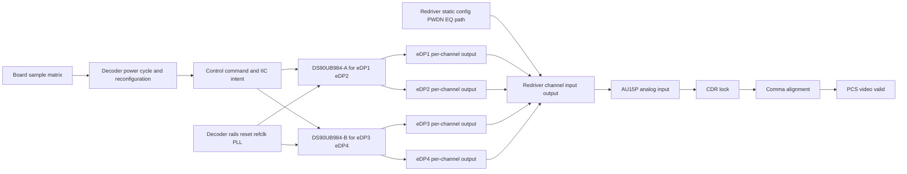
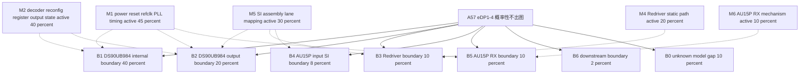
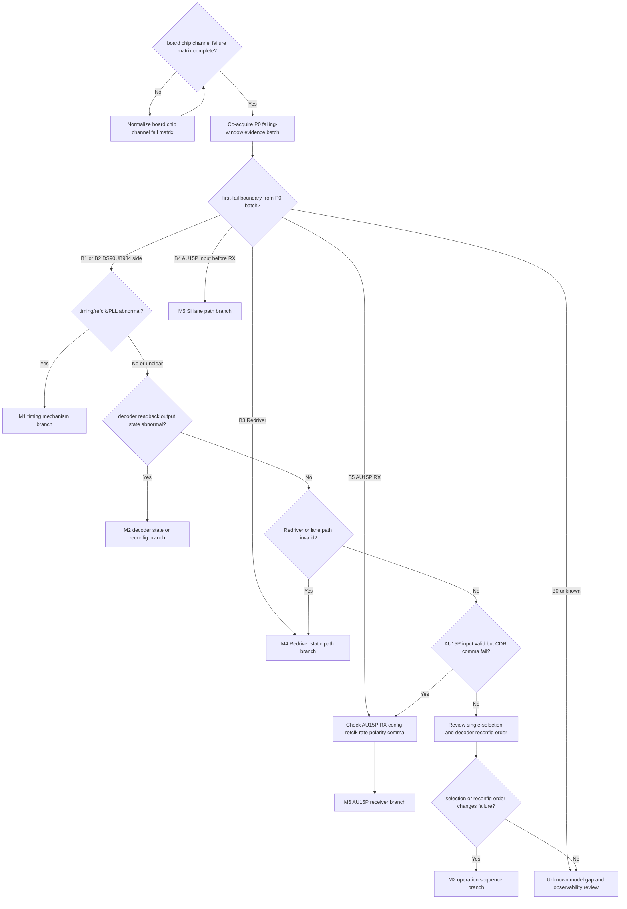

# Architecture-First Debug Decision Tree

## 1. Project Context Summary

案子：A57 项目，DS90UB984 解码板，Issue4 eDP 概率性出图异常。

本次补充改变了 case 的基本形状：它不再应被描述成“后两通道独有问题”。现在的已知情况是：

- eDP1、eDP2 来自一颗 DS90UB984；eDP3、eDP4 来自另一颗 DS90UB984。
- eDP1、eDP2、eDP3、eDP4 都有概率出图异常。
- 已测试 4 块解码板，板间表现不同：一块板 eDP3/4 异常概率更高，另外三块板 eDP1/2 异常概率更高。
- 同一颗 DS90UB984 下的两个 eDP 通道没有严格一致性，会出现一个好、一个不好。
- eDP mainstream 中间有 Redriver；Redriver 在设备上电后配置好，重复测试期间不重新配置。
- 重复测试的实际变量是 DS90UB984 重新上下电和重新配置。

选用模式：Architecture-First。当前没有新资料要求联网、查 wiki 或找相似案例；厂家寄存器确认属于低成本 point check，不等同于 broad web exploration。

当前不能下 root cause 结论。最有价值的下一步是把 `board_id / chip_id / channel_id / fail_count` 矩阵、DS90UB984 per-channel 状态、Redriver 静态状态、AU15P input/CDR/comma 放到同一故障窗口里切边界。

## 2. Input Cleaning Snapshot

### 已确认事实

| id | fact | source | confidence | staleness | affected boundary |
|---|---|---|---|---|---|
| F1 | eDP1/2 对应一颗 DS90UB984，eDP3/4 对应另一颗 DS90UB984 | Issue4 update | high | fresh | decoder mapping |
| F2 | eDP1、eDP2、eDP3、eDP4 都有概率出现问题 | Issue4 update | high | fresh | symptom distribution |
| F3 | 已测试 4 块解码板，板间表现有差异 | Issue4 update | high | fresh | multi-board matrix |
| F4 | 一块板 eDP3/4 异常概率较高，另外三块板 eDP1/2 异常概率较高 | Issue4 update | high | fresh | board/channel variation |
| F5 | 同一 DS90UB984 下的两个 eDP 通道没有严格一致性，会一个好、一个不好 | Issue4 update | high | fresh | per-channel behavior |
| F6 | Redriver 位于 eDP mainstream 中间 | Issue4 update | high | fresh | data path |
| F7 | Redriver 设备上电后配置好，后续重复测试中不重新配置 | Issue4 update | high | fresh | Redriver static config |
| F8 | 重复测试方式是对 DS90UB984 解码芯片重新上下电和重新配置 | Issue4 update | high | fresh | decoder reinit loop |
| F9 | 前后 2 通道 eDP SerDes 电路差异已确认无差异 | project action table | high | fresh | circuit comparison |
| F10 | 前 2 通道与后 2 通道 DS90UB984 IIC 指令、ini 和参数下发对比未发现问题 | project action table | high | fresh | IIC/config intent |
| F11 | eDP 上电时序、SerDes 参考时钟、Redriver PWDN/I2C、DS90UB984 寄存器和关键管脚仍待测或待厂家确认 | project action table | high | fresh | missing evidence |
| F12 | 旧版 context 中有 AUX 正常、AU15P CDR/comma 异常、SerDes reset 无改善等信息，但本次补充未重新给出同一故障窗口证据 | previous A57 latest | medium | requires_re_verification | prior receiver symptom |

### 当前判断，不是事实

| id | judgment | basis | confidence | could change if |
|---|---|---|---|---|
| J1 | case 应改写为四通道概率性出图异常，不再是后两通道独有问题 | F2,F3,F4 | high | 完整矩阵显示只有固定后通道组失败 |
| J2 | 整颗 DS90UB984 共同前提失效作为唯一解释被削弱 | F5 | medium-high | 同芯片共享 PLL/reset/output block 的故障状态被读回证明 |
| J3 | per-channel DS90UB984 output、Redriver/lane path、AU15P input 是优先切边界 | F2,F5,F6,F12 | high | 同一故障窗口证明这些边界都有效 |
| J4 | Redriver 动态 reconfig 错误分支降级，但 Redriver static PWDN/I2C/path 仍不能排除 | F6,F7,F11 | high | 证明重复测试期间 Redriver 被隐式改写或 PWDN 抖动 |
| J5 | IIC 指令/ini 对比完成只能降低“下发 intent 不同”，不能替代故障态 readback/status | F10,F11 | high | 故障态 readback 证明所有状态均符合预期 |

### 已尝试方法

| id | action | result | interpretation |
|---|---|---|---|
| M1 | 测试 4 块 DS90UB984 解码板 | 4 块都有异常倾向，且板间分布不同 | 从单板样本升级为多板概率性问题，但仍缺标准化矩阵 |
| M2 | 观察同芯片 eDP pair 是否一致 | eDP1/2、eDP3/4 都可出现一个好、一个不好 | per-channel 边界优先级上升 |
| M3 | 重复对 DS90UB984 上下电和重新配置 | 概率性异常仍存在 | 重复变量主要在 decoder reinit loop，不是 Redriver 动态重配 |
| M4 | 确认前后 2 通道 eDP SerDes 电路差异 | 已确认无差异 | 降低前后电路设计差异分支，但不排除板级装配/SI |
| M5 | 对比前后 DS90UB984 IIC 指令、ini 和参数下发 | 未发现问题，已完成 | 降低 intent/config-diff 分支，但 readback/status 未闭合 |

## 3. Architecture / Link Understanding

当前 link model 应按 “board -> decoder chip -> decoder channel -> Redriver static path -> AU15P receiver” 分层，而不是按“前两通道好、后两通道坏”的旧对照轴。

1. 板级样本轴：4 块已测板，计划表中还有 6 块目标或另外 2 块待确认，需统一成标准矩阵。
2. 芯片映射轴：DS90UB984-A 输出 eDP1/2；DS90UB984-B 输出 eDP3/4。
3. 通道轴：同一 DS90UB984 的两个通道可能一个好一个坏，所以 per-channel output/path/status 必须单独看。
4. 重复测试变量：DS90UB984 重新上下电和重新配置。
5. Redriver 边界：Redriver 上电后配置好，重复测试期间不重新配置；因此动态重配分支降级，但 PWDN、I2C 初始状态、EQ、path、input/output activity 仍是开放边界。
6. 接收边界：旧证据中的 AU15P CDR/comma 异常需要按 eDP1-4 重新对齐到同一故障窗口。

## 4. Evidence-Aware Link Model

| node | known | inferred | unknown | evidence that moves boundary |
|---|---|---|---|---|
| B0 board sample matrix | 4 块板已测，板间异常倾向不同 | 既不是纯单板，也不能直接叫共性同一 root cause | 每块板、每通道 test_count/fail_count | 标准化 board_id/chip_id/channel_id matrix |
| T0 decoder power cycle/reconfig | 重复测试变量是 DS90UB984 上下电和重配 | 故障可能在 decoder reinit 后状态不稳定 | 操作顺序、单独勾选含义、重配时序 | 带 pass/fail 标记的 operation log |
| C1 control command/IIC intent | 前后 IIC 指令、ini、参数下发对比未发现问题 | intent 正确不等于 fault-state persistent state 正确 | 故障态 readback、ACK/data、关键寄存器保持性 | good/fault readback table |
| U1/U2 DS90UB984 chips | eDP1/2 与 eDP3/4 分属两颗芯片 | 整颗芯片共同前提失效不能解释全部通道不一致 | per-chip rails/reset/refclk/PLL/status | 同一故障窗口 chip status + per-channel status |
| CH1-CH4 per-channel output | 四个通道都可能失败，同芯片 pair 不一致 | per-channel output/status/path 是强边界 | output-valid、stream-detect、error/status、test pattern | 厂家确认寄存器 + fault-state readback/output evidence |
| R0 Redriver static config | Redriver 上电后配置，重复测试期间不重配 | 动态 reconfig 不是主要重复变量 | PWDN/I2C/EQ/mux 是否稳定正确 | 上电初始化波形/readback/PWDN + 重复测试期间保持性 |
| R1 Redriver channel input/output | Redriver 在 mainstream 中间 | static path 或通道 SI 可造成 per-channel 差异 | 每通道 input/output activity | Redriver input/output 或安全 proxy |
| A0 AU15P analog input | 旧 context 中接收侧异常需要复核 | 若 AU15P input 无效，receiver tuning 不应优先 | eDP1-4 同窗口 input activity | near-FPGA activity/eye/status proxy |
| A1/A2 CDR/comma | 旧 context 中 CDR/comma 异常 | CDR/comma 是症状，不是 root cause | 是否覆盖所有通道和当前重复方式 | 同窗口 CDR/comma + input evidence |

## 5. Fact / Assumption Table

本节使用类型化 ID，避免和 §2 Input Cleaning Snapshot 中的 F 编号漂移混淆。§2 保留输入清洗快照的证据 ID；本节只做 architecture-first 的压缩视图。

| id | type | content | confidence | evidence_refs |
|---|---|---|---|---|
| AF-F1 | fact | eDP1/2 与 eDP3/4 分属两颗 DS90UB984 | high | Issue4 update |
| AF-F2 | fact | eDP1-4 都有概率出图异常 | high | Issue4 update |
| AF-F3 | fact | 4 块板表现出板间差异 | high | Issue4 update |
| AF-F4 | fact | 同芯片 pair 不严格一致 | high | Issue4 update |
| AF-F5 | fact | Redriver 重复测试期间不重配 | high | Issue4 update |
| AF-F6 | fact | 重复测试变量是 DS90UB984 上下电和重配 | high | Issue4 update |
| AF-F7 | fact | SerDes 电路差异已确认无差异 | high | project table |
| AF-F8 | fact | IIC 指令、ini 和参数下发对比未发现问题 | high | project table |
| AF-M1 | missing | DS90UB984 fault-state readback、output-valid、stream/status 仍缺 | high | project table |
| AF-M2 | missing | Redriver PWDN/I2C/static config/input-output 仍缺 | high | project table |
| AF-S1 | stale_context | AUX normal、CDR/comma fail、SerDes reset no recovery 需要新矩阵同窗口复核 | medium | previous latest |
| AF-A1 | assumption | DS90UB984 有可用的 per-channel stream/output/status 寄存器或厂家可确认诊断方式 | medium | vendor-dependent |
| AF-A2 | assumption | Redriver 4 通道 PWDN/I2C/input-output 可以安全测量或用状态代理确认 | medium | board-dependent |
| AF-A3 | assumption | AU15P CDR/comma 状态可按 eDP1-4 单独导出 | medium | FPGA debug-dependent |

## 6. Fault-Domain Localization

以下不再使用单一 flat root-cause probability table。A57 当前证据同时包含“信号第一次在哪里失效”的 boundary 问题，以及“什么机制导致失效”的 mechanism 问题；两者不是互斥同类项，不能强行相加到 100%。直接物理症状的最简解释仍必须进入 top two，但这里的 top two 指 boundary distribution：当前最可能的 first-fail boundary 在 DS90UB984 内部或 DS90UB984 output pin 侧。

### Boundary Distribution

本表是互斥分布，表示信号链第一次偏离 spec 的位置，概率和为 1.00。

| id | type | first_fail_boundary | p | why now | evidence that raises it | evidence that lowers it |
|---|---|---|---:|---|---|---|
| B1 | boundary | DS90UB984 内部 lock/PLL/CDR/state machine 或 per-channel internal state | 0.40 | 重复变量在 DS90UB984 上下电/重配；同芯片通道不一致仍可能来自内部 per-channel state | fault-state readback 显示 internal lock/PLL/output state 异常 | good/fault DS90UB984 internal status 均稳定有效 |
| B2 | boundary | DS90UB984 output pin / mainstream 离开 decoder 前后 | 0.20 | 四通道概率性异常和 per-channel 行为最直接要求确认 decoder output 是否真的有效 | per-channel output-valid false 或 output pin/activity 缺失 | decoder output pin/activity 对失败通道有效 |
| B3 | boundary | Redriver input 到 output 之间 | 0.10 | Redriver 是 mainstream 中间边界，static PWDN/I2C/EQ/path 未闭合 | Redriver input 有效但 output 无效，或 PWDN/I2C/static config 错 | Redriver input/output 同窗口均有效 |
| B4 | boundary | AU15P input pin 前的 SI/lane path | 0.08 | 板间/通道间差异可能落在 lane path、连接器、AC coupling、SI margin | Redriver output 有效但 AU15P input proxy 无效 | AU15P input activity 对失败通道有效 |
| B5 | boundary | AU15P SerDes RX CDR/comma/polarity/rate | 0.10 | 旧 context 有 CDR/comma 异常，但需要同窗口复核 | AU15P input 有效但 CDR/comma 失败 | AU15P input 缺失，或 CDR/comma 在新窗口有效 |
| B6 | boundary | downstream video pipeline | 0.02 | 理论存在但当前前级边界未闭合 | CDR/comma/PCS 有效但无 video | input/CDR/comma 仍异常 |
| B0 | boundary | unknown / model gap：同窗口证据不足，无法定位 first-fail boundary | 0.10 | DS90UB984 status、Redriver、AU15P input/CDR/comma 都缺同窗口证据 | P0 batch 后仍无法解释或出现未建模 shared resource | P0 batch 明确落入 B1-B6 |

### Mechanism Prior

本表是独立 prior，表示机制是否 active；多项可同时为真，不相加到 1.00。`observability_gap` 是观测能力缺口，不是物理 root cause。

| id | type | mechanism | p_active | affects_boundaries | why now | evidence gate |
|---|---|---|---:|---|---|---|
| M1 | mechanism | DS90UB984 power/reset/refclk/PLL/SerDes reference timing 边缘或不一致 | 0.45 | B1,B2,B5 | 重复测试变量包含 DS90UB984 上下电；上电时序和 SerDes refclk 尚未测 | failing vs passing timing capture |
| M2 | mechanism | DS90UB984 reconfig sequence、register retention、output enable 或 stream state 序列问题 | 0.40 | B1,B2 | 重复测试包含 decoder reconfig；IIC intent 正常但 fault-state readback 未闭合 | good/fault raw readback + operation log |
| M3 | observability_gap | DS90UB984 fault-state/status 未读或关键诊断位未覆盖 | 0.35 | B0 | 缺 per-channel raw readback，导致 boundary 不能被压缩 | P0a raw dump + vendor semantic point check |
| M4 | mechanism | Redriver static config、PWDN、I2C、EQ 或 path 状态异常 | 0.20 | B3 | Redriver 不动态重配，但 static state/PWDN/input-output 仍缺 | failing-window Redriver state + input/output |
| M5 | mechanism | 板间装配、SI margin、lane mapping 或 channel-id 固定差异 | 0.30 | B2,B3,B4 | 4 块板分布不同，同芯片双通道可一好一坏 | board/chip/channel matrix + lane/path evidence |
| M6 | mechanism | AU15P RX config、refclk、rate、polarity、comma 条件异常 | 0.10 | B5 | 旧 CDR/comma context 需要同窗口复核 | AU15P input 有效但 CDR/comma 仍 fail |
| M7 | mechanism | downstream video pipeline 异常 | 0.05 | B6 | 只作为低位保留 | CDR/comma/PCS 全有效但 video 无效 |

### Coverage Matrix

`H/M/L/-` 表示该 mechanism 对 boundary 的解释力。板间分布观测抬升 M5；同颗 DS90UB984 双通道一好一坏抬升 M2/M5，并压低“纯全局 M1”作为唯一解释，但 M1 仍可通过 per-channel state 或边缘时序表现为概率性失败。

| mechanism_id | B1 DS90 internal | B2 decoder output | B3 Redriver | B4 AU15P input SI | B5 AU15P RX | B6 downstream |
|---|---|---|---|---|---|---|
| M1 power/reset/refclk/PLL | H | M | - | - | M | - |
| M2 reconfig/register/output enable | H | M | - | - | L | - |
| M4 Redriver static/PWDN/EQ | - | - | H | L | L | - |
| M5 SI/assembly/lane mapping | L | M | M | H | M | - |
| M6 AU15P RX config/refclk/rate | - | - | - | - | H | - |
| M7 downstream pipeline | - | - | - | - | - | H |

### Evidence Ledger

当状态为“缺”时，相关 boundary/mechanism 不允许被写得过尖；本输出采用 `P <= 0.50` 的 evidence-gated ceiling。

| evidence | status | affects | probability effect |
|---|---|---|---|
| eDP/DS90UB984 上电时序 scope capture | 缺 | B1,B2,M1 | M1 不可压缩，但不能超过 0.50 |
| SerDes refclk 频率/稳定性/抖动或 lock proxy | 缺 | B1,B5,M1 | M1 和 B5 保留 |
| Redriver PWDN/I2C/EQ/static state in failing window | 缺 | B3,M4 | B3/M4 不可排除 |
| DS90UB984 fault-state/per-channel status raw 同窗口 | 缺 | B1,B2,B0,M2,M3 | B0 和 M3 保留；B1/B2 不能被确认 |
| AU15P input/CDR/comma status 同窗口 | 缺 | B4,B5,M6 | B4/B5/M6 不可排除 |
| 前后 DS90UB984 IIC 指令、ini、参数对比 | 有 | M2 | 压低显式 intent 错误，但不压低 fault-state retention/output enable |
| 前后 SerDes 电路差异确认 | 有 | M5 | 压低 schematic-level 前后差异，但不排除板级 SI/装配/lane mapping |

## 7. Hypothesis Tree With Probabilities

| item | probability semantics | how to read it |
|---|---|---|
| B1-B6/B0 | boundary distribution，互斥，sum=1.00 | 回答“信号第一次在哪里失效” |
| M1-M7 | mechanism prior，独立，不 sum=1.00 | 回答“哪些机制可能 active” |
| M3 | observability_gap | 回答“是不是因为没读到关键状态而无法定位” |
| P0 batch | information-gain action set | 不是按 mechanism rank 排序，而是同窗口压缩多行多列不确定度 |

## 8. Candidate Matching Report

| asset | type | decision | reason | evidence_refs |
|---|---|---|---|---|
| assets/link_models/LM-EDP-DECODER-FPGA-LINK.yaml | link_model | Adopted | 仍匹配 decoder -> Redriver/path -> FPGA receiver 的多层链路 | F1-F12 |
| assets/link_models/LM-VIDEO-LINK.yaml | link_model | Adopted | 需要保留 source/decoder/path/receiver/downstream 分层 | F2,F12 |
| assets/link_models/LM-CLOCK-RESET-TREE.yaml | link_model | Adopted | DS90UB984 上下电、reset、refclk/PLL 是当前待测前提 | F8,F11 |
| assets/link_models/LM-I2C-BUS.yaml | link_model | Adopted | IIC intent 已比对，但 readback/status 仍需用总线模型闭合 | F10,F11 |
| assets/debug_principles/DP-DYNAMIC-EVIDENCE-BEFORE-STATIC-RATING.yaml | debug_principle | Adopted | 概率性失败需要同一故障窗口动态证据，不能只看静态参数 | F3,F4 |
| assets/debug_principles/DP-MEASUREMENT-BEFORE-DESIGN-CHANGE.yaml | debug_principle | Adopted | 在证明 AU15P input 有效前不应优先调 receiver | B5,M6 |
| Knowledge-Linked point check: DS90UB984 output/status registers | mode | Adopted | 厂家确认寄存器属于点查，可降低 M3 并切分 B1/B2，不是 broad exploration | F19,B1,B2,M3 |
| Knowledge-Linked point check: Redriver PWDN/I2C behavior | mode | Adopted | PWDN/I2C 初始状态需要 datasheet/board 证据闭合 | F15,B3,M4 |
| Broad web/wiki exploration | mode | Deferred | 当前首批动作依赖板级测量和厂家点查，不依赖广泛资料 | current scope |
| 后两通道专属模型 | heuristic | Not Applied | 新证据显示 eDP1-4 都可能失败 | F2-F5 |
| Redriver dynamic reconfiguration-first | heuristic | Not Applied | Redriver 重复测试期间不重新配置 | F7,F8 |
| downstream-video-first debug | heuristic | Not Applied | input/CDR/comma 边界未闭合 | B4,B5 |

## 9. Adopted / Deferred / Not Applied

Adopted：

- Architecture-First mode。
- 四通道 board/chip/channel 矩阵视角。
- Boundary / mechanism / observability_gap 四表分离；不再把 DS90UB984 output/status boundary 和 power/refclk/PLL mechanism 放进同一张互斥表。
- Boundary distribution 的 top two 是 DS90UB984 内部边界 B1 与 DS90UB984 output boundary B2；mechanism prior 中 M1/M2/M5 是当前最需要同窗口分离的候选。
- 厂家寄存器说明和 PWDN/I2C 极性作为 Knowledge-Linked point checks。

Deferred：

- broad web exploration。
- similar-problem expansion。
- AU15P SerDes tuning、receiver 参数修改、downstream video debug，直到 AU15P input 有效被证明。

Not Applied：

- 不再把 eDP1/2 当作稳定好通道 baseline。
- 不把“同一颗 DS90UB984”自动当成两个通道同好同坏。
- 不把 IIC intent/ini 对比正常写成 readback/status 已闭合。
- 不把 Redriver 动态 reconfiguration 当成当前重复变量。
- 不用旧 AUX/CDR/comma context 直接改概率；需要同一故障窗口复核。

## 10. Cost / Probability Ranking

本表使用 `reasoning/cost_priors.yaml` 的经验中位数，并按 Architecture-First 模式的 `exclude_weight = 0.7` 计算。局部覆盖：A_P0m 的 `time_min=60` 是因为 4 块板已有部分测试，当前动作是补齐标准化矩阵，不是从零开始搭建 multi-board reproduction matrix。P0a-P0d 是同一次失败复现窗口的 co-acquisition batch，不是互斥排序。

| action_id | tier | co_acquisition | action | boundary_subset | mechanism_subset | p_hit | p_exclude | time_min | safety | priority_score | reason |
|---|---|---|---|---|---|---:|---:|---:|---|---:|---|
| A_P0a | P0 | true | DS90UB984 per-channel fault-state/status raw readback，厂家寄存器语义并行点查 | B1,B2,B0 | M2,M3 | 0.22 | 0.65 | 45 | S0 | 0.015 | 低成本同时压缩 observability gap 和 DS90UB984 boundary |
| A_P0m | P0 | false | 补齐 board/chip/channel/test_count/fail_count/operation 标准矩阵 | B0,B2,B3,B4 | M5 | 0.12 | 0.65 | 60 | S0 | 0.010 | 防止继续用混乱样本描述做概率判断 |
| A_P0b | P0 | true | DS90UB984 rails、reset、refclk/PLL、SerDes reference failing-vs-passing scope capture | B1,B2,B5 | M1 | 0.25 | 0.55 | 90 | S1 | 0.007 | 直接验证“上电时序/参考时钟”机制，但不和 boundary 项竞争 |
| A_P0d | P0 | true | Redriver PWDN/I2C/EQ/static state 与每通道 input/output activity | B3,B4 | M4,M5 | 0.18 | 0.55 | 90 | S1 | 0.007 | 切 Redriver/static path、lane path 与 AU15P input 前边界 |
| A_P0c | P0 | true | AU15P input activity、CDR、comma、lane status 按 eDP1-4 同窗口记录 | B4,B5 | M6,M5 | 0.15 | 0.50 | 90 | S1 | 0.006 | 切 AU15P input 前后边界，刷新旧 CDR/comma context |
| A_P1a | P1 | false | 只有 AU15P input 有效后，检查 AU15P SerDes refclk/config/rate/polarity/comma 设置 | B5 | M6 | 0.07 | 0.45 | 75 | S0 | 0.005 | receiver mechanism 的前置条件是 input 有效 |
| A_P1b | P1 | false | 复核单独勾选、decoder reconfig 顺序和串行化/固定顺序测试 | B1,B2 | M2 | 0.12 | 0.45 | 120 | S0 | 0.004 | 验证 operation/selection coupling，但应在 P0 batch 后解释 |

## 11. Optimal Troubleshooting Path

1. 并行补齐标准矩阵：`board_id / DS90UB984_A_or_B / eDP_channel / test_count / fail_count / operation / decoder_reconfig_params / Redriver_static_config_id`。这不要求和 P0 batch 同窗口，但必须在解释板间/通道间分布前完成。
2. 下一次失败复现时，把 A_P0a/A_P0b/A_P0c/A_P0d 作为同窗口 batch 采集：DS90UB984 raw status、DS90UB984 rails/reset/refclk/PLL、Redriver static/input-output、AU15P input/CDR/comma。四组数据必须带同一 failure timestamp 或同一复现窗口标记。
3. 用 P0 batch 先更新 boundary distribution：first-fail boundary 是 B1/B2、B3、B4、B5 还是仍为 B0。
4. 再用 coverage matrix 更新 mechanism prior：例如 timing 异常上调 M1；readback/output enable 异常上调 M2；板/通道/lane 相关性上调 M5；valid input but CDR/comma fail 才上调 M6。
5. 只有 P0 batch 证明 AU15P input 有效后，才进入 AU15P SerDes config/refclk/rate/polarity/comma 分支。

累计成本估算：A_P0m + A_P0a + A_P0b + A_P0c + A_P0d 标称约 375 min。若矩阵整理、寄存器点查、硬件测量和 FPGA status 导出可并行，现场日程约 6-8 小时更现实。

## 12. Decision Tree

## 13. Node Explanation Table

| id | type | action_type | check_or_action | tool_required | expected_observation | interpretation | safety_level | cost | reversibility | next_branch | evidence_refs |
|---|---|---|---|---|---|---|---|---|---|---|---|
| D1 | decision | none | 检查 board/chip/channel/fail matrix 是否完整 | test log | complete or incomplete | 矩阵不完整时不能稳定判断共性、板差或通道差 | S0 | low | n/a | A_P0m or A_P0 | F2,F3,F4 |
| A_P0m | action | observe | 统一整理 board_id、chip_id、channel_id、test_count、fail_count、operation 条件 | test log spreadsheet | 标准化失败率矩阵 | 把混乱样本描述变成可排序证据 | S0 | medium | reversible | D1 | B0,M5 |
| A_P0 | action | observe | 同窗口采集 DS90UB984 raw status、timing/refclk、Redriver state/input-output、AU15P input/CDR/comma | register dump scope FPGA status Redriver status | 带同一 failure timestamp 的 boundary evidence batch | 同时压缩 boundary distribution、mechanism prior 和 observability gap | S1 | high | reversible | D2 | B1-B5,M1-M6 |
| D2 | decision | none | 用 P0 batch 判断 first-fail boundary | evidence batch table | B1/B2/B3/B4/B5/B0 | 先定位 boundary，再谈 mechanism | S0 | low | n/a | D3 or T3 or T4 or A_P1a or T7 | B0-B5 |
| D3 | decision | none | 判断 DS90UB984 timing/refclk/PLL 是否异常 | waveform and status table | abnormal or clean | abnormal 支持 M1；clean 则查 readback/output state | S0 | low | n/a | T1 or D4 | M1 |
| T1 | terminal | none | M1 timing mechanism 分支激活 | aligned waveform | rail reset refclk PLL abnormal | 聚焦 DS90UB984 上电时序、参考时钟、PLL/lock margin | S0 | medium | n/a | terminal | M1,B1,B2 |
| D4 | decision | none | 判断 decoder readback/output state 是否异常 | register table | abnormal or clean | abnormal 支持 M2；clean 则 boundary 推后 | S0 | low | n/a | T2 or D5 | M2,B1,B2 |
| T2 | terminal | none | M2 decoder state/reconfig 分支激活 | raw readback and operation log | output enable、stream state、retention 或 reconfig sequence 异常 | 聚焦 DS90UB984 reinit sequence、output enable、stream detect、厂家建议寄存器 | S0 | medium | n/a | terminal | M2,B1,B2 |
| D5 | decision | none | 判断 Redriver 或 lane path 是否无效 | Redriver evidence | valid or invalid | invalid 支持 B3/M4 或 B4/M5 | S0 | low | n/a | T3 or D6 | B3,B4,M4,M5 |
| T3 | terminal | none | M4 Redriver static path 分支激活 | Redriver evidence | PWDN/I2C/path/input-output invalid | 聚焦 PWDN、EQ、mux、lane mapping、Redriver static state | S0 | medium | n/a | terminal | B3,M4 |
| T4 | terminal | none | M5 SI/lane path 分支激活 | input evidence and matrix | valid upstream but invalid AU15P input 或与 board/channel/lane 相关 | 聚焦 lane path、connector、AC coupling、SI margin、board/channel distribution | S0 | medium | n/a | terminal | B4,M5 |
| A_P1a | action | observe | 检查 AU15P SerDes refclk、config、rate、polarity、comma 设置 | FPGA debug status and clock measurement | receiver config/refclk valid or invalid | 只有 input 有效时才确认或降低 AU15P receiver mechanism | S0 | medium | reversible | T5 | B5,M6 |
| D6 | decision | none | 判断 AU15P input 有效但 CDR/comma 是否失败 | FPGA status | input valid with receiver fail or not | valid input + CDR/comma fail 才进入 receiver 分支 | S0 | low | n/a | A_P1a or A_P1b | B5,M6 |
| T5 | terminal | none | M6 AU15P receiver 分支激活 | receiver evidence | valid input but receiver abnormal | 此时才调 SerDes/refclk/rate/polarity/comma | S0 | medium | n/a | terminal | B5,M6 |
| A_P1b | action | reconfigure | 复核单独勾选语义、decoder reconfig 顺序、串行化或固定顺序测试 | firmware log controlled test | failure rate changes or stays same | 验证 operation/selection coupling 是否解释 B1/B2 | S0 | medium | reversible | D7 | M2 |
| D7 | decision | none | 判断 selection 或 reconfig order 是否改变失败 | operation matrix | changes or no change | 改变则 M2 operation branch 激活，否则进入 model gap review | S0 | low | n/a | T6 or T7 | M2,B0 |
| T6 | terminal | none | M2 operation sequence 分支激活 | controlled operation evidence | single-selection or order changes failure | 聚焦 DS90UB984 reinit sequence、delay、channel enable order | S0 | medium | n/a | terminal | M2 |
| T7 | terminal | none | unknown / model gap and observability review | evidence pack | B1-B6 与 M1-M7 未解释故障 | 重新审查 link model、厂家资料、未建模耦合和诊断盲区 | S0 | medium | n/a | terminal | B0,M3 |

## 14. Missing Architecture Information

| id | missing information | why it changes the plan |
|---|---|---|
| G1 | 4 块已测板和计划 6 块之间的完整 test matrix，含 board_id、DS90UB984 chip_id、channel_id、operation、test_count、fail_count、fail_condition、同芯片内具体失败 channel | 决定 B0/M5 是否上调或降级，并区分 channel-id 固定失效与板级随机失效 |
| G2 | DS90UB984 per-channel stream/output/status 寄存器定义和故障态 readback | 直接验证 B1/B2，并压缩 M2/M3 |
| G3 | DS90UB984 rails、reset、refclk/PLL、SerDes 参考时钟波形 | 直接验证 M1 及其对 B1/B2/B5 的解释力 |
| G4 | Redriver PWDN/I2C/static config、每通道 input/output activity | 直接验证 B3/M4，并辅助判断 B4/M5 |
| G5 | AU15P input/CDR/comma 是否按 eDP1-4 同窗口记录 | 决定 B4/B5/M6 是否能上调 |
| G6 | “单独勾选无法出图”的操作语义、勾选对象、时序和寄存器变化 | 影响 M2 |
| G7 | 旧 AUX/CDR/comma 证据是否适用于新的四通道多板矩阵 | stale context 需要重新确认后才能影响概率 |

## 15. Next 3-5 Actions

### First Actions

1. 先把已测 4 块和计划补测的 2 块统一成标准矩阵：`board_id / chip_id / eDP / test_count / fail_count / single-selection / decoder reconfig sequence / Redriver static config id`。
2. 下一次失败复现时，同窗口采集 DS90UB984 per-channel raw readback/status、DS90UB984 rails/reset/refclk/PLL、Redriver PWDN/I2C/static/input-output、AU15P input/CDR/comma。该 P0 batch 必须带同一 failure timestamp 或同一复现窗口标记。
3. 厂家点查 output-valid、stream-detect、error/status 寄存器语义并行推进，但不阻塞 raw dump。
4. 用 P0 batch 先更新 first-fail boundary，再用 coverage matrix 更新 mechanism prior。
5. 只有证明 AU15P input 有效后，才进入 AU15P SerDes config/refclk/rate/polarity/comma 分支。

### Action Items by Candidate Owner

以下 candidate_owner 来自用户提供的项目事项表。表中已有责任人字段，但正式排期、交付口径和 owner 仍建议由 PM/project lead 确认。

| candidate_owner | action item | expected output | priority |
|---|---|---|---|
| 吴志安 / 陈斌 | 统一补齐 4/6 块 DS90UB984 解码板的 board/chip/channel failure matrix | 标准矩阵和每通道失败率 | P0 |
| 陈斌 | 先读取 DS90UB984 故障态 raw register dump，再并行和厂家确认模拟出图输出/stream/status 诊断位 | good/fault per-channel raw dump + vendor point-check result | P0 |
| 吴峰 | 测 eDP 上电时序，覆盖 DS90UB984 rails、reset、refclk/PLL、SerDes 参考时钟 | 带 pass/fail 标注的 aligned waveform | P0 |
| 吴峰 | 确认 Redriver 4 通道上电 PWDN、I2C/static config、出图相关 PWDN 是否正确且保持稳定 | PWDN/I2C/static config coverage table | P0 |
| 吴峰 / FPGA debug owner 待确认 | 组织同一故障窗口 DS90UB984 output、Redriver output、AU15P input、CDR/comma 联合捕获 | boundary table：decoder output valid、Redriver output valid、AU15P input valid、CDR/comma state | P0 |
| 陈斌、吴峰 | 测 DS90UB984 关键管脚 | per-pin voltage/timing/status table | P1 |
| 罗奇军、陈斌 | 保留已完成的 IIC 指令/ini 参数对比，并补充 fault-state readback 是否一致 | intent-vs-readback comparison table | P1 |

## 16. Stop / Escalation Conditions

停止或降级分支：

- 如果标准矩阵未完成，停止继续用“前两通道/后两通道”粗粒度描述更新概率。
- 如果 DS90UB984 per-channel output/status 未测，停止把问题直接归到 Redriver 或 AU15P。
- 如果 Redriver PWDN/I2C/static config/input-output 未闭合，停止说 Redriver 已排除。
- 如果 AU15P input 未证明有效，停止把 AU15P SerDes tuning 作为主路径。
- 如果旧 AUX/CDR/comma 证据没有和新的 eDP1-4 多板矩阵对齐，停止把它当作 fresh evidence。
- 如果 P0a/P0b/P0c/P0d 不是同窗口采集，停止把这些证据做边界交叉推断，只能分别作为局部观察。

升级到 Knowledge-Linked point check 的条件：

- DS90UB984 寄存器含义、output-valid、stream-detect、模拟出图输出状态需要厂家或 datasheet 确认；
- Redriver PWDN/I2C/EQ/static config 的极性或保持性需要 datasheet/厂家确认。

升级到 broad exploration 或 similar-problem expansion 的条件：

- P0 batch 和标准矩阵仍无法解释问题；
- 厂家点查无法提供 DS90UB984/Redriver 的诊断路径；
- 新证据显示当前 link model 漏掉 shared resource、reset domain、lane remap 或未建模耦合。

## 17. Retrospective Trigger

出现以下任一情况时，开启 retrospective 并起草 case_record：

- DS90UB984 boundary B1/B2 被证明，且某个 mechanism（M1 或 M2）修复后失败率下降。
- Redriver boundary B3 和 M4 被证明，且修复后失败率下降。
- 标准矩阵证明问题是板间/通道间 SI、装配、lane mapping 或 channel-id 固定差异。
- 标准矩阵完成后，M5 仍保持中高概率；此时必须复审是否拆成 M5a 板级装配、M5b SI margin、M5c lane mapping、M5d channel-id 固定差异。
- AU15P input 有效但 B5/M6 receiver branch 被证实为主因。
- 最终解决方案改变 DebugTool 对“同芯片多通道不一致”“Redriver static vs dynamic config”“decoder reinit loop”的通用排查规则。
