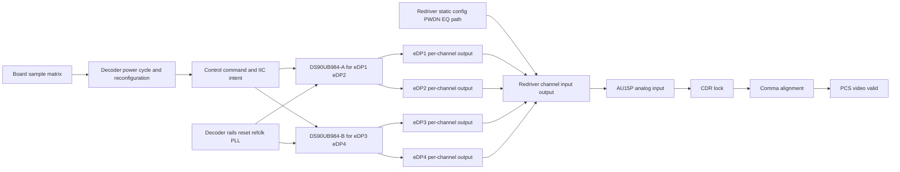
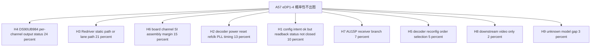
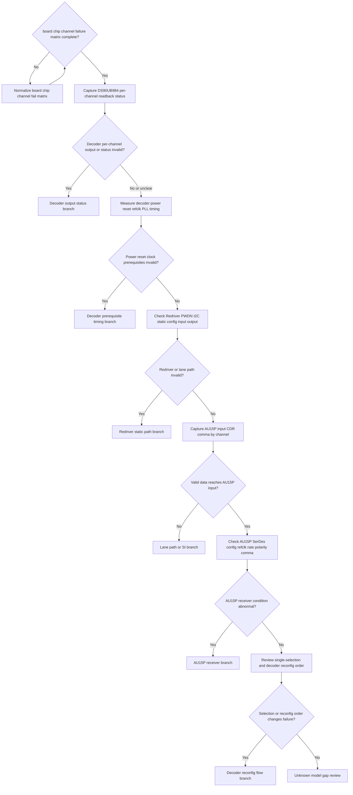

# Architecture-First Debug Decision Tree

## 1. Project Context Summary

案子：A57 项目，DS90UB984 解码板，Issue4 eDP 概率性出图异常。

本次补充改变了 case 的基本形状：它不再应被描述成“后两通道独有问题”。现在的已知情况是：

- eDP1、eDP2 来自一颗 DS90UB984；eDP3、eDP4 来自另一颗 DS90UB984。
- eDP1、eDP2、eDP3、eDP4 都有概率出图异常。
- 已测试 4 块解码板，板间表现不同：一块板 eDP3/4 异常概率更高，另外三块板 eDP1/2 异常概率更高。
- 同一颗 DS90UB984 下的两个 eDP 通道没有严格一致性，会出现一个好、一个不好。
- eDP mainstream 中间有 Redriver；Redriver 在设备上电后配置好，重复测试期间不重新配置。
- 重复测试的实际变量是 DS90UB984 重新上下电和重新配置。

选用模式：Architecture-First。当前没有新资料要求联网、查 wiki 或找相似案例；厂家寄存器确认属于低成本 point check，不等同于 broad web exploration。

当前不能下 root cause 结论。最有价值的下一步是把 `board_id / chip_id / channel_id / fail_count` 矩阵、DS90UB984 per-channel 状态、Redriver 静态状态、AU15P input/CDR/comma 放到同一故障窗口里切边界。

## 2. Input Cleaning Snapshot

### 已确认事实

| id | fact | source | confidence | staleness | affected boundary |
|---|---|---|---|---|---|
| F1 | eDP1/2 对应一颗 DS90UB984，eDP3/4 对应另一颗 DS90UB984 | Issue4 update | high | fresh | decoder mapping |
| F2 | eDP1、eDP2、eDP3、eDP4 都有概率出现问题 | Issue4 update | high | fresh | symptom distribution |
| F3 | 已测试 4 块解码板，板间表现有差异 | Issue4 update | high | fresh | multi-board matrix |
| F4 | 一块板 eDP3/4 异常概率较高，另外三块板 eDP1/2 异常概率较高 | Issue4 update | high | fresh | board/channel variation |
| F5 | 同一 DS90UB984 下的两个 eDP 通道没有严格一致性，会一个好、一个不好 | Issue4 update | high | fresh | per-channel behavior |
| F6 | Redriver 位于 eDP mainstream 中间 | Issue4 update | high | fresh | data path |
| F7 | Redriver 设备上电后配置好，后续重复测试中不重新配置 | Issue4 update | high | fresh | Redriver static config |
| F8 | 重复测试方式是对 DS90UB984 解码芯片重新上下电和重新配置 | Issue4 update | high | fresh | decoder reinit loop |
| F9 | 前后 2 通道 eDP SerDes 电路差异已确认无差异 | project action table | high | fresh | circuit comparison |
| F10 | 前 2 通道与后 2 通道 DS90UB984 IIC 指令、ini 和参数下发对比未发现问题 | project action table | high | fresh | IIC/config intent |
| F11 | eDP 上电时序、SerDes 参考时钟、Redriver PWDN/I2C、DS90UB984 寄存器和关键管脚仍待测或待厂家确认 | project action table | high | fresh | missing evidence |
| F12 | 旧版 context 中有 AUX 正常、AU15P CDR/comma 异常、SerDes reset 无改善等信息，但本次补充未重新给出同一故障窗口证据 | previous A57 latest | medium | requires_re_verification | prior receiver symptom |

### 当前判断，不是事实

| id | judgment | basis | confidence | could change if |
|---|---|---|---|---|
| J1 | case 应改写为四通道概率性出图异常，不再是后两通道独有问题 | F2,F3,F4 | high | 完整矩阵显示只有固定后通道组失败 |
| J2 | 整颗 DS90UB984 共同前提失效作为唯一解释被削弱 | F5 | medium-high | 同芯片共享 PLL/reset/output block 的故障状态被读回证明 |
| J3 | per-channel DS90UB984 output、Redriver/lane path、AU15P input 是优先切边界 | F2,F5,F6,F12 | high | 同一故障窗口证明这些边界都有效 |
| J4 | Redriver 动态 reconfig 错误分支降级，但 Redriver static PWDN/I2C/path 仍不能排除 | F6,F7,F11 | high | 证明重复测试期间 Redriver 被隐式改写或 PWDN 抖动 |
| J5 | IIC 指令/ini 对比完成只能降低“下发 intent 不同”，不能替代故障态 readback/status | F10,F11 | high | 故障态 readback 证明所有状态均符合预期 |

### 已尝试方法

| id | action | result | interpretation |
|---|---|---|---|
| M1 | 测试 4 块 DS90UB984 解码板 | 4 块都有异常倾向，且板间分布不同 | 从单板样本升级为多板概率性问题，但仍缺标准化矩阵 |
| M2 | 观察同芯片 eDP pair 是否一致 | eDP1/2、eDP3/4 都可出现一个好、一个不好 | per-channel 边界优先级上升 |
| M3 | 重复对 DS90UB984 上下电和重新配置 | 概率性异常仍存在 | 重复变量主要在 decoder reinit loop，不是 Redriver 动态重配 |
| M4 | 确认前后 2 通道 eDP SerDes 电路差异 | 已确认无差异 | 降低前后电路设计差异分支，但不排除板级装配/SI |
| M5 | 对比前后 DS90UB984 IIC 指令、ini 和参数下发 | 未发现问题，已完成 | 降低 intent/config-diff 分支，但 readback/status 未闭合 |

## 3. Architecture / Link Understanding

当前 link model 应按 “board -> decoder chip -> decoder channel -> Redriver static path -> AU15P receiver” 分层，而不是按“前两通道好、后两通道坏”的旧对照轴。

1. 板级样本轴：4 块已测板，计划表中还有 6 块目标或另外 2 块待确认，需统一成标准矩阵。
2. 芯片映射轴：DS90UB984-A 输出 eDP1/2；DS90UB984-B 输出 eDP3/4。
3. 通道轴：同一 DS90UB984 的两个通道可能一个好一个坏，所以 per-channel output/path/status 必须单独看。
4. 重复测试变量：DS90UB984 重新上下电和重新配置。
5. Redriver 边界：Redriver 上电后配置好，重复测试期间不重新配置；因此动态重配分支降级，但 PWDN、I2C 初始状态、EQ、path、input/output activity 仍是开放边界。
6. 接收边界：旧证据中的 AU15P CDR/comma 异常需要按 eDP1-4 重新对齐到同一故障窗口。

## 4. Evidence-Aware Link Model

| node | known | inferred | unknown | evidence that moves boundary |
|---|---|---|---|---|
| B0 board sample matrix | 4 块板已测，板间异常倾向不同 | 既不是纯单板，也不能直接叫共性同一 root cause | 每块板、每通道 test_count/fail_count | 标准化 board_id/chip_id/channel_id matrix |
| T0 decoder power cycle/reconfig | 重复测试变量是 DS90UB984 上下电和重配 | 故障可能在 decoder reinit 后状态不稳定 | 操作顺序、单独勾选含义、重配时序 | 带 pass/fail 标记的 operation log |
| C1 control command/IIC intent | 前后 IIC 指令、ini、参数下发对比未发现问题 | intent 正确不等于 fault-state persistent state 正确 | 故障态 readback、ACK/data、关键寄存器保持性 | good/fault readback table |
| U1/U2 DS90UB984 chips | eDP1/2 与 eDP3/4 分属两颗芯片 | 整颗芯片共同前提失效不能解释全部通道不一致 | per-chip rails/reset/refclk/PLL/status | 同一故障窗口 chip status + per-channel status |
| CH1-CH4 per-channel output | 四个通道都可能失败，同芯片 pair 不一致 | per-channel output/status/path 是强边界 | output-valid、stream-detect、error/status、test pattern | 厂家确认寄存器 + fault-state readback/output evidence |
| R0 Redriver static config | Redriver 上电后配置，重复测试期间不重配 | 动态 reconfig 不是主要重复变量 | PWDN/I2C/EQ/mux 是否稳定正确 | 上电初始化波形/readback/PWDN + 重复测试期间保持性 |
| R1 Redriver channel input/output | Redriver 在 mainstream 中间 | static path 或通道 SI 可造成 per-channel 差异 | 每通道 input/output activity | Redriver input/output 或安全 proxy |
| A0 AU15P analog input | 旧 context 中接收侧异常需要复核 | 若 AU15P input 无效，receiver tuning 不应优先 | eDP1-4 同窗口 input activity | near-FPGA activity/eye/status proxy |
| A1/A2 CDR/comma | 旧 context 中 CDR/comma 异常 | CDR/comma 是症状，不是 root cause | 是否覆盖所有通道和当前重复方式 | 同窗口 CDR/comma + input evidence |

## 5. Fact / Assumption Table

| id | type | content | confidence | evidence_refs |
|---|---|---|---|---|
| F1 | fact | eDP1/2 与 eDP3/4 分属两颗 DS90UB984 | high | Issue4 update |
| F2 | fact | eDP1-4 都有概率出图异常 | high | Issue4 update |
| F3 | fact | 4 块板表现出板间差异 | high | Issue4 update |
| F4 | fact | 同芯片 pair 不严格一致 | high | Issue4 update |
| F5 | fact | Redriver 重复测试期间不重配 | high | Issue4 update |
| F6 | fact | 重复测试变量是 DS90UB984 上下电和重配 | high | Issue4 update |
| F7 | fact | SerDes 电路差异已确认无差异 | high | project table |
| F8 | fact | IIC 指令、ini 和参数下发对比未发现问题 | high | project table |
| F9 | missing | DS90UB984 fault-state readback、output-valid、stream/status 仍缺 | high | project table |
| F10 | missing | Redriver PWDN/I2C/static config/input-output 仍缺 | high | project table |
| F11 | stale_context | AUX normal、CDR/comma fail、SerDes reset no recovery 需要新矩阵同窗口复核 | medium | previous latest |
| A1 | assumption | DS90UB984 有可用的 per-channel stream/output/status 寄存器或厂家可确认诊断方式 | medium | vendor-dependent |
| A2 | assumption | Redriver 4 通道 PWDN/I2C/input-output 可以安全测量或用状态代理确认 | medium | board-dependent |
| A3 | assumption | AU15P CDR/comma 状态可按 eDP1-4 单独导出 | medium | FPGA debug-dependent |

## 6. Fault-Domain Localization

### Root Cause Hypothesis Probability Table

以下概率是工程先验，用于行动排序，不是 root cause 结论。直接物理症状的最简解释必须进入 top two：四个通道概率性不出图、旧 context 中接收侧 CDR/comma 异常，最直接指向 AU15P input 之前没有有效高速数据。因此 DS90UB984 per-channel output/status 与 Redriver/static lane path 保持 top two；更远的控制顺序和 downstream video 分支不应压过它们。

| id | root-cause hypothesis | probability | why it is plausible now | evidence that raises it | evidence that lowers it |
|---|---:|---|---|---|---|
| H4 | DS90UB984 per-channel output/status 在重上电重配置后无效或不稳定 | 0.24 | 重复变量就是 DS90UB984 上下电和重配；同芯片 pair 可一个好一个坏 | fault-state per-channel output-valid false、stream/status abnormal、厂家确认相关诊断位异常 | 同一故障窗口每个失败通道 decoder output/status 有效 |
| H3 | Redriver static PWDN/I2C/EQ/path 或每通道 mainstream path 导致 AU15P input 前数据无效 | 0.21 | Redriver 在 mainstream 中间；动态重配虽降级，但 static path/PWDN/input-output 未闭合 | PWDN/I2C/static config 错、Redriver input/output 切分显示 path 失效、通道/板差与 path 相关 | Redriver input/output 和 AU15P input 同窗口均有效 |
| H6 | 板间/通道间装配、SI、lane mapping 或 margin 差异导致概率性失败 | 0.15 | 4 块板表现不同，同芯片通道不一致 | failure rate 与 board_id/channel_id/路径/连接器/AC coupling/SI proxy 相关 | 标准矩阵显示与板/通道无关 |
| H2 | DS90UB984 power/reset/refclk/PLL/SerDes reference timing 在重上电重配置中边缘或不一致 | 0.13 | 当前计划仍在测上电时序和 SerDes 参考时钟；控制可通不代表输出前提有效 | rails/reset/refclk/PLL timing 异常或与 fail 强相关 | aligned timing 和 PLL/refclk 状态干净 |
| H1 | DS90UB984 配置 intent 正确但 fault-state readback/status 未保持或关键位未覆盖 | 0.10 | IIC/ini 对比无问题降低 intent-diff，但 readback/status 仍缺 | good/fault readback 不同、关键状态位异常、厂家确认漏配位 | 故障态 readback 与 good 完全一致且 output 有效 |
| H7 | AU15P SerDes per-channel receiver config/refclk/rate/polarity/comma 设置问题 | 0.07 | 旧 context 有 CDR/comma 异常，但必须等 AU15P input 有效后再上调 | AU15P input 有效但 CDR/comma 仍 fail，receiver config/refclk 不一致 | AU15P input 缺失或 Redriver/path 无效 |
| H5 | decoder reconfig 操作顺序、单独勾选模式或控制流程造成状态机差异 | 0.05 | “单独勾选无法出图”和重配流程可能相关 | operation log 显示单通道选择/重配顺序改变失败率 | 串行化/固定顺序重配不改变失败率，readback/output 仍指向硬件边界 |
| H8 | PCS 之后 downstream video pipeline 问题 | 0.02 | 显示问题中理论存在 | CDR/comma/PCS 全有效但无 video | CDR/comma 或 AU15P input 仍异常 |
| H9 | unknown / model gap：当前 link model 漏掉耦合层或诊断变量 | 0.03 | 信息仍不完整，尤其 sample count、厂家寄存器和单独勾选语义不清 | H1-H8 被排除但故障仍存在，或出现未建模 shared resource | 新证据能完整落入 H1-H8 |

## 7. Hypothesis Tree With Probabilities

| branch | current state | first falsifier |
|---|---|---|
| H4 | top-2；重复变量直接落在 DS90UB984 上下电/重配，且同芯片通道不一致要求 per-channel status | fault-state decoder output/status 对所有失败通道有效 |
| H3 | top-2；最接近 AU15P input 的外部数据边界，Redriver static path 尚未闭合 | Redriver PWDN/I2C/input/output 与 AU15P input 均有效 |
| H6 | 中高；板间和通道间概率差异明显 | 标准矩阵显示故障与 board/channel/path 无关 |
| H2 | 中；上电时序和 SerDes 参考时钟仍未测 | rails/reset/refclk/PLL aligned waveform 干净 |
| H1 | 中低；IIC intent 对比已完成但 readback/status 未闭合 | good/fault readback/status 完全符合预期 |
| H7 | 暂缓；必须等 AU15P input 有效后上调 | AU15P input 缺失或前级无效 |
| H5 | 暂缓；只在 operation log 与单独勾选语义指向控制流程时上调 | 固定顺序/串行化重配不改变失败率 |
| H8 | 低；CDR/comma/input 边界未闭合前不优先 | receiver lock/input 仍异常 |
| H9 | 保留小概率 model-gap | 新证据能稳定归入 H1-H8 |

## 8. Candidate Matching Report

| asset | type | decision | reason | evidence_refs |
|---|---|---|---|---|
| assets/link_models/LM-EDP-DECODER-FPGA-LINK.yaml | link_model | Adopted | 仍匹配 decoder -> Redriver/path -> FPGA receiver 的多层链路 | F1-F12 |
| assets/link_models/LM-VIDEO-LINK.yaml | link_model | Adopted | 需要保留 source/decoder/path/receiver/downstream 分层 | F2,F12 |
| assets/link_models/LM-CLOCK-RESET-TREE.yaml | link_model | Adopted | DS90UB984 上下电、reset、refclk/PLL 是当前待测前提 | F8,F11 |
| assets/link_models/LM-I2C-BUS.yaml | link_model | Adopted | IIC intent 已比对，但 readback/status 仍需用总线模型闭合 | F10,F11 |
| assets/debug_principles/DP-DYNAMIC-EVIDENCE-BEFORE-STATIC-RATING.yaml | debug_principle | Adopted | 概率性失败需要同一故障窗口动态证据，不能只看静态参数 | F3,F4 |
| assets/debug_principles/DP-MEASUREMENT-BEFORE-DESIGN-CHANGE.yaml | debug_principle | Adopted | 在证明 AU15P input 有效前不应优先调 receiver | H7 |
| Knowledge-Linked point check: DS90UB984 output/status registers | mode | Adopted | 厂家确认寄存器属于点查，可影响 A2，不是 broad exploration | F19,H4 |
| Knowledge-Linked point check: Redriver PWDN/I2C behavior | mode | Adopted | PWDN/I2C 初始状态需要 datasheet/board 证据闭合 | F15,H3 |
| Broad web/wiki exploration | mode | Deferred | 当前首批动作依赖板级测量和厂家点查，不依赖广泛资料 | current scope |
| 后两通道专属模型 | heuristic | Not Applied | 新证据显示 eDP1-4 都可能失败 | F2-F5 |
| Redriver dynamic reconfiguration-first | heuristic | Not Applied | Redriver 重复测试期间不重新配置 | F7,F8 |
| downstream-video-first debug | heuristic | Not Applied | input/CDR/comma 边界未闭合 | H8 |

## 9. Adopted / Deferred / Not Applied

Adopted：

- Architecture-First mode。
- 四通道 board/chip/channel 矩阵视角。
- DS90UB984 per-channel output/status 与 Redriver/static path 作为 top-two direct-symptom branches。
- 厂家寄存器说明和 PWDN/I2C 极性作为 Knowledge-Linked point checks。

Deferred：

- broad web exploration。
- similar-problem expansion。
- AU15P SerDes tuning、receiver 参数修改、downstream video debug，直到 AU15P input 有效被证明。

Not Applied：

- 不再把 eDP1/2 当作稳定好通道 baseline。
- 不把“同一颗 DS90UB984”自动当成两个通道同好同坏。
- 不把 IIC intent/ini 对比正常写成 readback/status 已闭合。
- 不把 Redriver 动态 reconfiguration 当成当前重复变量。
- 不用旧 AUX/CDR/comma context 直接改概率；需要同一故障窗口复核。

## 10. Cost / Probability Ranking

本表使用 `reasoning/cost_priors.yaml` 的经验中位数，并按 Architecture-First 模式的 `exclude_weight = 0.7` 计算。局部覆盖：A1 的 `time_min=60` 是因为 4 块板已有部分测试，当前动作是补齐标准化矩阵，不是从零开始搭建 multi-board reproduction matrix。

| action_id | action | primary hypotheses | p_hit | p_exclude | time_min | safety | priority_score | reason |
|---|---|---|---:|---:|---:|---|---:|---|
| A2 | 抓故障态 DS90UB984 per-channel readback/status，并点查厂家 output-valid/stream/status 寄存器 | H4,H1 | 0.24 | 0.65 | 45 | S0 | 0.015 | 最直接验证 top-1 decoder output/status branch |
| A1 | 补齐 board/chip/channel/test_count/fail_count 标准矩阵 | H6,H9 | 0.12 | 0.65 | 60 | S0 | 0.010 | 防止继续用混乱样本描述做概率判断 |
| A4 | 确认 Redriver 上电 PWDN/I2C/static config 和每通道 input/output activity | H3,H6 | 0.20 | 0.55 | 90 | S1 | 0.007 | 直接切 Redriver/static path 与 AU15P input 前边界 |
| A3 | 测 DS90UB984 rails、reset、refclk/PLL、SerDes 参考时钟时序 | H2,H4 | 0.18 | 0.55 | 90 | S1 | 0.006 | 验证 decoder reinit loop 的前提条件 |
| A5 | 同窗口记录 AU15P input activity、CDR、comma，按 eDP1-4 拆分 | H3,H7 | 0.15 | 0.50 | 90 | S1 | 0.006 | 切 Redriver/path 与 AU15P receiver |
| A7 | 只有 AU15P input 有效后，检查 AU15P SerDes refclk/config/rate/polarity/comma 设置 | H7 | 0.07 | 0.45 | 75 | S0 | 0.005 | receiver branch 的前置条件是 input 有效 |
| A6 | 复核单独勾选、decoder reconfig 顺序和串行化/固定顺序测试 | H5,H1 | 0.12 | 0.45 | 120 | S0 | 0.004 | 验证 operation/selection coupling，但成本高于 readback/status |

## 11. Optimal Troubleshooting Path

1. 先把 4 块已测板和后续 2 块计划板统一成一张矩阵：`board_id / DS90UB984_A_or_B / eDP_channel / test_count / fail_count / operation / decoder_reconfig_params / Redriver_static_config_id`。
2. 对下一次失败抓 DS90UB984 per-channel readback/status：至少覆盖 stream detect、PLL/refclk、output enable、lane mode、error/status；如果寄存器定义不清，做厂家 point check。
3. 同一故障窗口测 DS90UB984 上电时序：rails、reset、refclk/PLL、SerDes 参考时钟、关键管脚。
4. 同一故障窗口确认 Redriver PWDN/I2C/static config 是否保持正确，并切 Redriver input/output。
5. 如果 Redriver output 或 AU15P input 无效，优先修 decoder/output/path；只有 AU15P input 有效但 CDR/comma 仍失败时，才把 AU15P SerDes 分支升为主路径。

累计成本估算：A1 + A2 + A3 + A4 + A5 标称约 375 min。若 A1 矩阵整理、A2 寄存器点查、A3/A4 硬件测量可并行，现场日程约 6-8 小时更现实。

## 12. Decision Tree

## 13. Node Explanation Table

| id | type | action_type | check_or_action | tool_required | expected_observation | interpretation | safety_level | cost | reversibility | next_branch | evidence_refs |
|---|---|---|---|---|---|---|---|---|---|---|---|
| D1 | decision | none | 检查 board/chip/channel/fail matrix 是否完整 | test log | complete or incomplete | 矩阵不完整时不能稳定判断共性、板差或通道差 | S0 | low | n/a | A1 or A2 | F2,F3,F4 |
| A1 | action | observe | 统一整理 board_id、chip_id、channel_id、test_count、fail_count、operation 条件 | test log spreadsheet | 标准化失败率矩阵 | 把混乱样本描述变成可排序证据 | S0 | medium | reversible | D1 | F3,F4,F17 |
| A2 | action | observe | 抓故障态 DS90UB984 per-channel readback/status，并点查厂家 output/status 寄存器 | register dump and vendor point check | good/fault per-channel status table | 直接确认或降低 decoder output/status branch | S0 | medium | reversible | D2 | F8,F11 |
| D2 | decision | none | 判断 decoder per-channel output/status 是否异常 | register table | valid or invalid | invalid 支持 DS90UB984 output/status branch | S0 | low | n/a | T1 or A3 | H4,H1 |
| T1 | terminal | none | DS90UB984 output/status 分支激活 | decoder status | per-channel output/status invalid | 聚焦 decoder reinit、output enable、stream detect、厂家建议寄存器 | S0 | medium | n/a | terminal | H4,H1 |
| A3 | action | observe | 测 DS90UB984 rails、reset、refclk/PLL、SerDes 参考时钟时序 | oscilloscope and status dump | aligned timing and status | 验证 decoder 重上电/重配置前提是否满足 | S1 | medium | reversible | D3 | H2,H4 |
| D3 | decision | none | 判断 power/reset/clock prerequisites 是否无效 | waveform and status table | valid or invalid | 前提异常可导致配置看似正常但输出不稳定 | S0 | low | n/a | T2 or A4 | H2 |
| T2 | terminal | none | decoder prerequisite timing 分支激活 | waveform evidence | rail reset clock PLL abnormal | 先修 timing/refclk/reset，再继续 receiver debug | S0 | medium | n/a | terminal | H2 |
| A4 | action | observe | 确认 Redriver PWDN、I2C/static config、每通道 input/output activity | scope logic analyzer status proxy | static config and data path valid or invalid | 切 Redriver/static path 与 decoder/AU15P | S1 | high | reversible | D4 | H3,H6 |
| D4 | decision | none | 判断 Redriver 或 lane path 是否无效 | Redriver evidence | valid or invalid | invalid 支持 Redriver/path branch | S0 | low | n/a | T3 or A5 | H3 |
| T3 | terminal | none | Redriver static path 分支激活 | Redriver evidence | PWDN/I2C/path/input-output invalid | 聚焦 PWDN、EQ、mux、lane mapping、SI、AC coupling | S0 | medium | n/a | terminal | H3,H6 |
| A5 | action | observe | 按 eDP1-4 同窗口记录 AU15P input activity、CDR、comma | FPGA status and input proxy | input valid plus CDR/comma state | 只有 input 有效才提升 AU15P receiver branch | S1 | high | reversible | D5 | H3,H7 |
| D5 | decision | none | 判断有效数据是否到达 AU15P input | input activity or status proxy | valid or invalid | invalid 指向前级 lane/path，valid 才查 receiver | S0 | low | n/a | T4 or A7 | H3,H7 |
| T4 | terminal | none | lane path 或 SI 分支激活 | input evidence | valid upstream but invalid AU15P input | 聚焦 lane path、connector、AC coupling、SI margin、Redriver output | S0 | medium | n/a | terminal | H3,H6 |
| A7 | action | observe | 检查 AU15P SerDes refclk、config、rate、polarity、comma 设置 | FPGA debug status and clock measurement | receiver config/refclk valid or invalid | 确认或降低 AU15P receiver branch | S0 | medium | reversible | D6 | H7 |
| D6 | decision | none | 判断 AU15P receiver 条件是否异常 | FPGA status | abnormal or clean | abnormal 支持 receiver branch；clean 则复核模型缺口 | S0 | low | n/a | T5 or A6 | H7 |
| T5 | terminal | none | AU15P receiver 分支激活 | receiver evidence | valid input but receiver abnormal | 只有此时才调 SerDes/refclk/rate/polarity/comma | S0 | medium | n/a | terminal | H7 |
| A6 | action | reconfigure | 复核单独勾选语义、decoder reconfig 顺序、串行化或固定顺序测试 | firmware log controlled test | failure rate changes or stays same | 验证 operation/selection coupling | S0 | medium | reversible | D7 | H5 |
| D7 | decision | none | 判断 selection 或 reconfig order 是否改变失败 | operation matrix | changes or no change | 改变则控制流程分支激活，否则进入 model gap review | S0 | low | n/a | T6 or T7 | H5,H9 |
| T6 | terminal | none | decoder reconfig flow 分支激活 | controlled operation evidence | single-selection or order changes failure | 聚焦 DS90UB984 reinit sequence、delay、channel enable order | S0 | medium | n/a | terminal | H5 |
| T7 | terminal | none | unknown / model gap review | evidence pack | H1-H8 未解释故障 | 重新审查 link model、厂家资料和未建模耦合 | S0 | medium | n/a | terminal | H9 |

## 14. Missing Architecture Information

| id | missing information | why it changes the plan |
|---|---|---|
| G1 | 4 块已测板和计划 6 块之间的完整 test matrix | 决定 H6/H9 是否上调或降级 |
| G2 | 每个通道每次测试的 DS90UB984 chip_id、channel_id、operation、fail_count | 防止“前后通道”粗粒度误导 |
| G3 | DS90UB984 per-channel stream/output/status 寄存器定义和故障态 readback | 直接验证 H4/H1 |
| G4 | DS90UB984 rails、reset、refclk/PLL、SerDes 参考时钟波形 | 直接验证 H2 |
| G5 | Redriver PWDN/I2C/static config、每通道 input/output activity | 直接验证 H3 |
| G6 | AU15P input/CDR/comma 是否按 eDP1-4 同窗口记录 | 决定 H7 是否能上调 |
| G7 | “单独勾选无法出图”的操作语义、勾选对象、时序和寄存器变化 | 影响 H5 |
| G8 | 旧 AUX/CDR/comma 证据是否适用于新的四通道多板矩阵 | stale context 需要重新确认后才能影响概率 |

## 15. Next 3-5 Actions

### First Actions

1. 先把已测 4 块和计划补测的 2 块统一成标准矩阵：`board_id / chip_id / eDP / test_count / fail_count / single-selection / decoder reconfig sequence / Redriver static config id`。
2. 在下一次失败时抓 DS90UB984 per-channel readback/status，并和厂家点查 output-valid、stream-detect、error/status 寄存器。
3. 同窗口测 DS90UB984 rails、reset、refclk/PLL、SerDes 参考时钟和关键管脚。
4. 同窗口确认 Redriver PWDN、I2C/static config、每通道 input/output activity；重点是证明它在 decoder 重上电/重配期间没有被隐式扰动。
5. 只有证明 AU15P input 有效后，才进入 AU15P SerDes config/refclk/rate/polarity/comma 分支。

### Action Items by Candidate Owner

以下 candidate_owner 来自用户提供的项目事项表。表中已有责任人字段，但正式排期、交付口径和 owner 仍建议由 PM/project lead 确认。

| candidate_owner | action item | expected output | priority |
|---|---|---|---|
| 吴志安 / 陈斌 | 统一补齐 4/6 块 DS90UB984 解码板的 board/chip/channel failure matrix | 标准矩阵和每通道失败率 | P0 |
| 陈斌 | 读取 DS90UB984 相关寄存器，并和厂家确认模拟出图输出/stream/status 诊断位 | good/fault per-channel readback + vendor point-check result | P0 |
| 吴峰 | 测 eDP 上电时序，覆盖 DS90UB984 rails、reset、refclk/PLL、SerDes 参考时钟 | 带 pass/fail 标注的 aligned waveform | P0 |
| 吴峰 | 确认 Redriver 4 通道上电 PWDN、I2C/static config、出图相关 PWDN 是否正确且保持稳定 | PWDN/I2C/static config coverage table | P0 |
| 陈斌、吴峰 | 测 DS90UB984 关键管脚 | per-pin voltage/timing/status table | P1 |
| 罗奇军、陈斌 | 保留已完成的 IIC 指令/ini 参数对比，并补充 fault-state readback 是否一致 | intent-vs-readback comparison table | P1 |

## 16. Stop / Escalation Conditions

停止或降级分支：

- 如果标准矩阵未完成，停止继续用“前两通道/后两通道”粗粒度描述更新概率。
- 如果 DS90UB984 per-channel output/status 未测，停止把问题直接归到 Redriver 或 AU15P。
- 如果 Redriver PWDN/I2C/static config/input-output 未闭合，停止说 Redriver 已排除。
- 如果 AU15P input 未证明有效，停止把 AU15P SerDes tuning 作为主路径。
- 如果旧 AUX/CDR/comma 证据没有和新的 eDP1-4 多板矩阵对齐，停止把它当作 fresh evidence。

升级到 Knowledge-Linked point check 的条件：

- DS90UB984 寄存器含义、output-valid、stream-detect、模拟出图输出状态需要厂家或 datasheet 确认；
- Redriver PWDN/I2C/EQ/static config 的极性或保持性需要 datasheet/厂家确认。

升级到 broad exploration 或 similar-problem expansion 的条件：

- A1-A5 的板级证据仍无法解释问题；
- 厂家点查无法提供 DS90UB984/Redriver 的诊断路径；
- 新证据显示当前 link model 漏掉 shared resource、reset domain、lane remap 或未建模耦合。

## 17. Retrospective Trigger

出现以下任一情况时，开启 retrospective 并起草 case_record：

- DS90UB984 per-channel status/output 证明 root cause，且修复后失败率下降。
- Redriver static PWDN/I2C/path 证明 root cause，且修复后失败率下降。
- 标准矩阵证明问题是板间/通道间 SI 或装配 margin。
- AU15P input 有效但 receiver branch 被证实为主因。
- 最终解决方案改变 DebugTool 对“同芯片多通道不一致”“Redriver static vs dynamic config”“decoder reinit loop”的通用排查规则。
