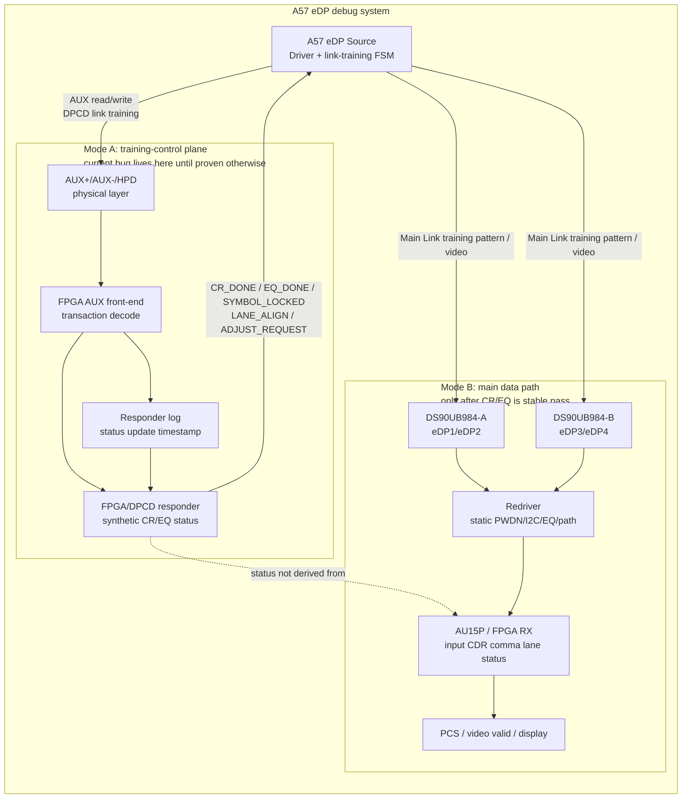
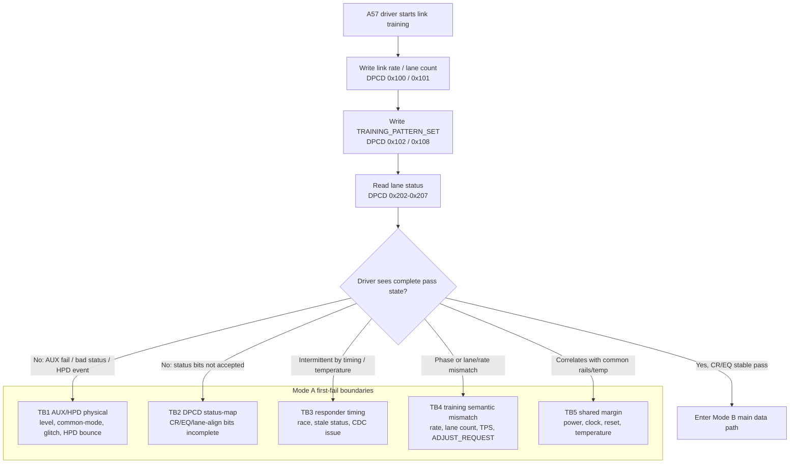
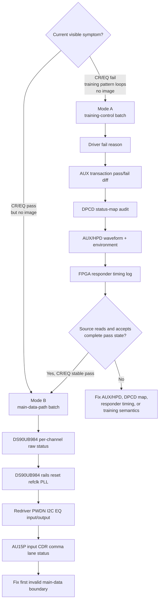

# A57 eDP Visual Architecture Brief

## Artifact Navigation

- Start here for system placement, subsystem ownership, and Mode A / Mode B routing.
- Then read `latest-architecture-first.md` for detailed boundary/mechanism reasoning.
- Use `field-action-plan.md` for same-window evidence capture and stop conditions.
- Use `latest-input-cleaning.md` for raw-fact provenance and stale evidence handling.
- Return to `README.md` for the full case index and archive list.

## 0. Executive Frame

当前 A57 eDP bug 先按 **Mode A: CR/EQ fail + 持续 training pattern + 无图** 处理。

关键判断：在当前实现里，CR/EQ pass/fail 不是 SerDes/Main Link 的真实闭环反馈，而是 FPGA/DPCD responder 通过 AUX 返回给 A57 Source 的合成训练状态。因此，当前 bug 首先落在 **training-control plane**，不是 AU15P/SerDes 眼图或 Redriver 主数据链。

行动路线：

1. 先拿 A57 driver 的精确 fail reason。
2. 同窗口抓成功/失败 AUX transaction diff。
3. 审 FPGA/DPCD responder 的 status-map 和 lane/rate/training-stage 语义。
4. 同窗口测 AUX+/AUX-/HPD 波形、温度、机械扰动。
5. 如果 AUX 物理和 status-map 干净，再查 responder timing race / stale status。
6. 只有 CR/EQ 稳定 pass 但仍无图，才切到 Mode B 的 DS90UB984 -> Redriver -> AU15P 主数据链。

## 1. System Placement

读图方式：如果 A57 driver 仍报 CR/EQ fail，Source 还没有稳定进入正常视频阶段。此时主数据链上的 DS90UB984、Redriver、AU15P 可以保留为背景，但不能作为第一 root-cause 路径。

## 2. Mode A Subsystem Architecture

Mode A 的最短闭环不是“继续猜哪个芯片坏”，而是把 driver 看到的 failure type、AUX transaction、DPCD 返回值、HPD/AUX 波形、responder 状态更新时间对齐到同一个 timestamp。

## 3. Mode Gate

工程原则：Mode A 未闭合时，Mode B 的主链路观测只能作为旁证；它不能解释 Source 为什么没有接受 CR/EQ pass。

## 4. High-Signal Evidence Stack

| priority | evidence | answers | if failing | if clean |
|---:|---|---|---|---|
| 1 | A57 driver fail reason | Source 到底拒绝了什么 | 分流到 AUX fail、status bit fail、HPD event、lane-align fail | 进入 transaction diff |
| 2 | AUX transaction diff | Source 实际读写到了什么 | NACK/DEFER/timeout/retry 或字节差异直接定位 | 进入 status-map / timing |
| 3 | DPCD status-map audit | responder 是否给了 Source 认可的完整 pass | 修 CR/EQ/lane-align/ADJUST_REQUEST/rate/lane 映射 | 进入物理和 timing |
| 4 | AUX+/AUX-/HPD waveform | 是否是物理层边际 | 修 AUX/HPD 电平、终端、共模、毛刺、去抖、连接器 | 降低 TB1，进入 responder race |
| 5 | FPGA responder log | 是否返回过早、过晚、stale、CDC 不稳 | 加 hold-off、DEFER、同步器、状态更新时间约束 | Mode A 基本闭合 |

## 5. Subsystem Conclusions

当前最该被画出来的架构不是完整视频链路，而是 **A57 Source link-training FSM 与 FPGA/DPCD responder 的控制闭环**。这是 bug 的第一系统边界。

主数据链仍然重要，但它现在是第二层：

- 如果 CR/EQ fail，优先系统是 AUX/DPCD/HPD/responder。
- 如果 CR/EQ pass 仍无图，优先系统才是 DS90UB984/Redriver/AU15P。

这个框架避免两个常见误判：

- 把温度敏感直接等同于 SerDes 眼图差。
- 把 FPGA 理论上“固定返回 OK”误当作 Source 已经实际读到并接受 OK。

## 6. Field Brief

给现场的第一句话：

> 这不是先查“为什么没图”的问题，而是先查“为什么 A57 Source 没有接受训练通过状态”的问题。

当天最小任务：

1. 打开 driver debug，拿到具体 fail reason。
2. 抓一组 pass 和一组 fail 的 AUX transaction。
3. 对照 DPCD `0x100/0x101/0x102/0x108/0x200-0x207`。
4. 同窗口测 AUX+/AUX-/HPD。
5. 导出 FPGA responder 的状态更新时间和返回值。

当天 stop 条件：

- 没有 driver fail reason，不继续争论 SerDes、Redriver 或 DS90UB984。
- 没有 AUX transaction diff，不声称 FPGA 已稳定把 CR/EQ OK 送到 Source。
- CR/EQ 没有稳定 pass，不把 AU15P CDR/comma 当主路径。
