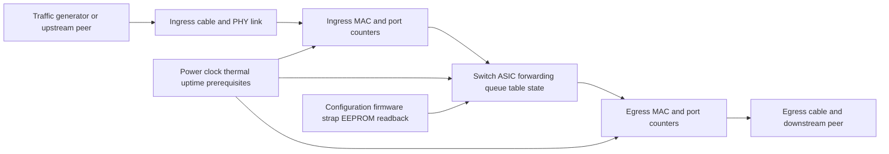
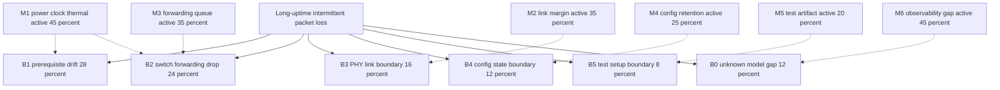
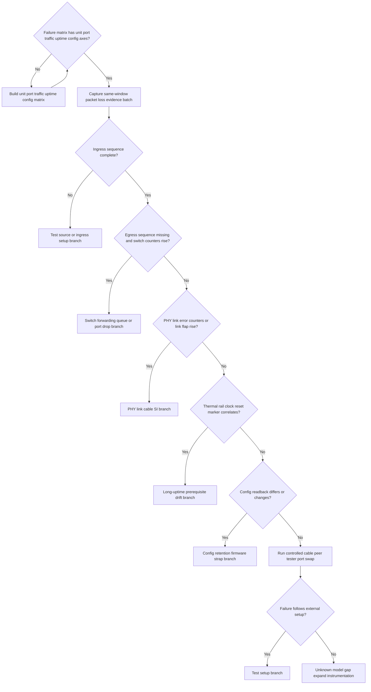

# Architecture-First Debug Decision Tree

## 1. Project Context Summary

案子：synthetic dry-run。用户给出的输入是：交换机在长时间工作后出现概率性丢包，100 台里面有一台，交换机芯片方案用 RTL8370。

当前只有自然语言描述，没有抓包、端口计数器、配置 readback、温度、电源、时钟、链路状态或复现时长。RTL8370 在本输出中只作为用户提供的 subsystem alias，不使用外部 datasheet 假设。

选用模式：Architecture-First。这个问题跨 sample distribution、long-uptime drift、traffic path、port/link boundary 和 configuration retention；不适合直接走单一 fast path。

## 2. Input Cleaning Snapshot

### 已确认事实

| id | fact | source | confidence | staleness | affected boundary |
|---|---|---|---|---|---|
| F1 | 交换机长时间工作后出现概率性丢包 | user synthetic case | medium | fresh | symptom / data path |
| F2 | 当前描述为 100 台里面有 1 台出现该现象 | user synthetic case | medium | fresh | sample distribution |
| F3 | 交换机芯片方案使用 RTL8370 | user synthetic case | medium | fresh | switch subsystem alias |
| F4 | 未提供端口、方向、流量、丢包率、工作时长、温度、电源、时钟、链路状态、计数器或配置 readback | input absence | high | fresh | observability gap |

### 当前判断，不是事实

| id | judgment | basis | confidence | could change if |
|---|---|---|---|---|
| J1 | 1/100 分布抬升单台样本差异、板级 margin、端口链路 margin、配置差异和测试夹具差异 | F2 | medium | 完整矩阵显示多台在同条件下同类失败 |
| J2 | 长时间工作后出现抬升热、电源、时钟、资源状态、配置保持性和端口 counters 的优先级 | F1 | medium | 同窗口证据显示上电即丢包或故障跟随外部测试设备 |
| J3 | 当前不能把 RTL8370 本体定为 root cause | F3,F4 | high | 同窗口证据证明 ingress/egress 边界、外部链路和板级前提后，芯片内部状态异常 |

## 3. Architecture / Link Understanding

当前 link model 应按 “traffic source -> ingress link/port -> switch chip forwarding/queue/state -> egress link/port -> traffic sink” 分层，并且并行看 sample、uptime、power/clock/temperature、configuration/readback 这些横向轴。

1. 样本轴：100 台中 1 台异常，必须记录 unit_id、board revision、批次、端口和测试条件。
2. 时间轴：长时间工作后出现，需要记录 uptime、温度、电源/时钟状态、link flap 和 counters 随时间变化。
3. 数据路径轴：同一故障窗口内必须对齐 ingress sequence、switch counters 和 egress sequence。
4. 配置轴：RTL8370 相关配置只作为 case-specific readback 对象，不假设 datasheet 细节；需要比较故障机和正常机。
5. 外部测试轴：测试仪、对端、网线、端口、流量模型都可能解释“1 台异常”的假象或真实边界。

## 4. Evidence-Aware Link Model

| node | known | inferred | unknown | evidence that moves boundary |
|---|---|---|---|---|
| L0 traffic source | 未提供 | 测试源可能造成表观丢包 | ingress sequence 是否完整 | ingress 抓包和 tester log |
| L1 ingress link | 未提供 | 长线、接触、PHY margin 可导致 CRC/link error | link status、CRC、alignment、flap | 同窗口 PHY/MIB counters |
| L2 ingress MAC/port | 未提供 | 可出现 port-level drop/error | port counters | ingress port counters aligned to loss window |
| L3 switch forwarding/queue/state | 芯片方案 alias 为 RTL8370 | long uptime 可能暴露 queue/table/state/config 问题 | internal counters、drop reason、config readback | 故障机与正常机 readback/counter 对比 |
| L4 egress MAC/port | 未提供 | egress port drop 或 pause/flow-control 可造成 egress 缺包 | egress counters | egress capture and counters |
| L5 downstream peer | 未提供 | sink/tester 也可能丢包 | sink counters/log | 端口、线缆、对端互换 |
| P0 prerequisites | 长时间工作后出现 | 热、电源、时钟、reset/brownout drift 可能触发 | temperature, rails, clock, reset status | uptime-aligned environment and rail/clock status |
| C0 config/readback | 未提供 | 1/100 可能来自配置、strap、EEPROM、版本差异 | config snapshot | good/fault unit readback diff |

## 5. Fact / Assumption Table

| id | type | content | confidence | evidence_refs |
|---|---|---|---|---|
| AF-F1 | fact | 现象描述为长时间工作后概率性丢包 | medium | F1 |
| AF-F2 | fact | 分布描述为 100 台中 1 台 | medium | F2 |
| AF-F3 | fact | RTL8370 是本案例 switch subsystem alias | medium | F3 |
| AF-M1 | missing | 缺 ingress/egress sequence capture 和 port counters | high | F4 |
| AF-M2 | missing | 缺温度、电源、时钟、reset/link 状态随 uptime 记录 | high | F4 |
| AF-M3 | missing | 缺故障机与正常机配置 readback 和硬件版本对比 | high | F4 |
| AF-A1 | assumption | 可以读取或导出端口 MIB/drop/error/link counters | medium | tool-dependent |
| AF-A2 | assumption | 可以在丢包窗口对齐 ingress 与 egress packet sequence | medium | lab-dependent |

## 6. Fault-Domain Localization

直接物理症状是“包在长时间运行后概率性消失”。最简解释必须进入前二：要么包在 switch 数据路径的某个边界被 drop，要么 long-uptime 触发单台样本的 prerequisite drift，使数据路径开始不稳定。1/100 分布让单台样本/环境/链路/测试差异也保持较高优先级，但它不能直接证明 root cause。

### Boundary Distribution

本表是互斥分布，表示包第一次离开预期路径的位置。概率是 dry-run 主观先验，sum=1.00。

| id | type | first_fail_boundary | p | why now | evidence that raises it | evidence that lowers it |
|---|---|---:|---|---|---|
| B1 | boundary | power / clock / thermal / reset prerequisite drift on the affected unit | 0.28 | 长时间工作后出现且只有 1/100 | 温度、电源、时钟、reset 或 brownout marker 与丢包窗口相关 | uptime-aligned prerequisite evidence clean |
| B2 | boundary | switch forwarding / queue / table / internal drop boundary | 0.24 | 直接症状是包通过交换机后丢失 | ingress 完整、egress 缺失，内部 drop/error counters 上升 | ingress/egress 都完整或 loss 在外部跟随 |
| B3 | boundary | port PHY / link / cable / connector boundary | 0.16 | 概率性丢包常可由链路 error 或接触/SI margin 造成 | CRC/alignment/link flap/PHY error 与 loss 同步 | link counters clean and loss does not follow port/cable |
| B4 | boundary | configuration / firmware / strap / EEPROM state boundary | 0.12 | 1/100 可能来自配置或状态保持差异 | 故障机 readback 与正常机不同或 long uptime 后变化 | config readback stable and identical |
| B5 | boundary | traffic generator / peer / test setup boundary | 0.08 | 当前没有证明 loss 不在测试系统 | 故障跟随 tester port、peer、cable 或 traffic profile | failure stays with switch unit after controlled swaps |
| B0 | boundary | unknown / model gap | 0.12 | 同窗口 evidence 全缺 | P0 batch 后仍不能定位 first-fail boundary | P0 batch 明确落入 B1-B5 |

### Mechanism Prior

本表是独立 mechanism prior，不相加到 1.00。

| id | type | mechanism | p_active | affects_boundaries | why now | evidence gate |
|---|---|---|---:|---|---|---|
| M1 | mechanism | thermal, rail, clock, reset, or brownout margin after long uptime | 0.45 | B1,B2,B3 | 长时间工作后出现 | uptime-aligned power/clock/thermal capture |
| M2 | mechanism | port PHY/link/cable/SI/contact margin | 0.35 | B3,B5 | 单台概率性丢包可来自物理链路 margin | PHY/MIB counters and cable/peer swap |
| M3 | mechanism | forwarding/queue/table/drop counter state or ASIC datapath state | 0.35 | B2 | 包可能在 switch 内部被 drop | ingress/egress sequence + internal counters |
| M4 | mechanism | configuration retention, firmware task, strap/EEPROM, or register-profile mismatch | 0.25 | B4,B2 | 1/100 可由单台配置差异或长时间后状态变化导致 | good/fault readback and version diff |
| M5 | mechanism | tester, peer, traffic-profile, or measurement artifact | 0.20 | B5 | 当前没有测试系统排除证据 | controlled swap and independent capture |
| M6 | observability_gap | missing same-window packet capture, counters, and environmental telemetry | 0.45 | B0 | 所有关键定位证据缺失 | P0 evidence batch |

### Coverage Matrix

| mechanism_id | B1 prerequisites | B2 switch drop | B3 PHY/link | B4 config state | B5 test setup | B0 model gap |
|---|---|---|---|---|---|---|
| M1 power_clock_thermal | H | M | M | - | - | - |
| M2 link_margin | - | L | H | - | M | - |
| M3 forwarding_queue_state | - | H | L | L | - | - |
| M4 config_retention | L | M | L | H | - | - |
| M5 test_artifact | - | - | M | - | H | - |
| M6 observability_gap | - | - | - | - | - | H |

### Evidence Ledger

| id | evidence | status | criticality | gates_boundaries | gates_mechanisms | probability_effect | local_override |
|---|---|---|---|---|---|---|---|
| EV1 | ingress and egress packet sequence capture in the same loss window | missing | critical | B2,B5,B0 | M3,M5,M6 | first-fail boundary cannot be confirmed | none |
| EV2 | per-port MIB/drop/error/CRC/link counters aligned to the loss window | missing | critical | B2,B3,B0 | M2,M3,M6 | switch vs link boundary remains open | none |
| EV3 | uptime-aligned temperature, rail, clock, reset, and brownout evidence | missing | critical | B1,B0 | M1,M6 | long-uptime prerequisite branch remains open | none |
| EV4 | fault unit vs known-good unit config/readback/version/strap comparison | missing | critical | B4,B2,B0 | M4,M6 | config or retention branch remains open | none |
| EV5 | controlled cable/peer/tester/port swap | missing | supporting | B5,B3 | M2,M5 | test setup cannot be excluded | none |

## 7. Hypothesis Tree With Probabilities

| item | probability semantics | how to read it |
|---|---|---|
| B1-B5/B0 | boundary distribution，互斥，sum=1.00 | 回答“包第一次在哪里离开预期路径” |
| M1-M6 | mechanism prior，独立，不 sum=1.00 | 回答“哪些机制可能 active” |
| M6 | observability_gap | 回答“是不是因为同窗口证据缺失而无法定位” |

## 8. Candidate Matching Report

| asset | type | decision | reason | evidence_refs |
|---|---|---|---|---|
| forms/failure_matrix_template.md | form | Adopted | 1/100 分布必须用 sample/port/traffic/uptime/config 矩阵表达 | F2,F4 |
| forms/same_window_evidence_batch_checklist.md | form | Adopted | 丢包窗口需要 packet capture、counters、telemetry 和 readback 同窗口对齐 | F1,F4 |
| LM-VIDEO-LINK style single-chain output | heuristic | Deferred | 当前不是视频链路；只复用 boundary-first 思路，不复用 A57 专有字段 | F1 |
| RTL8370-specific root-cause signature | signature | Not Applied | 当前没有已验证签名或 datasheet-backed evidence | F3,F4 |
| broad web/datasheet exploration | mode | Deferred | 第一轮需要现场证据；datasheet 只在 counter/register 含义不明时做 point check | F4 |

## 9. Adopted / Deferred / Not Applied

Adopted：

- Architecture-First mode。
- Generic failure matrix。
- Same-window evidence batch。
- Boundary / mechanism / observability_gap 分离。
- 直接症状最简解释前二：long-uptime prerequisite drift 和 switch forwarding/drop boundary。

Deferred：

- RTL8370 datasheet/register semantic point check，直到现场知道需要解释哪些 counters/registers。
- Firmware/config changes as fix。
- Hardware rework or replacement。

Not Applied：

- 不把 RTL8370 本体当作已确认 root cause。
- 不把 1/100 自动当作板级硬件 defect。
- 不用非同窗口 counters 或事后状态降低当前 branch。
- 不在通用模板、validator 或 asset 中硬编码本案例。

## 10. Cost / Probability Ranking

本表使用 `reasoning/cost_priors.yaml` 的经验中位数；无 local override。A_P0m 是 standalone matrix prerequisite，不要求同一故障窗口。A_P0a/A_P0b/A_P0c/A_P0d 属于同一 packet-loss window co-acquisition batch。

| action_id | tier | co_acq_group_id | same_failure_window | capture_channel | action | boundary_subset | mechanism_subset | p_hit | p_exclude | time_min | reason |
|---|---|---|---|---|---|---|---|---:|---:|---:|---|
| A_P0m | P0 | CO-SW-MATRIX-STANDALONE | false | test_matrix | 建立 unit/port/traffic/uptime/config/fail_count 矩阵 | B0,B1,B2,B3,B4,B5 | M1,M2,M3,M4,M5,M6 | 0.15 | 0.65 | 120 | standalone matrix prerequisite：防止用 1/100 模糊描述直接定性 |
| A_P0a | P0 | CO-SW-LOSS-WINDOW-1 | true | packet_sequence_capture | 同窗口 ingress/egress sequence 抓包 | B2,B5,B0 | M3,M5,M6 | 0.30 | 0.60 | 120 | 直接判断包是否进入和离开交换机 |
| A_P0b | P0 | CO-SW-LOSS-WINDOW-1 | true | port_counter_snapshot | 同窗口 per-port MIB/drop/error/CRC/link counters | B2,B3,B0 | M2,M3,M6 | 0.25 | 0.55 | 45 | 用 counters 切 switch drop 与 PHY/link error |
| A_P0c | P0 | CO-SW-LOSS-WINDOW-1 | true | uptime_telemetry | 温度、电源、时钟、reset/brownout uptime 记录 | B1,B0 | M1,M6 | 0.25 | 0.50 | 90 | 验证 long-uptime prerequisite drift |
| A_P0d | P0 | CO-SW-LOSS-WINDOW-1 | true | config_readback | 故障窗口配置 readback 与正常机对比 | B4,B2,B0 | M4,M6 | 0.18 | 0.45 | 45 | 验证配置保持性或单台配置差异 |
| A_P1a | P1 | none | false | cable_peer_swap | 控制交换网线、对端、tester port、交换机端口的跟随实验 | B5,B3 | M2,M5 | 0.15 | 0.45 | 60 | 在 P0 仍不能定位时排除外部夹具 |

## 11. Optimal Troubleshooting Path

1. 先建立 sample matrix：100 台中至少记录故障机、2-3 台正常对照机、端口、方向、traffic profile、uptime、config profile、test_count、fail_count。
2. 下一次丢包窗口做 P0 batch：ingress/egress packet sequence、port counters、温度/电源/时钟/reset、配置 readback 必须共享同一 `packet_loss_window_id`。
3. 用 ingress/egress 与 counters 先判断 first-fail boundary：测试源、PHY/link、switch forwarding/drop、配置状态、还是 prerequisite drift。
4. 只有同窗口证据把 boundary 压到 switch/config 后，才考虑 RTL8370 register semantic point check 或配置/固件改动。
5. 如果 P0 batch 没有解释丢包，保留 B0 unknown/model gap，扩展 instrumentation，而不是直接换芯片或改固件。

累计成本估算：A_P0m + A_P0a/A_P0b/A_P0c/A_P0d 约 420 min 标称工作量。若测试矩阵、抓包、counters、telemetry、readback 能并行准备，现场可压缩到一个长 soak run 加前后整理。

## 12. Decision Tree

## 13. Node Explanation Table

| id | type | action_type | check_or_action | tool_required | expected_observation | interpretation | safety_level | cost | reversibility | next_branch | evidence_refs |
|---|---|---|---|---|---|---|---|---|---|---|---|
| D1 | decision | none | 检查 matrix 是否包含 unit、port、traffic、uptime、config 轴 | test log | complete or incomplete | 矩阵不完整时不能解释 1/100 分布 | S0 | low | n/a | A_P0m or A_P0 | F2,F4 |
| A_P0m | action | observe | 建立 unit/port/traffic/uptime/config/fail_count 矩阵 | test log spreadsheet | 标准化 failure distribution | 将 1/100 描述转成可排序证据 | S0 | medium | reversible | D1 | F2 |
| A_P0 | action | observe | 同窗口采集 packet sequence、port counters、uptime telemetry、config readback | packet capture counter log telemetry readback | 同一个 packet_loss_window_id 的证据批次 | 同时切分 test source、link、switch、config 和 prerequisite boundary | S0 | high | reversible | D2 | F1,F4 |
| D2 | decision | none | 判断 ingress sequence 是否完整 | packet capture | complete or missing | ingress 缺包说明测试源或 ingress setup 优先 | S0 | low | n/a | T1 or D3 | EV1 |
| T1 | terminal | none | 测试源或 ingress setup 分支激活 | tester log capture | ingress already missing | 聚焦 tester、peer、网线、ingress capture setup | S0 | medium | n/a | terminal | B5 |
| D3 | decision | none | 判断 egress 缺包且 switch counters 是否上升 | packet capture counters | egress missing with counters or not | 支持 switch forwarding/queue/port drop branch | S0 | low | n/a | T2 or D4 | EV1,EV2 |
| T2 | terminal | none | switch forwarding queue or port drop 分支激活 | counters readback | internal drop/error evidence rises | 聚焦 forwarding、queue、port MAC、ASIC datapath state | S0 | medium | n/a | terminal | B2,M3 |
| D4 | decision | none | 判断 PHY/link error 或 link flap 是否上升 | PHY/MIB counters | error rises or clean | 支持或降低 link margin 分支 | S0 | low | n/a | T3 or D5 | EV2 |
| T3 | terminal | none | PHY link cable SI 分支激活 | PHY counters swap test | link errors correlate | 聚焦 cable、connector、PHY、SI、port margin | S0 | medium | n/a | terminal | B3,M2 |
| D5 | decision | none | 判断 temperature、rail、clock、reset marker 是否和 loss 相关 | telemetry scope status | correlated or clean | 支持或降低 long-uptime prerequisite drift | S0 | low | n/a | T4 or D6 | EV3 |
| T4 | terminal | none | long-uptime prerequisite drift 分支激活 | telemetry | drift correlates with loss | 聚焦热、电源、时钟、reset、brownout、单台 margin | S0 | medium | n/a | terminal | B1,M1 |
| D6 | decision | none | 判断 config readback 是否差异或 long uptime 后变化 | register/config dump | differs or stable | 支持或降低 config retention 分支 | S0 | low | n/a | T5 or A_P1a | EV4 |
| T5 | terminal | none | config retention firmware strap 分支激活 | readback diff | config differs or changes | 聚焦 firmware task、register retention、strap、EEPROM、配置 profile | S0 | medium | n/a | terminal | B4,M4 |
| A_P1a | action | reproduce | 控制交换 cable、peer、tester port、switch port，观察故障是否跟随 | traffic generator cable peer | failure follows or stays | 区分外部夹具与 switch unit/port | S0 | medium | reversible | D7 | EV5 |
| D7 | decision | none | 判断故障是否跟随外部 setup | swap matrix | follows or stays | 跟随外部则测试 setup 分支，否则保留 model gap | S0 | low | n/a | T6 or T7 | EV5 |
| T6 | terminal | none | test setup branch 激活 | swap result | failure follows external setup | 聚焦 tester、peer、cable、traffic profile | S0 | medium | n/a | terminal | B5,M5 |
| T7 | terminal | none | unknown / model gap and instrumentation review | evidence pack | P0 batch 未解释 loss | 扩展 instrumentation，暂不硬件 rework 或固件改动 | S0 | medium | n/a | terminal | B0,M6 |

## 14. Missing Architecture Information

| id | missing information | why it changes the plan |
|---|---|---|
| G1 | 具体丢包端口、方向、traffic profile、VLAN/queue、包长、速率和持续时间 | 决定 boundary 在测试源、link、switch queue、egress 还是 downstream |
| G2 | 故障机和正常机的 unit_id、board revision、批次、端口矩阵 | 判断 1/100 是单台、单端口、批次还是测试条件差异 |
| G3 | 同窗口 ingress/egress sequence capture | 直接定位包第一次消失的位置 |
| G4 | port MIB/drop/error/CRC/link counters | 区分 switch internal drop 与 PHY/link error |
| G5 | 长时间运行中的温度、电源、时钟、reset/brownout 状态 | 验证 long-uptime drift |
| G6 | 配置 readback、固件版本、strap/EEPROM、RTL8370 相关 register profile | 验证配置差异或保持性 |

## 15. Next 3-5 Actions

1. 建立 failure matrix：记录故障机和正常对照机的 unit、port、direction、traffic profile、uptime、config、test_count、fail_count。
2. 设计下一次丢包窗口的 co-acquisition：ingress/egress 抓包、端口 counters、温度/电源/时钟/reset、配置 readback 使用同一个 run id。
3. 做一次 controlled swap：至少确认故障是否跟随 cable、peer、tester port 或 switch port。
4. 如果 ingress 完整且 egress 缺包，再看 counters 是 link error、drop/queue，还是完全没有 counter 解释。
5. 只有 boundary 指向 switch/config 后，再做 RTL8370 datasheet/register semantic point check。

### Action Items by Candidate Owner

candidate_owner 只是执行角色建议，正式 owner 需要 PM/project lead 确认。

| candidate_owner | action item | expected output | priority |
|---|---|---|---|
| lab/test owner | 建立 unit/port/traffic/uptime/config/fail matrix | 标准化矩阵 | P0 |
| lab/test owner | 同窗口 ingress/egress packet capture | sequence gap table | P0 |
| switch debug owner | 导出 port MIB/drop/error/link counters | counter delta table | P0 |
| hardware owner | 记录温度、电源、时钟、reset/brownout uptime telemetry | telemetry trend table | P0 |
| firmware/switch owner | 故障机与正常机 config/readback/version/strap 对比 | readback diff table | P0 |

## 16. Stop / Escalation Conditions

停止或降级分支：

- 如果 failure matrix 未完成，停止用 1/100 直接判断单台硬件 defect。
- 如果 ingress/egress 抓包未对齐，停止把丢包直接归到 RTL8370 或外部测试仪。
- 如果 port counters 未在丢包窗口采集，停止排除 PHY/link 或 switch internal drop。
- 如果温度、电源、时钟、reset 未记录，停止排除 long-uptime prerequisite drift。
- 如果 config readback 未比较，停止把配置/固件/strap 分支降到低位。

升级到 Knowledge-Linked point check 的条件：

- 同窗口 counters 或 readback 指向具体 RTL8370 register/status 语义，但本地资料无法解释；
- 需要确认某个 counter、drop reason、PHY status、strap/config bit 的定义。

## 17. Retrospective Trigger

出现以下任一情况时，开启 retrospective：

- P0 batch 证明 first-fail boundary，并且修复后故障机丢包率下降。
- controlled swap 证明故障跟随外部测试 setup，形成测试方法类学习。
- 标准矩阵证明 1/100 来自单台板级 margin、固定端口、固定 traffic profile 或配置差异。
- 该 dry-run 暴露出通用 failure matrix 或 same-window evidence checklist 字段不够用，需要更新模板。
