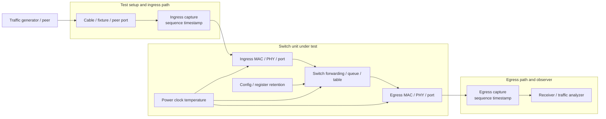
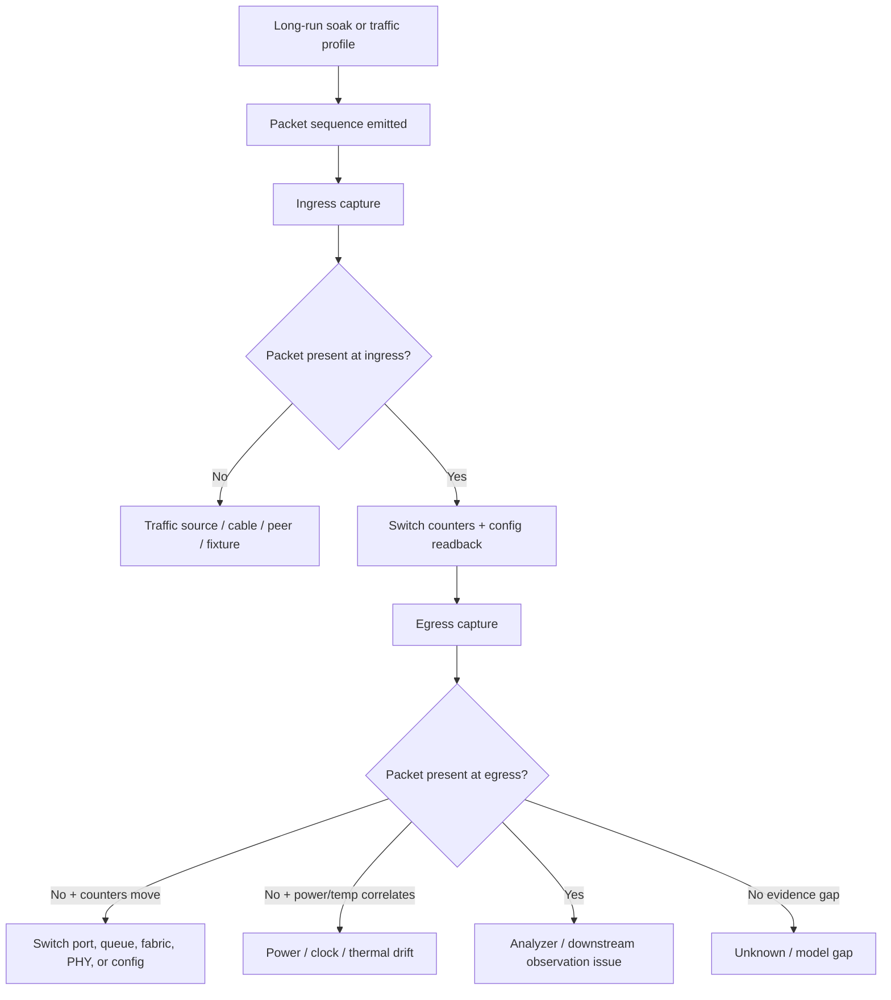
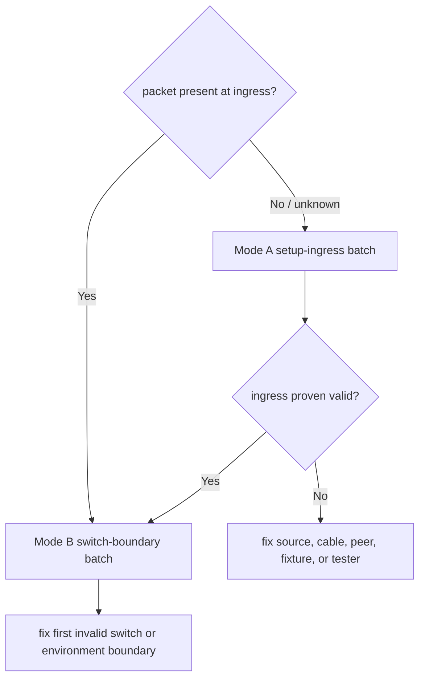

# RTL8370 Switch Packet-Loss Visual Architecture Brief

## Artifact Navigation

- Start here for system placement, subsystem ownership, and Mode A / Mode B routing.
- Then read `latest-architecture-first.md` for detailed boundary/mechanism reasoning.
- Use `field-action-plan.md` for same-window evidence capture and stop conditions.
- Use `latest-input-cleaning.md` for raw-fact provenance and synthetic dry-run limits.
- Return to `README.md` for case-level maintenance notes.

## 0. Executive Frame

Current conclusion:

- current visible symptom: one synthetic packet-loss report after long uptime;
- current owning system: packet-forwarding evidence chain;
- current owning subsystem: ingress/egress capture plus switch counters, until the first missing packet boundary is proven;
- current mode / gate: ingress-valid versus ingress-missing;
- strongest reason: packet loss cannot be attributed to RTL8370, firmware, or board drift until ingress, counters, egress, environment, and configuration readback share one loss window;
- first action: capture ingress sequence, egress sequence, counters, environment, and config readback in the same packet-loss window;
- stop condition: do not call RTL8370 root cause until ingress/egress and counters locate the first-fail boundary.

Action route:

1. Prove whether the packet enters the switch.
2. If ingress is valid, prove whether the packet leaves the switch and which counters move.
3. If counters and captures are clean, expand instrumentation before changing firmware or hardware.

## 1. System Placement

Reader note: the bug is not inside the switch until ingress capture proves the missing packet entered the unit.

## 2. Subsystem Architecture

## 3. Mode Gate

| mode | visible symptom | first subsystem | required evidence batch | stop condition |
|---|---|---|---|---|
| Mode A | packet absent or unclear at ingress | traffic source / fixture / ingress path | ingress sequence capture and setup swap | Do not debug switch internals until ingress is proven valid. |
| Mode B | packet present at ingress but absent at egress | switch forwarding / port / config / environment | same-window counters, egress capture, config readback, environment | Do not change firmware or registers until counters/readback point there. |

## 4. High-Signal Evidence Stack

| priority | evidence | answers | if failing | if clean |
|---:|---|---|---|---|
| 1 | ingress sequence capture | did the packet enter the unit? | debug source/test setup | move to switch boundary |
| 2 | egress sequence capture | did the unit drop the packet? | correlate with counters | check downstream observer |
| 3 | per-port counters | which boundary saw errors or drops? | localize MAC/PHY/queue/link | check config/environment |
| 4 | config readback | did long uptime change state? | debug retention/firmware/control path | check physical/environment |
| 5 | power/clock/temperature | did prerequisites drift over uptime? | debug board-level margin | keep unknown/model gap active |

## 5. Subsystem Conclusions

- current first subsystem: traffic evidence chain, not the named chip;
- current non-goals: root-causing RTL8370, firmware, or board defect from a 1/100 distribution alone;
- conditions to change route: ingress is proven valid and egress/counters show the first missing boundary;
- most likely mistake to avoid: treating a distribution fact as root cause before same-window captures exist.

## 6. Field Brief

One sentence for the field team:

> First prove where the packet disappears; only then decide whether this is setup, switch forwarding, link margin, configuration, or environment.

Minimum same-window tasks:

1. Capture ingress packet sequence with timestamp.
2. Capture egress packet sequence with timestamp.
3. Snapshot counters, config readback, and environment during the same loss window.

Stop conditions:

- Stop naming RTL8370 as root cause until ingress and egress locate the first-fail boundary.
- Stop using 1/100 distribution as proof of board defect until matrix axes are logged.
- Stop changing firmware/registers until same-window counters or readback point there.
