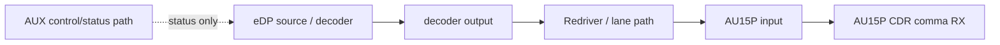
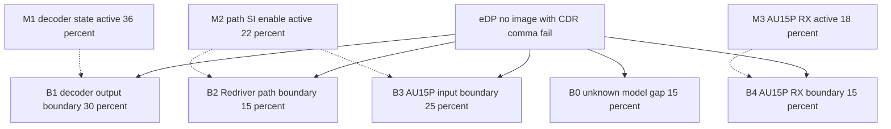
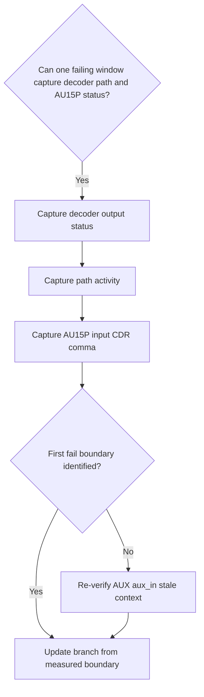

# Architecture-First Debug Decision Tree

## 1. Project Context Summary

A57 eDP 后通道不出图。用户报告 AUX 正常、AU15P CDR 不锁、comma fail，SerDes reset 无效。早期 aux_in 弱下拉无改善是 stale context，不是当前同一故障窗口证据。

## 2. Input Cleaning Snapshot

关键清洗结果：F5 aux_in 弱下拉记录被标记为 `requires_re_verification`，只进入 missing information，不直接提高或降低任何当前 boundary/mechanism 概率。当前可用事实支持先切 main data path 和 receiver boundary。

## 3. Architecture / Link Understanding

链路按 control path 与 main data path 分离：AUX/control 可以帮助配置和状态读取，但 AUX 正常不能证明 eDP main data 已到 AU15P。main data 需要沿 decoder output、Redriver/path、AU15P input、AU15P RX CDR/comma 切分。

## 4. Evidence-Aware Link Model

| node | role | known | inferred | unknown | evidence_that_moves_boundary |
|---|---|---|---|---|---|
| AUX | control/status | user says AUX normal | stale aux_in context is not current proof | same-window AUX waveform/status | AUX retry/NACK/status stale in failing window |
| OUT | decoder output | not measured | could be first fail | output activity/status | decoder output absent or invalid |
| PATH | Redriver/lane path | not measured | could attenuate or misroute data | Redriver output and lane activity | input valid/output invalid |
| IN | AU15P input | not measured | CDR fail may be caused before RX | input activity | input absent while upstream is valid |
| RX | AU15P receiver | CDR/comma fail reported | receiver symptom observed | same-window status | input valid but CDR/comma fail |

## 5. Fact / Assumption Table

| id | type | content | confidence | staleness | affected boundary |
|---|---|---|---|---|---|
| AF-F1 | fact | eDP 后通道不出图 | high | fresh | symptom |
| AF-F2 | fact | 用户报告 AUX 正常 | high | fresh | AUX control path |
| AF-F3 | fact | AU15P CDR 不锁、comma fail | high | fresh | B4 |
| AF-F4 | fact | SerDes reset 无效 | high | fresh | B4 |
| AF-S1 | stale_context | aux_in 初始电平差异和弱下拉无改善是早期记录 | medium | requires_re_verification | AUX context |
| AF-M1 | missing | decoder output/status、Redriver/path、AU15P input、CDR/comma 缺同窗口证据 | high | fresh | B1-B4 |

## 6. Fault-Domain Localization

以下不使用 flat root-cause probability table。直接物理症状的最简解释必须进入 top two：CDR/comma fail 的最近 first-fail boundary 可能在 AU15P input 前，也可能在 AU15P RX 本身；但 decoder output 未测，因此 decoder output 仍保留为 top-two boundary。

### Boundary Distribution

| id | type | first_fail_boundary | p | evidence_refs | why now |
| --- | --- | --- | ---: | --- | --- |
| B1 | boundary | decoder output/status first fail | 0.30 | AF-F1,AF-F2 | AUX 正常不证明 main data output 有效 |
| B2 | boundary | Redriver/lane path between decoder and AU15P | 0.15 | AF-F1,AF-F3 | path 未同窗口测量 |
| B3 | boundary | AU15P input before RX | 0.25 | AF-F3,AF-F4 | CDR/comma fail 可能由 input 缺失导致 |
| B4 | boundary | AU15P RX CDR/comma/rate/polarity | 0.15 | AF-F3,AF-F4 | receiver symptom 已观察但 input 前提未闭合 |
| B0 | boundary | unknown / model gap | 0.15 | AF-F1,AF-F3 | 同窗口证据不足，且 stale aux_in context 未复核 |

### Mechanism Prior

| id | type | mechanism | p_active | affects_boundaries | why now |
|---|---|---|---:|---|---|
| M1 | mechanism | decoder output enable/status/state issue | 0.36 | B1 | decoder output 未测，AUX 正常不能排除 |
| M2 | mechanism | Redriver/lane path SI or enable issue | 0.22 | B2,B3 | path 未同窗口测量 |
| M3 | mechanism | AU15P RX config/refclk/rate/polarity/comma condition | 0.18 | B4 | CDR/comma fail 和 reset 无效保留此机制 |
| M4 | observability_gap | stale AUX/aux_in context lacks same-window waveform/status | 0.17 | B0 | must not directly change probabilities until re-verified |

### Coverage Matrix

| mechanism_id | B1 decoder output | B2 Redriver/path | B3 AU15P input | B4 AU15P RX |
|---|---|---|---|---|
| M1 decoder state | H | L | L | - |
| M2 path SI/enable | - | H | M | L |
| M3 AU15P RX config | - | - | L | H |

### Evidence Ledger

| id | evidence | status | criticality | gates_boundaries | gates_mechanisms | probability_effect | local_override |
|---|---|---|---|---|---|---|---|
| EV1 | decoder output/status in failing window | missing | critical | B1 | M1 | B1/M1 cannot be confirmed and must stay <=0.50 | none |
| EV2 | Redriver/path input-output in failing window | missing | critical | B2,B3 | M2 | B2/B3/M2 cannot be excluded | none |
| EV3 | AU15P input plus CDR/comma in same window | missing | critical | B3,B4 | M3 | B3 vs B4 cannot be split | none |
| EV4 | AUX waveform/status for stale aux_in context | missing | critical | B0 | M4 | stale context must not directly change probabilities | none |

## 7. Hypothesis Tree With Probabilities

| item | probability semantics | how to read it |
|---|---|---|
| B1-B4/B0 | boundary distribution，互斥，sum=1.00 | first-fail boundary |
| M1-M4 | mechanism prior，独立，不 sum=1.00 | active mechanism candidates |
| M4 | observability_gap | stale AUX/aux_in needs same-window re-verification |

## 8. Candidate Matching Report

| asset | type | decision | reason | evidence_refs |
|---|---|---|---|---|
| LM-EDP-DECODER-FPGA-LINK | link_model | Adopted | separates AUX control, decoder output, path, AU15P input, and RX | AF-F1-AF-F4 |
| DP-DYNAMIC-EVIDENCE-BEFORE-STATIC-RATING | debug_principle | Adopted | stale aux_in record cannot drive current probabilities | AF-S1 |
| AUX-first root cause | branch | Not Applied | AUX status is not same-window waveform and does not prove main data path | AF-F2,AF-S1 |

## 9. Adopted / Deferred / Not Applied

Adopted: Architecture-First data-boundary split and stale-evidence quarantine.
Deferred: AUX/aux_in branch until same-window waveform/status is captured.
Not Applied: stale evidence lowers AUX probability; direct AU15P tuning before input validity.

## 10. Cost / Probability Ranking

This table uses `reasoning/cost_priors.yaml`; no local override is applied.

| action_id | tier | co_acq_group_id | same_failure_window | capture_channel | action | boundary_subset | mechanism_subset | prior_source | p_hit | p_exclude | time_min | reason |
| --- | --- | --- | --- | --- | --- | --- | --- | --- | ---: | ---: | ---: | --- |
| A1 | P0 | CO-STALE-EDP-FAILWIN-1 | true | decoder_status | Capture decoder output/status in failing window | B1 | M1 | cost_priors.yaml:register_status_capture | 0.25 | 0.55 | 45 | split decoder output before downstream tuning |
| A2 | P0 | CO-STALE-EDP-FAILWIN-1 | true | path_activity | Capture Redriver/path input-output activity | B2,B3 | M2 | cost_priors.yaml:scope_or_logic_capture | 0.20 | 0.50 | 60 | split path vs AU15P input |
| A3 | P0 | CO-STALE-EDP-FAILWIN-1 | true | au15p_status | Capture AU15P input plus CDR/comma status | B3,B4 | M3 | cost_priors.yaml:fpga_status_capture | 0.20 | 0.50 | 60 | split input absence vs RX condition |
| A4 | P1 | none | false | aux_waveform | Re-verify AUX/aux_in waveform/status | B0 | M4 | cost_priors.yaml:scope_capture | 0.05 | 0.30 | 30 | only refresh stale context after data-boundary batch |

## 11. Optimal Troubleshooting Path

1. Run A1/A2/A3 as one same-window P0 batch.
2. Use the batch to decide whether first fail is decoder output, path/AU15P input, or AU15P RX.
3. Re-check AUX/aux_in only as a P1 stale-context refresh unless same-window data contradicts the current boundary.

## 12. Decision Tree

## 13. Node Explanation Table

| id | type | action_type | check_or_action | tool_required | expected_observation | interpretation | safety_level | cost | reversibility | next_branch | evidence_refs |
|---|---|---|---|---|---|---|---|---|---|---|---|
| D1 | decision | none | Check whether same-window capture is available | scope/register dump/FPGA status | capture can be aligned | same-window capture prevents stale-state probability updates | S0 | low | n/a | A1 or A4 | AF-M1 |
| A1 | action | observe | Capture decoder output/status | register dump or probe | decoder output valid/invalid | separates B1 from downstream | S0 | medium | reversible | A2 | EV1 |
| A2 | action | observe | Capture Redriver/path activity | scope/LA/proxy status | path input-output valid/invalid | separates B2/B3 | S1 | medium | reversible | A3 | EV2 |
| A3 | action | observe | Capture AU15P input plus CDR/comma | FPGA status/scope | input and RX status aligned | separates B3/B4 | S1 | medium | reversible | D2 | EV3 |
| D2 | decision | none | Determine whether first-fail boundary is identified | captured batch | B1/B2/B3/B4 or unknown | directs next branch without stale evidence | S0 | low | n/a | T1 or A4 | EV1,EV2,EV3 |
| A4 | action | observe | Re-verify AUX/aux_in stale context | AUX waveform/status | current-window AUX/aux_in state | refreshes or retires stale context | S0 | low | reversible | T1 | EV4 |
| T1 | terminal | none | Update branch from measured boundary | none | measured boundary drives next plan | no root cause claim before evidence | S0 | low | n/a | terminal | AF-F1 |

## 14. Missing Architecture Information

- same-window decoder output/status
- same-window Redriver/path input-output
- same-window AU15P input/CDR/comma
- same-window AUX/aux_in waveform/status for stale context refresh

## 15. Next 3-5 Actions

1. Co-acquire A1/A2/A3 in `CO-STALE-EDP-FAILWIN-1`.
2. Do not use AF-S1 stale aux_in context to change current probabilities.
3. Re-verify AUX/aux_in only if P0 batch remains ambiguous or indicates control/status inconsistency.

## 16. Stop / Escalation Conditions

Stop any branch that uses stale aux_in evidence as current proof. Escalate only after same-window evidence shows AUX/status or aux_in behavior is synchronized with the current failure.

## 17. Retrospective Trigger

Run retrospective if same-window capture proves that stale aux_in context was either misleading or a real repeated mechanism, and decide whether to update stale-evidence quarantine rules.
