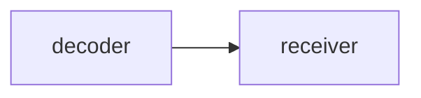
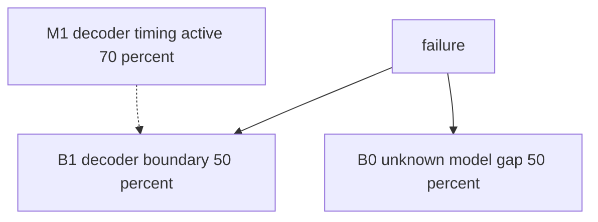
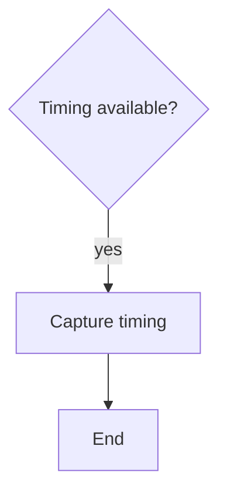

# Architecture-First Debug Decision Tree

## 1. Project Context Summary

Video link intermittently fails. This fixture intentionally assigns high mechanism probability despite missing critical evidence.

## 2. Input Cleaning Snapshot

Observed facts are cleaned.

## 3. Architecture / Link Understanding

Decoder output feeds receiver input.

## 4. Evidence-Aware Link Model

| node | known | unknown |
|---|---|---|
| decoder | link exists | status |
| receiver | no stable image | input |

## 5. Fact / Assumption Table

| id | type | content |
|---|---|---|
| F1 | fact | intermittent no-image symptom |

## 6. Fault-Domain Localization

The direct symptom's simplest physical interpretation is kept in the top two.

### Boundary Distribution

| id | type | first_fail_boundary | p |
|---|---|---|---:|
| B1 | boundary | decoder output boundary | 0.50 |
| B0 | boundary | unknown / model gap | 0.50 |

### Mechanism Prior

| id | type | mechanism | p_active | affects_boundaries |
|---|---|---|---:|---|
| M1 | mechanism | decoder timing issue | 0.70 | B1 |
| M2 | mechanism | receiver setup issue | 0.10 | B1 |
| M3 | observability_gap | missing decoder status | 0.10 | B0 |

### Coverage Matrix

| mechanism_id | B1 decoder output | B0 model gap |
|---|---|---|
| M1 decoder timing | H | - |
| M2 receiver setup | L | - |

### Evidence Ledger

| id | evidence | status | criticality | gates_boundaries | gates_mechanisms | probability_effect | local_override |
|---|---|---|---|---|---|---|---|
| EV1 | decoder timing and status capture | missing | critical | B1 | M1 | missing evidence should cap M1 | none |

## 7. Hypothesis Tree With Probabilities

## 8. Candidate Matching Report

No asset adopted in this negative fixture.

## 9. Adopted / Deferred / Not Applied

Not Applied: evidence cap.

## 10. Cost / Probability Ranking

This table uses `reasoning/cost_priors.yaml`.

| node | tier | co_acq_group_id | same_failure_window | capture_channel | action | boundary_subset | mechanism_subset | p_hit | p_exclude | time_min |
|---|---|---|---|---|---|---|---|---:|---:|---:|
| A1 | P0 | CO-CAP-BAD | true | timing_capture | Capture decoder timing | B1 | M1 | 0.20 | 0.40 | 20 |

## 11. Optimal Troubleshooting Path

Capture timing first.

## 12. Decision Tree

## 13. Node Explanation Table

| id | type | action_type | check_or_action | tool_required | expected_observation | interpretation | safety_level | cost | reversibility | next_branch | evidence_refs |
|---|---|---|---|---|---|---|---|---|---|---|---|
| D1 | decision | none | Check timing availability | scope | timing exists | choose capture path | S0 | low | n/a | A1 | F1 |
| A1 | action | observe | Capture decoder timing | scope | timing waveform | split mechanism | S0 | low | reversible | T1 | F1 |
| T1 | terminal | none | End fixture | none | done | done | S0 | low | n/a | terminal | F1 |

## 14. Missing Architecture Information

Missing timing capture.

## 15. Next 3-5 Actions

1. This fixture should fail validation.

## 16. Stop / Escalation Conditions

Stop when validator rejects the uncapped probability.

## 17. Retrospective Trigger

Trigger if this fixture ever passes.
