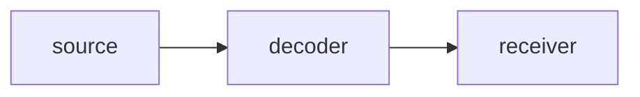
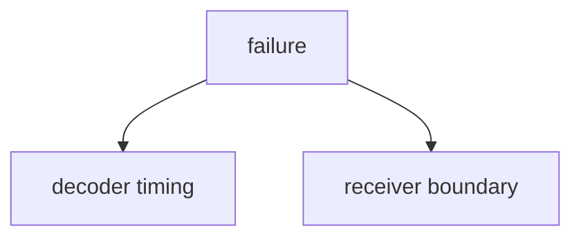
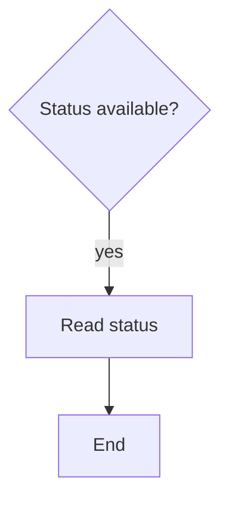

# Architecture-First Debug Decision Tree

## 1. Project Context Summary

Video link intermittently fails. This fixture intentionally uses the old flat probability table shape.

## 2. Input Cleaning Snapshot

Facts and assumptions are separated for the fixture.

## 3. Architecture / Link Understanding

Source feeds a decoder, path conditioning, and receiver.

## 4. Evidence-Aware Link Model

| node | known | unknown |
|---|---|---|
| decoder | intermittent link failure nearby | raw status |
| receiver | no stable image | input validity |

## 5. Fact / Assumption Table

| id | type | content |
|---|---|---|
| F1 | fact | intermittent no-image symptom |

## 6. Fault-Domain Localization

The direct symptom's simplest physical interpretation is in the top two, but this table is invalid because it mixes mechanism, boundary, and observability-gap rows in one normalized table.

| id | hypothesis | probability |
|---|---|---:|
| H1 | decoder power timing mechanism | 0.40 |
| H2 | receiver input boundary | 0.35 |
| H3 | missing decoder status observability gap | 0.25 |

## 7. Hypothesis Tree With Probabilities

## 8. Candidate Matching Report

No asset adopted in this negative fixture.

## 9. Adopted / Deferred / Not Applied

Not Applied: separated probability schema.

## 10. Cost / Probability Ranking

This table uses `reasoning/cost_priors.yaml`.

| node | tier | co_acq_group_id | same_failure_window | capture_channel | action | boundary_subset | mechanism_subset | p_hit | p_exclude | time_min |
|---|---|---|---|---|---|---|---|---:|---:|---:|
| A1 | P0 | CO-FLAT-BAD | false | register_dump | Read decoder status | B0 | M1 | 0.20 | 0.40 | 20 |

## 11. Optimal Troubleshooting Path

Read status first.

## 12. Decision Tree

## 13. Node Explanation Table

| id | type | action_type | check_or_action | tool_required | expected_observation | interpretation | safety_level | cost | reversibility | next_branch | evidence_refs |
|---|---|---|---|---|---|---|---|---|---|---|---|
| D1 | decision | none | Check status availability | register map | status exists | choose readback path | S0 | low | n/a | A1 | F1 |
| A1 | action | observe | Read decoder status | I2C dump | raw status | split boundary | S0 | low | reversible | T1 | F1 |
| T1 | terminal | none | End fixture | none | done | done | S0 | low | n/a | terminal | F1 |

## 14. Missing Architecture Information

Missing separated probability schema.

## 15. Next 3-5 Actions

1. This fixture should fail validation.

## 16. Stop / Escalation Conditions

Stop when validator rejects the flat table.

## 17. Retrospective Trigger

Trigger if this fixture ever passes.

