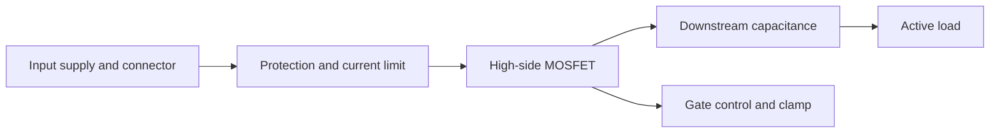
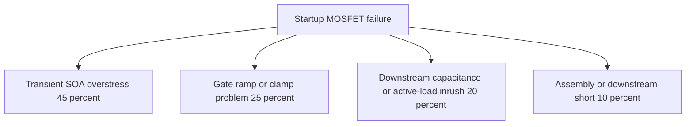
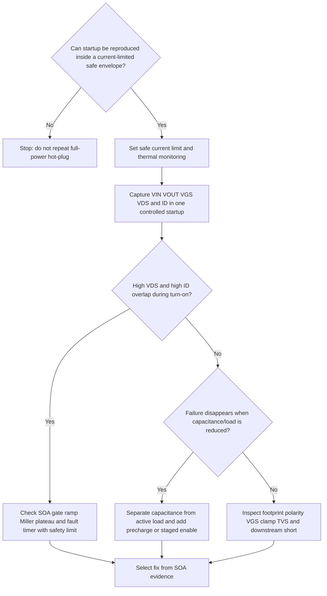

# Architecture-First Debug Decision Tree

## 1. Project Context Summary

Problem: a board uses a high-side MOSFET hot-swap path to feed a large downstream capacitor bank. The MOSFET becomes hot or fails during plug-in/startup. The user wants the safest first debug path.

## 2. Input Cleaning Snapshot

Observed facts: MOSFET fails or overheats during hot-plug/startup. Assumptions: downstream capacitance is large and current waveforms are not yet captured. No solved root cause is claimed.

## 3. Architecture / Link Understanding

Input supply enters connector and protection path, then passes through a high-side MOSFET into downstream capacitance and active loads. The likely stress window is startup, where VDS and ID can overlap while VOUT ramps and the gate passes through the Miller region.

## 4. Evidence-Aware Link Model

| node | role | known_evidence | unknowns |
|---|---|---|---|
| L1 | energy source | failure happens at plug-in/startup | source impedance and transient profile |
| L3 | stressed switch | MOSFET overheats or fails | VDS, ID, VGS overlap |
| L6 | control path | gate ramp not yet measured | clamp, resistor, fault timer |

## 5. Fact / Assumption Table

| Fact ID | State | Content |
|---|---|---|
| F1 | observed | MOSFET fails or overheats during hot-plug/startup |
| F2 | assumed | downstream capacitance is large enough to create inrush |
| F3 | missing | VGS, VDS, VOUT, and ID waveforms are not yet captured |
| F4 | missing | exact FET SOA curve and gate-control network are not yet reviewed |

## 6. Fault-Domain Localization

| Domain | Why Relevant | Evidence Refs | Priority |
|---|---|---|---|
| Safe test envelope | repeated full-power reproduction may destroy parts | F1 | P0 |
| MOSFET transient SOA | startup has high VDS and high ID overlap | F1,F2 | P0 |
| Gate drive / Miller plateau | slow or uncontrolled gate ramp can worsen SOA stress | F3,F4 | P1 |
| Downstream capacitance/load | inrush source and active-load timing must be separated | F2,F3 | P1 |
| Steady-state thermal | still possible but less likely if failure occurs at plug-in | F1 | P2 |

## 7. Hypothesis Tree With Probabilities

| id | hypothesis | probability | confirm_by | falsify_by |
|---|---|---:|---|---|
| H1 | transient SOA overstress | 0.45 | VDS and ID overlap exceeds SOA | safe capture shows low stress |
| H2 | gate ramp or clamp problem | 0.25 | abnormal VGS/Miller plateau | normal gate profile |
| H3 | capacitance or active load inrush | 0.20 | failure changes with isolated load | failure unchanged |
| H4 | assembly or downstream short | 0.10 | DMM/thermal inspection finds short | clean static checks |

## 8. Candidate Matching Report

| Asset | Type | Decision | Reason | Evidence Refs |
|---|---|---|---|---|
| SIG-HOTSWAP-INRUSH-SOA-RISK | signature | Adopted | symptom matches startup/hot-plug MOSFET failure and large capacitance risk | F1,F2 |
| LM-HOTSWAP-HIGHSIDE-MOSFET | link_model | Adopted | gives causal order for source, gate, capacitance, SOA, and protection | F1,F2,F3 |
| LM-POWER-CHAIN | link_model | Adopted | parent model for current-limited power isolation | F1 |
| generic software/driver path | heuristic | Not Applied | failure is electrical and destructive before software state matters | F1 |

## 9. Adopted / Deferred / Not Applied

Adopted: `SIG-HOTSWAP-INRUSH-SOA-RISK`, `LM-HOTSWAP-HIGHSIDE-MOSFET`, `LM-POWER-CHAIN`.  
Deferred: exact MOSFET replacement choice until SOA and waveform evidence exist.  
Not Applied: repeat full-power hot-plug, software-first debugging, lower-RDS(on)-only replacement.

## 10. Cost / Probability Ranking

| node | action | p_hit | p_exclude | time_min | priority_reason |
|---|---|---:|---:|---:|---|
| A1 | Set safe current limit and thermal monitoring | 0.20 | 0.70 | 10 | prerequisite for safe evidence |
| A2 | Capture VIN VOUT VGS VDS and ID | 0.45 | 0.50 | 30 | highest root-cause evidence value |
| A5 | Inspect polarity clamp TVS and downstream short | 0.10 | 0.40 | 20 | cheap exclusion path |

## 11. Optimal Troubleshooting Path

First define a safe current-limited startup envelope. Then capture one controlled startup event with VIN, VOUT, VGS, VDS, and current if safe. After that, separate capacitive inrush from active-load enable, estimate MOSFET transient SOA, and only then change gate ramp, current limit, precharge, controller, or MOSFET selection.

## 12. Decision Tree

## 13. Node Explanation Table

| id | type | action_type | check_or_action | tool_required | expected_observation | interpretation | safety_level | cost | reversibility | next_branch | evidence_refs |
|---|---|---|---|---|---|---|---|---|---|---|---|
| D1 | decision | none | Determine whether a limited safe startup setup exists | bench supply or fuse or precharge setup | current and energy can be limited | If not limited, destructive reproduction risk remains too high | S3 | low | n/a | A1 or T1 | F1 |
| T1 | terminal | none | Stop full-power hot-plug reproduction | none | no further destructive test | Need safe envelope before more data collection | S3 | low | n/a | terminal | F1 |
| A1 | action | isolate | Set current limit and thermal monitoring before startup | current-limited supply and thermal camera | startup energy is bounded and hot spot can be detected | Establishes safety risk mitigation | S3 | low | reversible | A2 | F1 |
| A2 | action | observe | Capture VIN VOUT VGS VDS and ID during one controlled startup under current limit | oscilloscope differential probe current probe | aligned waveforms for stress window | Shows whether MOSFET SOA is plausible root cause with safety mitigation | S2 | medium | reversible | D2 | F3 |
| D2 | decision | none | Check whether VDS and ID overlap is severe under safe envelope | scope waveform | high power pulse is present or absent | High overlap points to transient SOA or gate ramp risk with current limit still required | S2 | low | n/a | A3 or D3 | F3 |
| A3 | action | observe | Review SOA gate ramp Miller plateau and fault timer with safety limit | datasheet scope schematic | SOA margin is quantified | Confirms or rejects startup SOA overstress | S2 | medium | reversible | T2 | F3,F4 |
| D3 | decision | none | Test reduced capacitance or isolated active load under current limit | jumper preload or staged enable | failure changes with capacitance/load | Separates capacitive inrush from active load fault | S2 | medium | n/a | A4 or A5 | F2 |
| A4 | action | reconfigure | Add precharge or staged downstream enable for diagnosis with current limit | resistor jumper controller config | inrush peak and stress window reduce | Supports capacitance/load as dominant cause while keeping safety limit | S2 | medium | reversible | T2 | F2 |
| A5 | action | observe | Inspect footprint polarity VGS clamp TVS and downstream short | schematic DMM microscope thermal camera | alternate destructive cause found or excluded | Prevents false SOA conclusion | S1 | medium | reversible | T2 | F1 |
| T2 | terminal | none | Select fix from evidence | none | fix path is tied to measured stress | Candidate fixes can be evaluated safely | S1 | low | n/a | terminal | F1,F3,F4 |

## 14. Missing Architecture Information

- exact MOSFET part number and SOA curve
- downstream capacitance and active load profile
- gate resistor, RC ramp, clamp, and driver topology
- current limit or fault timer implementation
- connector and input transient environment

## 15. Next 3-5 Actions

1. Stop uncontrolled full-power hot-plug reproduction.
2. Create a current-limited startup setup and thermal monitoring plan.
3. Capture VIN, VOUT, VGS, VDS, and ID during one controlled startup.
4. Compare the measured power pulse against MOSFET transient SOA.
5. Test reduced capacitance or staged load enable to separate inrush from active load.

## 16. Stop / Escalation Conditions

Stop if the MOSFET or connector overheats under the limited test envelope, if VGS exceeds absolute maximum, or if current limit is hit instantly. Escalate to schematic/layout review and component stress calculation before any further destructive reproduction.

## 17. Retrospective Trigger

Run retrospective when the measured stress window identifies whether root cause is MOSFET SOA, gate control, output capacitance, downstream short, VGS overvoltage, or an unrelated layout/assembly issue.
