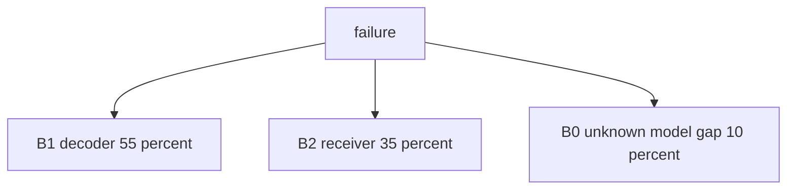
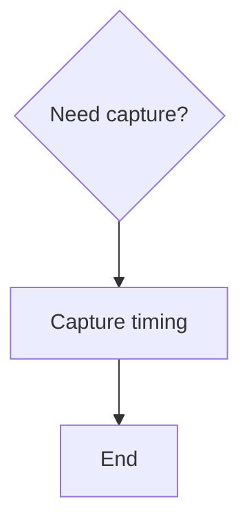

# Architecture-First Debug Decision Tree

## 1. Project Context Summary

This adversarial fixture says "top two" and `cost_priors.yaml`, but does not bind the ranking to observed facts or per-row cost priors.

## 2. Input Cleaning Snapshot

Observed fact: a video path has no output.

## 3. Architecture / Link Understanding

Decoder feeds receiver.

## 4. Evidence-Aware Link Model

| node | known | unknown |
|---|---|---|
| D | no output | status |

## 5. Fact / Assumption Table

| id | state | content |
|---|---|---|
| F1 | observed | no output on the receiver |

## 6. Fault-Domain Localization

The direct symptom's simplest physical interpretation is in the top two.

### Boundary Distribution

| id | type | first_fail_boundary | p |
|---|---|---|---:|
| B1 | boundary | decoder output boundary | 0.55 |
| B2 | boundary | receiver boundary | 0.35 |
| B0 | boundary | unknown / model gap | 0.10 |

### Mechanism Prior

| id | type | mechanism | p_active | affects_boundaries |
|---|---|---|---:|---|
| M1 | mechanism | decoder timing issue | 0.45 | B1 |
| M2 | mechanism | receiver setup issue | 0.30 | B2 |
| M3 | observability_gap | missing same-window capture | 0.20 | B0 |

### Coverage Matrix

| mechanism_id | B1 decoder | B2 receiver |
|---|---|---|
| M1 decoder timing | H | L |
| M2 receiver setup | L | H |

### Evidence Ledger

| id | evidence | status | criticality | gates_boundaries | gates_mechanisms | probability_effect | local_override |
|---|---|---|---|---|---|---|---|
| EV1 | same-window capture | missing | critical | B1,B2 | M1,M2 | caps probabilities | none |

## 7. Hypothesis Tree With Probabilities

## 8. Candidate Matching Report

No adopted asset.

## 9. Adopted / Deferred / Not Applied

Not Applied: no asset.

## 10. Cost / Probability Ranking

This prose cites `reasoning/cost_priors.yaml`, but the table omits row-level prior provenance.

| node | tier | co_acq_group_id | same_failure_window | capture_channel | action | boundary_subset | mechanism_subset | p_hit | p_exclude | time_min | priority_reason |
|---|---|---|---|---|---|---|---|---:|---:|---:|---|
| A1 | P0 | CO-BAD | true | scope | Capture timing | B1 | M1 | 0.30 | 0.40 | 20 | standalone capture |

## 11. Optimal Troubleshooting Path

Capture timing.

## 12. Decision Tree

## 13. Node Explanation Table

| id | type | action_type | check_or_action | tool_required | expected_observation | interpretation | safety_level | cost | reversibility | next_branch | evidence_refs |
|---|---|---|---|---|---|---|---|---|---|---|---|
| D1 | decision | none | Decide capture | scope | timing visible | choose capture | S0 | low | n/a | A1 | F1 |
| A1 | action | observe | Capture timing | scope | timing visible | split fault | S0 | low | reversible | T1 | F1 |
| T1 | terminal | none | End | none | done | done | S0 | low | n/a | terminal | F1 |

## 14. Missing Architecture Information

Same-window evidence.

## 15. Next 3-5 Actions

1. This fixture should fail.

## 16. Stop / Escalation Conditions

Stop when validator catches missing evidence binding.

## 17. Retrospective Trigger

Trigger if this fixture passes.
