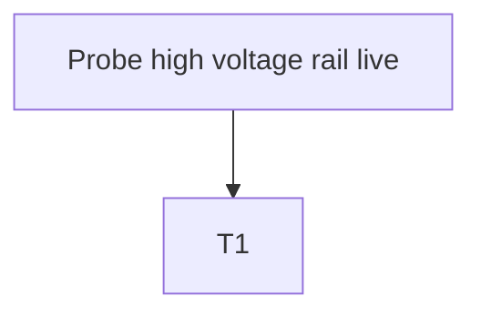

# Debug Decision Tree
## 1. Problem Summary
x
## 2. Context Mode
x
## 3. Safety Gate
x
## 4. Candidate Matching Report
x
## 5. Adopted / Deferred / Not Applied
x
## 6. Optimal Troubleshooting Path
x
## 7. Decision Tree

## 8. Node Explanation Table
| id | type | check_or_action | safety_level | cost |
|---|---|---|---|---|
| A1 | action | Probe live high voltage rail | S3 | low |
## 9. Missing Information
x
## 10. Next 3-5 Actions
x
## 11. Stop / Escalation Conditions
x
## 12. Retrospective Trigger
x
