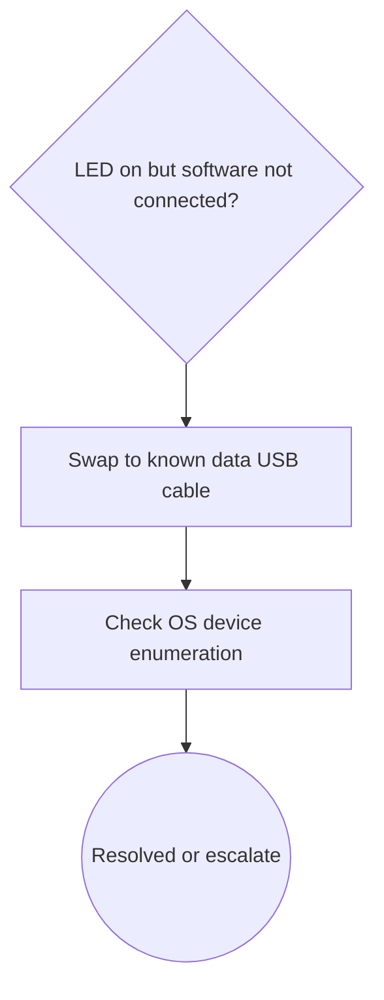

# Debug Decision Tree

## 1. Problem Summary

USB logic analyzer LED is on but software reports not connected.

## 2. Input Cleaning Snapshot

Facts: LED is on, host software reports not connected. Assumption: LED proves only power, not USB data enumeration.

## 3. Context Mode

Signature-Based Fast Path is eligible, but standard output is used for validation.

## 4. Safety Gate

S0 only.

## 5. Working Link Model / Scope

USB power LED -> USB data cable -> host enumeration -> driver binding -> capture software.

## 6. Fact / Assumption Table

| id | type | content | confidence |
|---|---|---|---|
| F1 | fact | LED is on | high |
| F2 | fact | software reports not connected | high |
| A1 | assumption | cable may be power-only or data path may fail | medium |

## 7. Hypothesis Ranking

| id | hypothesis | probability | evidence_for | evidence_against |
|---|---|---:|---|---|
| H1 | Power-only or bad USB cable | 0.45 | F1,F2 | none yet |
| H2 | Host driver/enumeration issue | 0.35 | F2 | LED power present |
| H3 | Tool hardware failure | 0.20 | F2 | not yet tested on another port |

## 8. Candidate Matching Report

| Asset | Type | Decision | Reason | Evidence Refs |
|---|---|---|---|---|
| SIG-USB-NOT-CONNECTED | signature | Adopted | LED-on plus software-not-connected matches minimal USB enumeration path | F1,F2 |

## 9. Adopted / Deferred / Not Applied

Adopted: USB enumeration path. Deferred: hardware replacement. Not Applied: SPI decode.

## 10. Cost / Probability Ranking

| action | p_hit | p_exclude | time_min | priority |
|---|---:|---:|---:|---:|
| Swap to known data USB cable | 0.45 | 0.30 | 2 | high |
| Check OS device enumeration | 0.35 | 0.50 | 5 | high |

## 11. Optimal Troubleshooting Path

Cable, direct port, OS enumeration, driver, minimal capture.

## 12. Decision Tree

## 13. Node Explanation Table

| id | type | action_type | check_or_action | tool_required | expected_observation | interpretation | safety_level | cost | reversibility | next_branch | evidence_refs |
|---|---|---|---|---|---|---|---|---|---|---|---|
| D1 | decision | n/a | Confirm software not connected while LED is on | none | Error persists | Power does not prove USB data link | S0 | low | n/a | A1 | F1,F2 |
| A1 | action | replace | Replace USB cable with known-good data cable | USB cable | Device enumerates or error changes | Power-only or bad cable likely | S0 | low | reversible | A2 | F1,F2 |
| A2 | action | observe | Check OS device enumeration | OS device manager | Device present with valid driver | Driver/link layer status known | S0 | low | reversible | T1 | F2 |
| T1 | terminal | n/a | Stop or escalate after minimal acquisition | none | Resolved or still failing | Close loop or escalate | S0 | low | n/a | terminal | F2 |

## 14. Missing Information

Cable type and OS enumeration status.

## 15. Next 3-5 Actions

1. Swap cable.
2. Use direct USB port.
3. Check device manager.

## 16. Stop / Escalation Conditions

Stop once device enumerates and minimal capture passes.

## 17. Retrospective Trigger

If cable is root cause, create case_record update.
