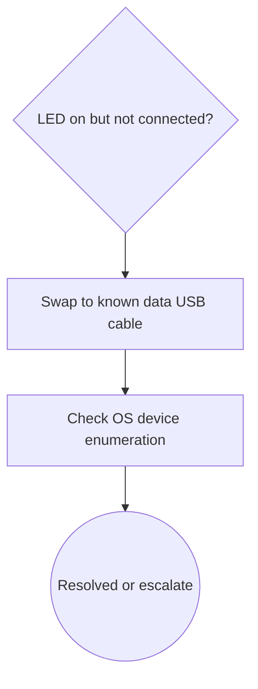

# Debug Decision Tree

## 1. Problem Summary
USB logic analyzer LED is on but software reports not connected.

## 2. Context Mode
Signature-Based Fast Path eligible but standard output used for validation.

## 3. Safety Gate
S0 only.

## 4. Candidate Matching Report
SIG-USB-NOT-CONNECTED adopted.

## 5. Adopted / Deferred / Not Applied
Adopted: USB enumeration path. Not Applied: SPI decode.

## 6. Optimal Troubleshooting Path
Cable, direct port, OS enumeration, driver, minimal capture.

## 7. Decision Tree

## 8. Node Explanation Table
| id | type | action_type | check_or_action | tool_required | expected_observation | interpretation | safety_level | cost | reversibility | next_branch | evidence_refs |
|---|---|---|---|---|---|---|---|---|---|---|---|
| D1 | decision | n/a | Confirm software not connected while LED is on | none | Error persists | Power does not prove USB data link | S0 | low | n/a | A1 | [] |
| A1 | action | replace | Replace USB cable with known-good data cable | USB cable | Device enumerates or error changes | Power-only or bad cable likely | S0 | low | reversible | A2 | [] |
| A2 | action | observe | Check OS device enumeration | OS device manager | Device present with valid driver | Driver/link layer status known | S0 | low | reversible | T1 | [] |
| T1 | terminal | n/a | Stop or escalate after minimal acquisition | none | Resolved or still failing | Close loop or escalate | S0 | low | n/a | terminal | [] |

## 9. Missing Information
Cable type and OS enumeration status.

## 10. Next 3-5 Actions
1. Swap cable.
2. Use direct USB port.
3. Check device manager.

## 11. Stop / Escalation Conditions
Stop once device enumerates and minimal capture passes.

## 12. Retrospective Trigger
If cable is root cause, create case_record update.
