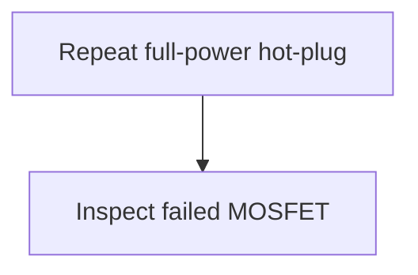

# Signature-Based Fast Path Debug

## 0. Mode / Signature / Confidence

Mode: Signature-Based Fast Path.
Matched signature: `SIG-HOTSWAP-INRUSH-SOA-RISK`.
Confidence: medium.

## 1. Safety Gate

S3. Safety review is required for the hot-swap path.

## 2. Quick Diagnosis

MOSFET failure during startup suggests a destructive electrical stress window. This paragraph is intentionally long enough that the global safety wording above should not mitigate a later unsafe action. The validator must require local mitigation near the hazardous wording, not merely any safety word somewhere in the document.

## 3. Minimal Context Still Needed

- MOSFET part number
- output capacitance
- VGS, VDS, and ID waveforms

## 4. Top 3-5 Actions

1. Repeat full-power hot-plug to reproduce the failure quickly.

## 5. Stop / Escalate Conditions

Stop after failure is reproduced.

## 6. Mini Decision Tree

## 7. Why Full Architecture Is Not Needed Yet

This intentionally bad smoke case focuses on unsafe wording detection.

## 8. When To Switch Modes

Switch when more architecture is available.
