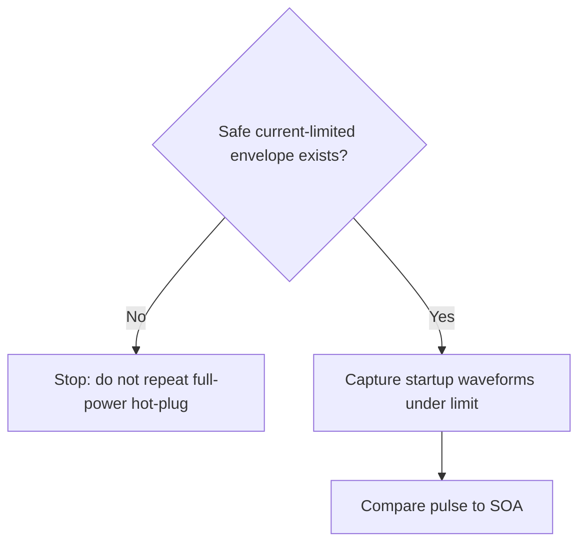

# Signature-Based Fast Path Debug

## 0. Mode / Signature / Confidence

Mode: Signature-Based Fast Path.
Matched signature: `SIG-HOTSWAP-INRUSH-SOA-RISK`.
Confidence: medium.

## 1. Safety Gate

S3. Destructive hot-swap debug requires a bounded test envelope.

## 2. Quick Diagnosis

MOSFET failure during startup suggests a destructive electrical stress window.

## 3. Minimal Context Still Needed

- MOSFET part number
- output capacitance
- VGS, VDS, and ID waveforms

## 4. Top 3-5 Actions

1. Do not repeat full-power hot-plug. Use a current-limited safe envelope with precharge or fuse protection before collecting waveforms.
2. Capture VGS, VDS, VOUT, and ID in one controlled startup if the limit holds.
3. Compare the measured pulse against transient SOA.

## 5. Stop / Escalate Conditions

Stop if current limit is hit instantly, VGS exceeds absolute maximum, or the MOSFET heats under the limited envelope.

## 6. Mini Decision Tree

## 7. Why Full Architecture Is Not Needed Yet

The first decision is safety envelope feasibility.

## 8. When To Switch Modes

Switch to Architecture-First when schematic, capacitance, and gate-control details are available.
