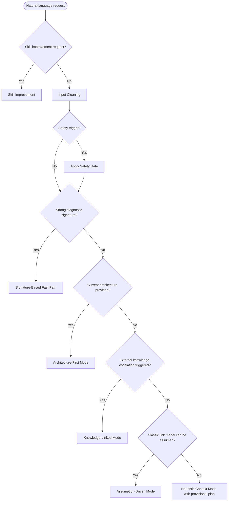

# Mode Router

## Decision Order

Current user-provided architecture takes priority over potentially stale KB.

## Explicit Routing Rules

| condition | selected_mode | rationale |
|---|---|---|
| user critiques DebugTool behavior, output quality, routing, contracts, validators, artifact organization, or says the goal is skill optimization rather than more debug | Skill Improvement | improve the skill layer; treat the referenced case as a fixture, not a request for another root-cause pass |
| safety trigger exists | Safety Gate before selected debug mode | safety overrides routing emphasis |
| strong validated signature matches and architecture is not needed for first action | Signature-Based Fast Path | fastest safe evidence-gathering path |
| user provides module chain, register relationship, waveform relationship, or updated architecture conclusion | Architecture-First | current structure is stronger than generic priors |
| user explicitly asks for wiki/KB/repo/schematic/datasheet/prior records, online learning, similar cases, or broad exploration | Knowledge-Linked | external knowledge was requested |
| a high-impact missing project fact changes the first two actions, safety envelope, link boundary, or top hypothesis ranking | Knowledge-Linked | model is unstable without external/project knowledge |
| a classic domain link model applies and no external escalation is needed | Assumption-Driven | useful provisional plan without retrieval |
| none of the above applies | Heuristic Context | minimal provisional plan with explicit assumptions |

Project KB/docs/repo merely being available is not enough to select Knowledge-Linked. Knowledge retrieval is an escalation path, not the default path.

Skill Improvement is outside the normal debug-mode order. It should not run Input Cleaning for the hardware case unless the requested improvement concerns intake quality.

## Natural-Language Default

Do not require the user to name a mode. If the user only says "help debug this" or provides a brief symptom, run Input Cleaning, choose the strongest available mode, and deliver a provisional plan with assumptions. Ask questions only after giving the first safe evidence-gathering actions.
