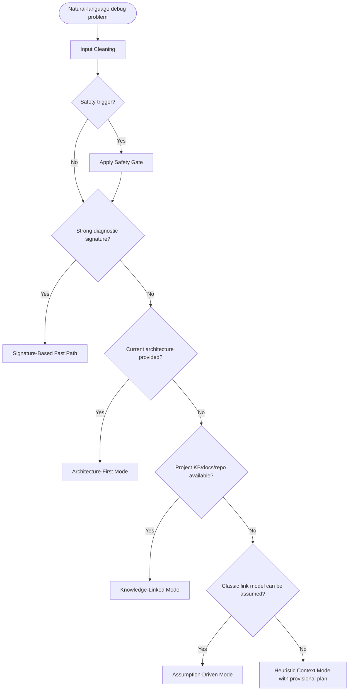

# Mode Router

## Decision Order

Current user-provided architecture takes priority over potentially stale KB.

## Natural-Language Default

Do not require the user to name a mode. If the user only says "help debug this" or provides a brief symptom, run Input Cleaning, choose the strongest available mode, and deliver a provisional plan with assumptions. Ask questions only after giving the first safe evidence-gathering actions.
