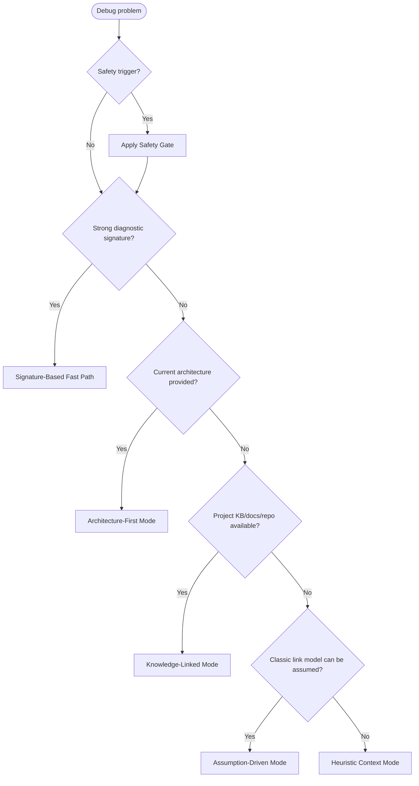

# Mode Router

## Decision Order

```mermaid
flowchart TD
S([Debug problem]) --> D0{Safety trigger?}
D0 -- Yes --> A0[Apply Safety Gate]
D0 -- No --> D1{Strong diagnostic signature?}
A0 --> D1
D1 -- Yes --> M1[Signature-Based Fast Path]
D1 -- No --> D2{Current architecture provided?}
D2 -- Yes --> M2[Architecture-First Mode]
D2 -- No --> D3{Project KB/docs/repo available?}
D3 -- Yes --> M3[Knowledge-Linked Mode]
D3 -- No --> D4{Classic link model can be assumed?}
D4 -- Yes --> M4[Assumption-Driven Mode]
D4 -- No --> M5[Heuristic Context Mode]
```

Current user-provided architecture takes priority over potentially stale KB.
